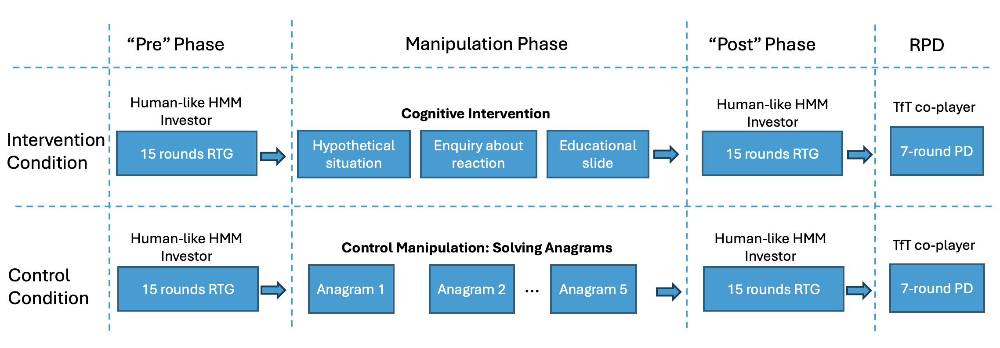

\small
^1^ *Department of Experimental Psychology, Division of Psychology and Language Sciences, UCL*

^2^ *Division of Psychiatry and Max Planck Centre for Computational Psychiatry and Ageing Research, Queen Square Institute of Neurology, UCL.*

^\*^ *Email: ismail.guennouni@zi-mannheim.de*

---

```{r setupCoax, include=FALSE}
knitr::opts_chunk$set(warning = FALSE, message = FALSE, echo = FALSE) 
knitr::opts_chunk$set(out.width = "\\textwidth")
```

```{r load-packages05, include = FALSE}
library(papaja)
library(kableExtra)
require(knitr)
#require(citr)
require(bookdown)

# using some functions dplyr, ggpubr, PairedData and sjPlot. Need to be loaded. 
library(tidyverse)
library(afex)
library(PairedData)
library(multcompView)
library(lsmeans)
library(depmixS4)
library(flextable)
library(grid)
library(gridExtra)
library(forcats)
library(ggsignif)
library(magick)


```

```{r analysis-preferences, include = FALSE}
# Seed for random number generation
set.seed(42)
options(tinytex.verbose = TRUE)
```


# Introduction {.unnumbered}

<!-- Cooperation refers to the collaborative efforts of individuals or entities working towards a shared goal or advantage [@tomasello2012two]. This coordinated approach often leads to outcomes that exceed the sum of individual contributions.  Trust is a key driver of cooperation, enabling individuals to engage in mutually beneficial interactions without fear of exploitation [@balliet2013trust]. This aligns with some definitions of trust as “a psychological state comprising the intention to accept vulnerability based on positive expectations of the intentions or behavior of another” [@rousseau1998not]. When we trust others, we are more likely to cooperate with them, even when there is a risk of being cheated. Prior research also emphasises the importance of social trust in determining why some people fare better than others physically and mentally [@giordano_trust_2016; @meng_multilevel_2014]. Research into the determinants of psychopathology has linked trust-based constructs to the emergence of mental health disorders [@fonagy_role_2014]. -->


Cooperation, defined as individuals or entities working together towards a shared goal, plays a fundamental role in promoting collective success and social harmony [@tomasello_two_2012]. At the heart of cooperation is trust—the belief that others will act in ways that are mutually beneficial, even when they have the opportunity to exploit the situation [@rousseau_introduction_1998]. Trust enables individuals to engage in risky interactions where immediate self-interest could easily override long-term benefits [@balliet_trust_2013]. Without trust, cooperation tends to break down, leading to suboptimal outcomes for all parties involved. Understanding how to maintain and repair cooperation following such breakdowns is therefore of significant interest to researchers and practitioners alike.


<!-- A well-established paradigm in the study of trust is the Repeated Trust Game (RTG; @joyce_trust_1995). In this game, the "investor" decides how much of an endowment to send to the other player (the "trustee"). The amount that is sent is tripled and the trustee decides, in return, how much of the tripled amount to send back to the investor. The Nash equilibrium for a single-round version of the game is for the investor to send nothing. In the repeated version, rewards for both players are maximised if they build trust and share the benefits of higher investments. If the investor is rewarded for taking the risk of sending an investment, they are likely invest again in future rounds. But if the investor obtains a low return on their investment, they will likely reduce future investments, thereby diminishing the potential gains for both players.  -->

The Repeated Trust Game (RTG) has emerged as a well-established paradigm for studying trust and cooperation in controlled settings [@joyce_trust_1995]. In this game, an "investor" decides how much of an endowment to send to a "trustee." The amount sent is typically multiplied by 3, and the trustee then decides how much of this multiplied amount to return to the investor. Cooperation emerges when both parties act in ways that promote mutual gains over multiple rounds. However, trust is fragile, and a single instance of defection—where one player fails to reciprocate appropriately—can lead to the breakdown of cooperation [@bendor_when_1991]. Once trust is violated, it is often difficult to re-establish, even if doing so would be mutually beneficial [@harth_spiral_2017].

Previous research has explored ways to encourage initial cooperation in trust games, such as using third-party enforcement [@charness_investment_2008; @fiedler_effect_2017], gratitude priming [@drazkowski_gratitude_2017], or with the concepts of friend and foe [@burnham_friend-or-foe_2000]. While these approaches improve early cooperative behavior, they often fail to address the more challenging task of repairing cooperation after trust has been broken. Once defection occurs, individuals may react impulsively by reducing their own cooperative efforts, even if re-establishing trust would be mutually beneficial. Thus, interventions aimed at restoring cooperation in these contexts are crucial but understudied.

<!-- Given the importance of trust for building and maintaining strong social bonds, interventions that foster and strengthen cooperation would be highly beneficial to society. Such interventions would allow people to more easily repair broken relationships and continue harvesting the benefits of cooperation even in the presence of accidental or intentional social norm violations. Previous studies have attempted to restore cooperation in trust games through mechanisms such as third-party enforcement [@charness_investment_2008; @fiedler_effect_2017] or gratitude priming [@drazkowski_gratitude_2017]. Whilst these results show that it is possible to improve cooperative outcomes at the start of the game, they do not address how to repair a breakdown of trust after intentional or accidental non-cooperative actions by the players. -->

<!-- To encourage the emergence and maintenance of trust in the RTG setting, some studies have focused on modification of the game, e.g. through introducing a third-party who monitors the actions of the other players [@charness_investment_2008; @fiedler_effect_2017]. Others chose to prime participants towards feeling gratitude [@drazkowski_gratitude_2017] or with the concepts of friend and foe [@burnham_friend-or-foe_2000]. Whilst these results show that it is possible to improve cooperative outcomes at the start of the game, they do not address how to repair a breakdown of trust after intentional or accidental non-cooperative actions by the players. Cooperation in the RTG can easily break down after a transgressive behavior such as a nil or very low investment by the investor or a return by the trustee below the investment sent [@bendor_when_1991]. Such breakdowns of cooperation are particularly evident when the trustee suffers from social disorders such as Borderline Personality Disorder (BPD; @lieb_borderline_2004). Trustees with BPD fail to engage in trust-repairing behaviors such as coaxing the investor by signalling trustworthiness via sending high returns [@king-casas_rupture_2008].  Neuroimaging analysis from the study of @king-casas_rupture_2008 is consistent with the idea that individuals with BPD may not recognize how offering low returns in such interactions conflicts with societal expectations. Further, computational analysis by @hula2018model links this issue to some BPD individuals' mentalizing difficulties, such as their inability to foresee the impact of their low returns on the investor's future actions. -->

In this study, we focus on the role of the trustee in the RTG, as a driver of cooperation dynamics. While the trustee does not exercise trust in the same way as the investor, their decisions to reciprocate (or not) play a critical role in maintaining or disrupting the cooperative relationship. A lack of reciprocation from trustees erodes trust over time [@servatka_words_2011] and is particularly evident when the trustee suffers from some personality disorders [@lieb_borderline_2004]. These trustees fail to engage in trust-repairing behaviors such as coaxing the investor by signalling trustworthiness via sending high returns [@king-casas_rupture_2008].
Additionally, unpredictable behavior from trustees fosters mistrust and impedes future cooperation [@rigdon_sustaining_2007]. In contrast, consistent cooperation from trustees promotes trust and encourages further collaboration, as evidenced by neural data [@king-casas_getting_2005]. Therefore, emphasizing the role of trustees in rebuilding cooperation is essential; when trustees demonstrate reliability and reciprocity, even after breaches of trust, cooperation can be restored and sustained.

Given the pivotal role of trustees' behavior in shaping cooperative dynamics, it is worth exploring whether interventions aimed at improving interpersonal skills could positively influence their decision-making in the RTG. In the broader field of psychological therapies, cognitive interventions inspired by  Dialectical Behavior Therapy [@linehan_cognitive-behavioral_1993] and Mentalisation Based Therapy [@allen_handbook_2006-1] have shown promise in enhancing social skills among individuals with interpersonal difficulties. These approaches often focus on helping individuals recognize the impact of their actions on others and consider alternative behavioral strategies. However, response to these treatments is highly variable, and determining which interventions are effective for particular sub-groups of patients is challenging [@rudge_mechanisms_2020; @arch_longitudinal_2012]. One promising approach is the study of how specific components of psychotherapeutic treatment affect quantitative markers of behavior such as those inferred through computational models [@huys_computational_2016; @reiter_neuro-cognitive_2021; @dercon_core_2024]. Combining the use of specific cognitive probes inspired by therapeutic interventions and computational models of behavior may allow us to uncover the cognitive mechanisms targeted by common forms of psychotherapy. In turn, this may provide the basis for choosing effective psychotherapeutic interventions for given individuals, potentially extending to improving trustee behavior and fostering cooperation in the RTG.

<!-- In devising interventions to repair trust in the RTG, we can take inspiration from cognitive interventions championed by successful therapies that aim to improve social dysfunction in BPD. Psychotherapies such as Mentalisation Based Therapy [@allen_handbook_2006-1] and Dialectical Behavior Therapy [@linehan_cognitive-behavioral_1993] have been shown to improve social skills in BPD [@gunderson_borderline_2018]. However, response to these treatments is highly variable, and determining which interventions are effective for particular sub-groups of patients is challenging [@rudge_mechanisms_2020; @arch_longitudinal_2012]. One promising approach is the study of how specific components of psychotherapeutic treatment affect quantitative markers of behavior such as those inferred through computational models [@huys_computational_2016; @reiter_neuro-cognitive_2021; @dercon2022core]. Combining the use of specific cognitive probes inspired by therapeutic interventions and computational models of behavior may allow us to uncover the cognitive mechanisms targeted by common forms of psychotherapy. In turn, this may provide the basis for choosing effective psychotherapeutic interventions for given individuals. -->


Drawing inspiration from such therapeutic approaches, we employ a randomized control trial to evaluate a cognitive intervention aimed at repairing cooperation after low investments from a computerized investor. The intervention in this study is a brief, multi-component cognitive intervention inspired by Dialectical Behavior Therapy (DBT) principles. It combines elements aimed at understanding long-term consequences of actions and promoting prosocial behavior. This approach mirrors real-world cognitive interventions that often employ multiple strategies to effect behavioral change [@linehan_dbt_2015]. Specifically, we hypothesize that encouraging participants to reflect on the consequences of their actions and consider a non-impulsive course of action might lead to more resilient cooperative behavior, even in the face of perceived non-cooperation from their partner. 

We conducted an online experiment with 318 participants acting as trustees in two RTG rounds, with the intervention administered between rounds to a subset of participants. While previous studies have often relied on predetermined or simplistic computer strategies in economic games, our study introduces a novel approach using Hidden Markov Models (HMMs) to create more realistic, adaptive computer agents. A key aspect of these agents is that their actions depend on a latent “trust state” which reacts dynamically to the trustees’ returns, simulating real-life trust-building scenarios. To foreshadow our results, we find that the intervention led to more cooperative actions (higher returns) by the participants and countered a tendency to send back lower returns after a transgression from the investor. However, we found no evidence that the effects of the intervention transfer to a different (Repeated Prisoner’s Dilemma) game.


```{r dataLoad, include=FALSE }

d_finished <- readRDS("data/d_anonym.RDS")

sd(as.numeric(d_finished$exitSurvey.age), na.rm=TRUE)
```


# Methods {.unnumbered}

## Participants  {.unnumbered}

A total of 320 participants were recruited on the Prolific Academic platform (prolific.co). Two players had incomplete trust game entries and their data was disregarded, leaving data for 318 participants for analysis, equally split between the two conditions. The required sample size was determined using an *a priori* power analysis to have an 80% probability to detect a small effect size (Cohen's f = 0.10) for a within-between interaction with a 5% type I error rate in a repeated measures ANOVA. The sample size calculation assumed 2 groups, 2 measurement per group and was performed using the G*Power software [@faul_statistical_2009]. The mean age of participants was `r round(mean(as.numeric(d_finished$exitSurvey.age), na.rm=TRUE),1)` years, with a `r round(sd(as.numeric(d_finished$exitSurvey.age), na.rm=TRUE),1)` years standard deviation. Participants were paid a fixed fee of £5 plus a bonus payment dependent on their performance that averaged £0.71.

## Design and Procedure {.unnumbered}

The experiment employed a 2 (Condition: Intervention or Control) by 2 (Game: Trust-Game Pre-Intervention, Trust-Game Post-Intervention) design, with repeated measures on the second factor. Participants were randomly assigned to either the intervention or control condition. Following the post-intervention Trust Game, all participants completed a Repeated Prisoner's Dilemma (RPD) game to assess potential transfer effects (See Figure \ref{fig:HMMPanels}.A for experiment overview). The games were designed and implemented online using Empirica [@almaatouq_empirica_2021-1]. This research received approval from a UCL ethics board (ID:21029/001) and the experiment was performed in accordance with the ethics board guidelines and regulations. 

```{r timeline, include=F, fig.cap = "Experiment overview. After playing 15 rounds of the RTG as the trustee, participants were randomized to either be part of the control or intervention condition. They then played the second set of 15 rounds of RTG (again as the trustee) to examine intervention effects, and 7 rounds of a repeated Prisoner’s Dilemma to examine generalization of intervention effects. Finally, participants answered questionnaires and were debriefed.", fig.align='center', out.width="100%", out.height= "120%"}



```

## Tasks and Measures {.unnumbered}

### Repeated Trust Game {.unnumbered}

Participants played two separate 15-round Repeated Trust Games [@joyce_trust_1995] in the role of trustee. They were told (correctly) that each 15-round game was played against the same co-player, and that they will face a new player when they started a new 15-round game. Participants were led to believe they were interacting with human co-players when in fact they faced the same computerised investor in all trust games. This design allows us to examine the effects of our intervention while controlling for individual differences in play style, as well as minimizing the influence of reputational concerns or carry-over effects that might occur if participants believed they were facing the same partner twice. In each round of the RTG, the investor (computer-simulated) was endowed with 20 units and decided how much of that endowment to invest. This investment was tripled, and the participant, as the trustee, then decided how to split this tripled amount between themselves and the investor. If the trustee returns more than one third of the amount, the investor makes a gain. On each round, immediately after being informed of the investment sent, participants in the intervention condition were asked to provide an evaluation of their emotion in terms of valence (from negative to positive) and arousal (from low to high). Participants in the control condition were asked to evaluate the investment in terms of speed (from slow to fast) and magnitude (from low to high). These evaluations were made by clicking on a two-dimensional field with labelled axes as shown in Figure \ref{fig:HMMPanels}.C for the intervention condition. 

<!-- Participants played a 15-round Repeated Trust Game [@joyce_trust_1995] in the trustee role against a computer-programmed investor. On each round the investor is endowed with 20 units and decides how much of that endowment to invest. This investment is tripled and the trustee then decides how to split this tripled amount between them and the investor. If the trustee returns more than one third of the amount, the investor makes a gain. Each player was represented with an icon with the participant always on the left of the screen and the co-player on the right (Figure \ref{fig:HMMPanels}.A). The participants were able to choose the icon that represents them at the start of the experiment. The icon representing the co-player changed at the start of each new game, to simulate a new interaction partner. Participants were not told they were facing computerised co-players. -->

### Adaptive Computerised Investor {.unnumbered} 


The strategy of the computerised investor was modelled on behavior of human investors in the Repeated Trust Game (RTG) over 10-rounds with the same (human) co-player from existing datasets. Full detail on the data sources used are in the Supplementary Information. Using this data, we estimated a hidden Markov model (HMM) on investors' behavior with three latent states. Each latent state was associated with a state-conditional distribution over the possible investments from 0 to 20 (Figure \ref{fig:HMMPanels}.B). These distributions reflect "low-trust", "medium-trust", or "high-trust". Over rounds, the investor can move between states, and the probability of these transitions was modelled as a function of their net return (i.e return - investment) in the previous round (see Figure \ref{fig:HMMPanels}.D). In order to instigate a potential breakdown of trust, thereby allowing us to probe efforts to repair trust, the computerised agent was programmed to provide a low investment on round 12 (pre-intervention) or round 13 (post-intervention). On all other rounds, the investor's actions were determined by randomly drawing an investment from the state-conditional distribution, with the state over rounds determined by randomly drawing the next state from the state-transition distribution as determined from the net return on the previous round (disregarding the net return immediately after the pre-programmed low investment rounds). The initial state for the HMM investor in each instance of the game was the "mid-trust" state.

Our use of HMMs to model investor behavior represents a significant advancement in experimental design for economic games. Unlike traditional fixed-strategy computer opponents, our HMM-based agents adapt their behavior based on the participant's actions, mirroring the complex decision-making processes observed in human players. This approach allows us to maintain experimental control while significantly enhancing the ecological validity of our study.


### Repeated Prisoner's Dilemma {.unnumbered}

To ascertain whether any effect of the intervention would transfer to a different game, participants played 7 rounds of a Repeated Prisoner’s Dilemma (RPD). In each round, participants could choose between a cooperative action with a reward of 5 (the other player also cooperates) or 1 (the other player defects), or a defect action with a reward of 7 (the other player cooperates) or 2 (the other player defects). The Nash equilibrium for a single-round version is to choose the non-cooperative action. In the repeated version, both players can maximise their reward by choosing to cooperate.

```{r, include=FALSE}
Anti_social <-  c(0.1025436430408, 0.1221931236853, 0.1345215238995,
0.1368182252617, 0.1285592471751, 0.1116014322677, 0.0895041220882,
0.0663166721334, 0.0453950277118, 0.0287077419587, 0.0167723588011,
0.0090530028158, 0.0045143317507, 0.0020796744990, 0.0008851094702,
0.0003480141146, 0.0001264134789, 0.0000424213859, 0.0000131513231,
0.0000037665630, 0.0000009965755)

Neutral <- c(0.003393529, 0.006930874, 0.013053553, 0.022671228,
0.036310144, 0.053627606, 0.073039389, 0.091734929, 0.106248217,
0.113479701, 0.111769796, 0.101517390, 0.085028780, 0.065675083,
0.046778251, 0.030725245, 0.018610323, 0.010394861, 0.005354126,
0.002543094, 0.001113881)

Pro_social <- c(0.003162697, 0.001057162, 0.001410197, 0.001881016,
0.002508877, 0.003346113, 0.004462480, 0.005950950, 0.007935434,
0.010581067, 0.014107909, 0.018809194, 0.025075644, 0.033427845,
0.044559370, 0.059394206, 0.079163228, 0.105506029, 0.140606514,
0.187373417, 0.249680651)

investment <- seq(0:20) -1

response_probs <- as.data.frame(cbind(investment,Anti_social,Neutral,Pro_social)) %>% 
  rename("low-trust" = "Anti_social", "medium-trust"="Neutral", "high-trust" = "Pro_social") %>%
  pivot_longer(cols=c("low-trust","medium-trust","high-trust"),
                    names_to='Investor_state',
                    values_to='probability') %>% 
   mutate(across(Investor_state, factor, levels=c("low-trust","medium-trust","high-trust")))
```

```{r, include=FALSE}

plotinvHMM <- ggplot(response_probs,                            
       aes(x = investment,
           y = probability,
           fill = Investor_state)) +
  geom_bar(stat = "identity",
           position = "dodge") + 
  labs(fill='Latent investor state', x = "Investment", y= "Probability") + 
  theme_bw() + 
  theme(legend.position = "bottom",  legend.text = element_text(size = 12),  legend.title = element_text(size = 14))
  
plotinvHMM
```


```{r, include=FALSE}

unhappy_pars <- rbind(c(3.5435248 , 0.0592584), c(0.1611541, 0.4675468), c(0,0)) 
neutral_pars <- rbind(c(0.8846036, - 0.4394031), c(2.4214322, - 0.0710711), c(0,0))
happy_pars <- rbind(c(-2.004988 ,- 0.151186), c(-1.2976976 , - 0.1357088), c(0,0))

pars_inv <- list(unhappy_pars, neutral_pars, happy_pars)

plot_HMM_transitions <- function(ns, pars_mat) {

  trans_prob <- data.frame(
    from = rep(1:ns, each=100*ns),
    to = rep(1:ns, each=100),
    ret = seq(-20,60,length=100),
    probs = 0
  )
  
  
  y <- matrix(0.0,ncol=ns, nrow=100)
  
  for(from in 1:ns) {
  pars <- matrix(pars_mat[[from]], ncol=2)
  # print(pars)
  
    for(to in 1:ns) {
        x <- trans_prob[trans_prob$from == from & trans_prob$to == to,"ret"]
        y[,to] <- exp(pars[to,1] + pars[to,2]*x)
    }
    y <- y/rowSums(y)

    
    for(to in 1:ns) {
      trans_prob$probs[trans_prob$from == from & trans_prob$to == to] <- y[,to]
    }
  }
  
  df <- as.data.frame(trans_prob) %>% 
    mutate(from = recode(from, "1" = "low-trust", "2" = "medium-trust", "3" = "high-trust"),
           to = recode(to, "1" = "low-trust", "2" = "medium-trust", "3" = "high-trust") ) %>% 
    mutate(across(from, factor, levels=c("low-trust","medium-trust","high-trust"))) %>% 
    mutate(across(to, factor, levels=c("low-trust","medium-trust","high-trust")))
                                    
  
    # Create a separate data frame with the background colors
  bg_colors <- data.frame(
    from = factor(c("low-trust", "medium-trust", "high-trust"), levels=c("low-trust","medium-trust","high-trust"))
  )
  
  # plotting code...
  ggplot() +
    geom_rect(data = bg_colors, aes(xmin = -Inf, xmax = Inf, ymin = -Inf, ymax = Inf, fill = from), alpha = 0.1) +
    geom_line(data = df, aes(x = ret, y = probs, colour = as.factor(to))) +
    facet_wrap(~from, labeller = labeller(from = function(x) paste("From", x, "state on trial t"))) +
    ylim(c(0,1)) +
    scale_fill_manual(values = c("low-trust" = "red", "medium-trust" = "green", "high-trust" = "blue"),
                    name = "From state") +  # Changed legend title for 'fill' here
    scale_color_manual(values = c("low-trust" = "red", "medium-trust" = "green", "high-trust" = "blue"),
                       labels = c("low-trust", "medium-trust", "high-trust"),
                       name = "State transitioned to") +
    labs(x = "Investor's net return on trial t", y = "Transition probability to \nState on trial t+1", color = 'State transitioned to') +
    theme_bw() +
    theme(legend.position = "bottom",
          legend.text = element_text(size = 12),
          legend.key.size = unit(1, 'lines'),
          legend.spacing.x = unit(0.1, 'in'),
          legend.title = element_text(size = 14),
          legend.margin = margin(t = 0.2, b = 0, unit = 'cm'),
          plot.margin = margin(t = 0, r = 0, b = 0, l = 0, unit = "cm"),
          strip.text = element_text(size = 10),
          legend.box = "vertical" # Arrange legends vertically
    ) +
    guides(fill = guide_legend(order = 1, title.position = "left", title.hjust = 0.3),
           color = guide_legend(order = 2, title.position = "left", title.hjust = 0.3))
}

```


```{r, include=F}

plotInvTran <- plot_HMM_transitions(3, pars_inv) 
print(plotInvTran)

```

In this game, the computerised agent was programmed to act according to a tit-for-tat strategy [@axelrod_evolution_1981], starting with a cooperative action and then mirroring what the other player chose in the preceding round. On round 4, the computerised agent was pre-programmed to choose the defect action, regardless of the participant's preceding action. 

## Intervention {.unnumbered}

The intervention was built on Dialectical Behavior Therapy (DBT) skills training, asking patients to reflect on the consequences of actions taken in emotional states [@linehan_dbt_2015]. Specifically, participants were presented with a hypothetical situation in which they receive a low investment and asked to indicate how they would respond. They were then presented with an educational slide inviting them to consider that the ultimate aim in the game is to maximise their total reward and to reflect on whether punishing the investor for the low investment is beneficial to achieving that aim. Participants were told that punishment can create a negative feedback loop where the other player might trust them even less. An alternative action was suggested, whereby players would respond kindly to such a transgression in the hope of gaining trust from the investor. Participants were then asked whether the information just received would change their behavior in such a hypothetical situation and to justify their answer. Full details on the intervention are provided in the Supplementary Information.

In order to separate any general practice effects from the effect of the intervention, we added a control condition in which participants were asked to solve five anagrams ("listen", "triangle", "deductions", "players", "care"). They provided their answers in a free-form text box. The time given to solve the anagrams was the same as that given to respond to questions in the intervention manipulation.

## Procedure {.unnumbered}

At the start of the experiment, participants provided informed consent and were instructed the study would consist of three phases. Participants across conditions were told their goal was to maximise the number of points in all phases. Participants had to pass comprehension checks about the number of phases, the fact the co-player was the same within each phase, and that they would face a new player at the start of each new phase. They were not told the number of rounds of each phase. 

Phase one was a 15 round RTG in which participants took the role of trustee, facing the same investor over all 15 rounds. Participants were given details instructions about the game and had to pass comprehension checks to test their understanding of their and their co-player's payoff in a hypothetical situation. On each round, after being informed about the amount sent by the investor, participants were asked to evaluate their emotion (intervention condition) or the investment (control condition). Participants then decided on how much of the tripled investment to return to the investor, before continuing to the next round. After completing 15 rounds of the RTG, participants rated how cooperative, selfish, trustworthy and friendly they perceived the investor to be (all on a scale from 1 to 10). After phase one, participants in the intervention condition completed the intervention, and participants in the control condition solved anagrams. Subsequent phase two was similar to phase one, with participants being told they would face a new player. 

Phase three consisted of 7 rounds of the Repeated Prisoner's Dilemma game (RPD), with participants informed they would face a third player. Participants then completed questionnaires related to mentalising abilities, emotion regulation, and BPD traits (see the supplement for details). They were then asked about the strategy in the games, as well as whether they thought the other players were human or computer agents. Finally, participants were debriefed and thanked for their participation.  

## Statistical analysis {.unnumbered}


To explore whether participants behaved differently in the RTG after the intervention compared to the control group, we model the percentage return (percentage of tripled investment returned to investor) using a linear mixed-effects model as described below:


\[
\begin{split}
R_{ij} = & \beta_0 + \beta_1 \text{ (Condition)}_i + \beta_2 \text{ (Game)}_i + \beta_3 \text{ (Investment)}_i + \\
& \beta_4 \text{ (Condition × Game)}_i + \beta_5 \text{ (Condition × Investment)}_i + \beta_6 \text{ (Game × Investment)}_i +  \\ 
& \beta_7 \text{ (Condition × Game × Investment)}_i +b_{0j} + b_{1j} \text{ (Game)}_i + \epsilon_{ij}
\end{split}
\]

where:

- \( R_{ij} \): percentage of tripled investment returned to investor for participant \( j \) in observation \( i \)
- \( \beta_0 \): intercept
- \( \beta_1 \): effect of Condition (intervention vs. control)
- \( \beta_2 \): effect of Game (RTG game pre vs. post-intervention)
- \( \beta_3 \): effect of Investment
- \( \beta_4 \): interaction effect between Condition and Game
- \( \beta_5 \): interaction effect between Condition and Investment
- \( \beta_6 \): interaction effect between Game and Investment
- \( \beta_7 \): three-way interaction effect between Condition, Game and Investment
- \( b_{0j} \): participant-wise random intercept for participant \( j \)
- \( b_{1j} \): participant-wise random slope for Game for participant \( j \)
- \( \epsilon_{ij} \): error term for participant \( j \) in observation \( i \)


Our choice of linear mixed-effects models (LMMs) over mixed ANOVA was based on their greater flexibility in handling our complex data structure, including continuous predictors and nested repeated measures. LMMs offer increased statistical power and more flexible assumptions, particularly regarding sphericity, which is often violated in repeated measures designs. The model was estimated using the `afex` package [@singmann_afex_2022] in R. More complex models with additional random effects could not be estimated reliably, and as such the estimated model can be considered to include the optimal random effects structure [@matuschek_balancing_2017]. A similar process was used to establish the random effects structures of other linear mixed-effects models used throughout the statistical analyses. As there is no agreed upon way to calculate effect sizes for mixed effects models, we will report instead on testing differences in marginal means. For the $F$-tests, we used the Kenward-Roger approximation to the degrees of freedom, as implemented in the R package "afex". For all post-hoc pairwise comparisons following significant effects in the mixed-effects models, we used Tukey's Honestly Significant Difference (HSD) test to adjust for multiple comparisons, unless otherwise stated. We Z-transform the Investment variable as centering is beneficial to interpreting the main effects more easily in the presence of interactions.

To model participants' returns in the RTG across games and conditions, we fit various hidden Markov models [@visser_hidden_2022] to participants' returns using the depmixS4 package [@visser_depmixs4_2021] for R. The transition between latent states is assumed to depend on the investment received and a dummy variable to characterise the group that the participant belongs to. Details on how the models are constructed can be found in the supplement. We fit models with different numbers of hidden states, and use the Bayesian Information Criterion [@schwarz_estimating_1978-1] to select the best fitting model.

\begin{landscape}
```{r HMMPanels, fig.cap= "\\small{Panel A: Experimental design overview. Participants in both conditions played two 15-round Repeated Trust Games (RTGs) with human-like Hidden Markov Model (HMM) investors, separated by a manipulation phase. The intervention condition received a cognitive intervention, while the control condition solved anagrams. Both groups then completed a 7-round Repeated Prisoner's Dilemma (RPD) with a tit-for-tat (TFT) co-player to assess transfer effects. This design allows for comparison of cooperative behavior before and after the intervention, as well as between conditions. Immediately before making return decisions in the RTG, participants are shown a two dimensional grid (Panel C) where they need to report their reaction to the investment. Those in the intervention condition were asked questions about their emotional state and those in the control condition were asked to report features of the investment unrelated to their emotion. Panels B - D: We construct the artificial investor agent by fitting a three-state hidden Markov model to data of human investors engaged in the 10 round Repeated Trust Game against human trustees. From the fitted HMM, we get the distribution of investments by the artificial investor agent conditional on its latent state as shown in Panel B. The fitted HMM also yields the transition probability of the agent to a state on trial t+1 as a function of the net return (difference between the investment sent and the amount received in return) on trial t as shown in Panel D. Each plot in Panel D represents a different starting latent state on trial t, and each line represents the probability of transitioning to a particular state in trial t+1.}",echo=FALSE, message=FALSE, warning=FALSE, out.width='1\\linewidth', out.height='1\\textheight', fig.align='center'}


library(magick)

# Read in the images
image1 <- image_read("figures/timeline.png")
image2 <- image_read("figures/HMMinvPolicy2.png")
image3 <- image_read("figures/emotion_grid.png")
image4 <- image_read("figures/HMMinvTrans2.png")


# Determine the target width for all images, for example, the width of the widest image
target_width <- max(image_info(image1)$width, image_info(image2)$width, 
                    image_info(image3)$width, image_info(image4)$width)

target_height <- max(image_info(image1)$height, image_info(image2)$height, 
                    image_info(image3)$height, image_info(image4)$height)


# Scale images to have the same width
image1 <- image_scale(image1, paste0(target_width, "x", target_height))
image2 <- image_scale(image2, paste0(target_width, "x", target_height))
image3 <- image_scale(image3, paste0(target_width, "x", target_height))
image4 <- image_scale(image4, paste0(target_width, "x", target_height))

# Annotate each image with a label
image1 <- image_annotate(image1, text = "A", location = "+0+10", size = 90, color = "black", gravity = "northwest")
image2 <- image_annotate(image2, text = "B", location = "+0+10", size = 90, color = "black", gravity = "northwest")
image3 <- image_annotate(image3, text = "C", location = "-0+10", size = 90, color = "black", gravity = "northwest")
image4 <- image_annotate(image4, text = "D", location = "+0+10", size = 90, color = "black", gravity = "northwest")

# Assuming a 300 DPI resolution for good print quality
dpi <- 300

# Spacing of 0.1 inches converted to pixels
spacing <- 0.05 * dpi

# Calculating the width and height for each image
width_per_image <- ((12 - 0.1) / 2) * dpi
height_per_image <- ((7.4 - 0.1) / 2) * dpi
# The geometry string for each image, including spacing (assuming no borders)
geometry_string <- paste0(width_per_image, 'x', height_per_image, '+', spacing, '+', spacing)

# Now create the montage with the specified geometry
combined_image <- image_montage(
  c(image1, image2, image3, image4), 
  tile = "2x2",
  geometry = geometry_string
)


# Display the combined image
plot(combined_image)
```
\end{landscape}


# Behavioral results {.unnumbered}


```{r dataClean, include=FALSE}
# Filter only trust rounds and create % returns and investments 

avg_ret_df <- d_finished %>% 
  dplyr::select(playerId, condition.f,roundType,investment,returns,roundNum,gameNum.f,BPD_trait,PBOR_score,DERS_score,RFQ_c,RFQ_u) %>% 
  mutate( condition.f = fct_recode(condition.f, "intervention" = "coaxing"))%>%
  filter(roundType=="trust",!is.na(roundNum)) %>% 
  mutate(roundNum = as.numeric(as.character(roundNum))) %>%
  mutate(inv_scaled = scale(investment)) %>% 
  mutate(inv_pct = investment/20, ret_pct = returns/(3*investment), ret_pct_0 = ifelse(investment==0,0,returns/(3*investment)))  %>% 
  # Creating Quartiles of % returns by participant over BOTH TRUST GAMES
  group_by(playerId) %>% 
  mutate(mean_pct_ret = mean(ret_pct), mean_abs_ret = mean(returns), mean_inv = mean(investment)) %>%
  ungroup() %>% 
  mutate(Quart_pct_ret = ntile(mean_pct_ret,4),
         Quart_abs_ret = ntile(mean_abs_ret,4),
         Quart_inv     = ntile(mean_inv, 4))


# average investment for first 10 rounds pre intervention
avg_pct <- avg_ret_df %>% filter(roundNum < 11 , gameNum.f == "pre") %>% summarise(avg_inv = mean(inv_pct), avg_ret = mean(ret_pct, na.rm=TRUE))

# Find rows with NAs, excluding the 'ret_pct' column
df_temp <- avg_ret_df%>%dplyr::select(playerId,condition.f,investment,returns,roundNum)

# Identify the playerId(s) with NA values
na_player <- df_temp[!complete.cases(df_temp), "playerId"]

# Remove rows corresponding to the playerId with NA values
avg_ret_df <- avg_ret_df[!avg_ret_df$playerId %in% na_player, ]

# Display the cleaned dataframe
avg_ret_df

# Number of people left for analysis. 
nrow(avg_ret_df %>% filter(condition.f == "intervention"))/30
nrow(avg_ret_df %>% filter(condition.f == "control"))/30


```


```{r gamesPlot, include=F, echo=FALSE, fig.cap="Averages and standard errors of the trustee's return as a percentage of the multiplied investment received by Condition, Phase, and game round. The blue line shows the returns pre-manipulation and the green line post-manipulation. We note a different reaction to the pre-programmed one-off low investment between the two conditions: Whilst there is a dip in returns pre-manipulation for both conditions,  post manipulation we see higher returns in the intervention condition compared to the dip in returns seen in the control condition in the right panel",fig.align="center", fig.width=6, fig.height = 4}

# Create a data frame for the vertical linesr
vline_data <- data.frame(
  xintercept = c(12, 13),
  Defection_round = factor(c("Pre-manipulation", "Post-manipulation"), levels = c("Pre-manipulation", "Post-manipulation"))
)
# Plot
ggplot(avg_ret_df, aes(x=as.factor(roundNum), y=ret_pct, group=gameNum.f, color = gameNum.f, fill=gameNum.f)) +
  stat_summary(fun = mean, geom = "line") +
  stat_summary(fun.data = mean_se, geom = "ribbon", aes(ymin=..ymin.., ymax=..ymax..),
               alpha = 0.3, linetype = 0) +
  geom_vline(data = vline_data, aes(xintercept = xintercept, linetype = Defection_round), color = "black", size = 0.6) +
  scale_linetype_manual(values = c("Pre-manipulation" = "dotted", "Post-manipulation" = "dashed"),
                        name = "Defection round") +
  labs(x = "Round",
       y = "Percentage Return",
       color = "Trust Game Phase") +
  theme_bw() +
  theme(legend.position = "bottom",
        legend.box = "vertical", # This will stack the legends vertically
        legend.key = element_blank(),
        legend.margin = margin(t = 0.2, b = 0.2, unit = "pt"),
        legend.box.margin = margin(t = 0, b = 0, unit = "pt"),
        legend.title = element_text(size = 12),
        legend.text = element_text(size = 10)) +
  facet_wrap(~condition.f) +
  scale_color_manual(values = c("darkblue", "darkgreen"),
                     labels = c("Pre-manipulation", "Post-manipulation")) +
  scale_fill_manual(values = c("darkblue", "darkgreen"),
                    guide = "none") +
  guides(color = guide_legend(title = "Trust Game Phase", override.aes = list(fill = NA)),
         linetype = guide_legend(title = "Defection round"))


```


<!-- Plotting individual differences   -->
```{r, include =F}
ret_post_int <- avg_ret_df %>% filter(roundNum == 13 , gameNum.f == "post") 

library(ggplot2)
ggplot(ret_post_int, aes(x = "", y = ret_pct)) +
  geom_violin(fill="lightblue") +
  geom_jitter(width = 0.2, height = 0.02, size = 1, col = "black") +
  geom_hline(yintercept = 0.33, color = "red", linetype = "dashed") +
  theme_bw() +
  facet_wrap(~condition.f) +
  labs(x = NULL, y = "% Return", title = "")


```

<!-- Linear mixed effects model for all returns  -->
```{r modAllReturns, include=FALSE, cache=TRUE}

# mod_returns_pct <- mixed( ret_pct ~ gameNum.f*condition.f*inv_scaled+ (1 + gameNum.f| playerId), avg_ret_df, REML= TRUE, method="KR")
# save(mod_returns_pct, file = "data/mod_returns_pct.RData")


```

```{r, include=FALSE}

load("data/mod_returns_pct.RData")
anova(mod_returns_pct)
summary(mod_returns_pct)
library(sjstats)
effectsize::eta_squared(mod_returns_pct)

```


```{r modemmeans, include=F, cache=TRUE }
# prepost_bycond <- pairs(emmeans::emmeans(mod_returns_pct, c("gameNum.f"), by = "condition.f", pbkrtest.limit = 9400))
# save(prepost_bycond, file="data/prepost_bycond.RData")
#cond_effect <- pairs(emmeans::emmeans(mod_returns_pct, c("condition.f"), by="gameNum.f"))
```


```{r}
load("data/prepost_bycond.RData")
```


<!-- VIOLIN PLOTS OF ALL RETURNS MODEL -->
```{r, include=F}
# Function to calculate y_position for geom_signif
calculate_y_position <- function(plot) {
  plot_data <- ggplot_build(plot)$data[[1]]
  max_y <- max(plot_data$ymax, na.rm = TRUE)
  y_position <- max_y + (max_y * 0.05) # Adding 5% of the maximum y-value as a margin
  return(y_position)
}
```

```{r, include=FALSE}
pctRet_all <- afex::afex_plot(mod_returns_pct, x = "gameNum.f", trace = "condition.f", dodge = 0.8, error = "within",
            mapping = c("linetype", "shape", "fill"),
            data_geom = geom_violin, 
            data_arg = list(width = 0.5),
            factor_levels = list(gameNum.f = c("Pre-manipulation", "Post-manipulation")), legend_title = "Condition") + 
  theme_bw() + 
  labs(y = "Percentage Return", x = "Trust Game Phase") + 
  ggtitle("All rounds percentage returns") + 
  theme(plot.title = element_text(size = 16)) +
  theme(legend.position = "bottom") +
  geom_signif(xmin = 0.8, xmax = 1.8, annotations = "***", y_position = 0.88, tip_length = 0.03, textsize = 3) +  # Intervention Group
  geom_signif(xmin = 1.2, xmax = 2.2, annotations = "*", y_position = 0.80, tip_length = 0.03, textsize = 3)  # Control Group

```


Average investments and returns prior to the "defection round" (Figure \ref{fig:TrustGameResults}.A) were within the range of reported investments (40-60% of endowment) and returns (35-50% of total yield) in the literature [@charness_investment_2008; @fiedler_social_2011]. 
Mixed-effects analysis on the percentage returns shows a significant main effect of Condition (intervention vs. control), `r papaja::apa_print(mod_returns_pct)$full_result$condition_f`, 
<!-- with an effect size (partial eta-squared) of $\eta_p^2$ = `r round(effectsize::eta_squared(mod_returns_pct)$Eta2_partial[2],2)`, -->
due to overall higher percentage returns in the intervention compared to the control condition.
Importantly, we also find an interaction between Condition and Game (RTG pre- vs. post-intervention), `r papaja::apa_print(mod_returns_pct)$full_result$gameNum_f_condition_f`. 
<!-- with an effect size of $\eta_p^2$ = `r round(effectsize::eta_squared(mod_returns_pct)$Eta2_partial[4],2)` -->
Post-hoc tests show an increase in the percentage returned in the intervention condition, pre - post, `r papaja::apa_print(prepost_bycond)$full_result$Intervention_Pre_post`, but a decrease in the control condition, `r papaja::apa_print(prepost_bycond)$full_result$Control_Pre_post` (see Figure \ref{fig:TrustGameResults}.C). This indicates the intervention was effective in increasing cooperative behavior. 

There was also a significant main effect of Investment, 
`r gsub("(\\d{1,3}),(\\d{3})", "\\1\\2", papaja::apa_print(mod_returns_pct)$full_result$inv_scaled)`, 
<!-- $\eta_p^2$ = `r round(effectsize::eta_squared(mod_returns_pct)$Eta2_partial[3],2)`, -->
such that higher investments were associated with higher percentage returns. An Investment by Condition interaction, 
`r gsub("(\\d{1,3}),(\\d{3})", "\\1\\2", papaja::apa_print(mod_returns_pct)$full_result$condition_f_inv_scaled)`, indicates that returns were more affected by investments in the control condition. There was also an Investment by Game interaction, 
`r gsub("(\\d{1,3}),(\\d{3})", "\\1\\2", papaja::apa_print(mod_returns_pct)$full_result$gameNum_f_inv_scaled)`. 
Finally, we find a three way interaction between Game, Condition and Investment, 
`r gsub("(\\d{1,3}),(\\d{3})", "\\1\\2", papaja::apa_print(mod_returns_pct)$full_result$gameNum_f_condition_f_inv_scaled)`, showing that the differentiated effect of the investment on the proportion returned by condition is itself moderated by the Game (pre- vs post intervention).

<!-- Linear mixed effects model for Investments -->
```{r modInvs, include=FALSE, cache=TRUE}
mod_invs <- mixed( investment ~ gameNum.f*condition.f  + (1 + gameNum.f| playerId), avg_ret_df, method="KR")
summary(mod_invs)
anova(mod_invs)

#cond_effect_inv <- pairs(emmeans::emmeans(mod_invs, c("condition.f"), by = "gameNum.f", pbkrtest.limit = 9570))

# pairs(emmeans::emmeans(mod_invs, c("condition.f"), by = "gameNum.f" ))
# 
# pairs(emmeans::emmeans(mod_invs,c("gameNum.f") , by = c("condition.f")))
# 
# pairs(emmeans::emmeans(mod_invs, c("gameNum.f")))
# pairs(emmeans::emmeans(mod_invs, c("condition.f")))

 
```

```{r, include=FALSE}

inv_all <- afex_plot(mod_invs, x = "gameNum.f", trace = "condition.f", dodge = 0.8, error = "within",
            mapping = c("linetype", "shape", "fill"),
            data_geom = geom_violin,
            data_arg = list(width = 0.5),
            factor_levels = list(gameNum.f = c("Pre-manipulation", "Post-manipulation")), 
            legend_title = "Condition") + 
  theme_bw() + 
  ggtitle("All rounds investments") +
  labs(y = "HMM Investment", x = "Trust Game Phase") + 
  theme(plot.title = element_text(size = 16)) +
  theme(legend.position = "bottom") +
  geom_signif(xmin = 0.8, xmax = 1.8, annotations = "***", y_position = 1, tip_length = -0.03,textsize = 3) +  # Intervention Group
  geom_signif(xmin = 1.2, xmax = 2.2, annotations = "***", y_position = 18, tip_length = 0.03,textsize = 3)   # Control Group
  

```

To explore the HMM investors' behavior across games and conditions, we estimate a linear mixed-effects model of investments sent by the computerised HMM agent with Condition and Game and their interaction as fixed effects, and a similar random effects structure to the returns model. This shows a main effect of Condition, `r papaja::apa_print(mod_invs)$full_result$condition_f`<!--$F(1,317) = 8.7$, $p = .003$-->, and Game, `r papaja::apa_print(mod_invs)$full_result$gameNum_f`<!--$F(1,317) = 8.3$, $p = .004$-->. As can be seen in Figure \ref{fig:TrustGameResults}.D, investment was higher in the intervention compared to the control condition across games, and higher in the second game compared to first across conditions.


<!-- Linear fixed effects model for returns: ROUNDS BEFORE DEFECTION TRIAL -->
```{r preDefMod, include=FALSE, cache=TRUE}

pre_int_data <- avg_ret_df %>% filter(roundType=="trust",!is.na(gameNum.f),(roundNum < 12 & gameNum.f =="pre")| (roundNum < 13 & gameNum.f =="post"))

# mod_returns_pre <- mixed( ret_pct ~ gameNum.f*condition.f*inv_scaled+ (1 + gameNum.f| playerId), pre_int_data, REML= TRUE, method="KR")
# anova(mod_returns_pre)
# summary(mod_returns_pre)
# save(mod_returns_pre, file="data/mod_returns_pre.RData")
# 
# pairs_pre_int <- pairs(emmeans::emmeans(mod_returns_pre, c("gameNum.f"), by = "condition.f", pbkrtest.limit = 9400, reverse=TRUE))
# save(pairs_pre_int, file="data/pairs_pre_int.RData")

```

```{r loadPreDefMod, include=F}
load("data/mod_returns_pre.RData")
load("data/pairs_pre_int.RData")
```


```{r, include=F}
pctRet_pre <- afex_plot(mod_returns_pre, x = "gameNum.f", trace = "condition.f", dodge = 0.8, error = "within",
            mapping = c("linetype", "shape", "fill"),
            data_geom = geom_violin,
            data_arg = list(width = 0.5),
            factor_levels = list(gameNum.f = c("Pre-manipulation", "Post-manipulation")), 
            legend_title = "Condition") + 
  theme_bw() + 
  labs(y = "Percentage Return", x = "Trust Game Phase") + 
  ggtitle("Pre defection trials percentage returns")+
  theme(plot.title = element_text(size = 16)) +
  theme(legend.position = "bottom") + 
  geom_signif(xmin = 0.8, xmax = 1.8, annotations = "***", y_position = 0.95, tip_length = 0.03,textsize = 3) +  # Intervention Group
  geom_signif(xmin = 1.2, xmax = 2.2, annotations = "n.s", y_position = 0.85, tip_length = 0.03,textsize = 3)   # Control Group

```

```{r, include =FALSE}

# Defection trial only 
coax_data <- avg_ret_df %>%  filter(roundType=="trust",!is.na(gameNum.f),(roundNum == "12" & gameNum.f =="pre")| (roundNum == "13" & gameNum.f =="post"))

coax_data %>% group_by(gameNum.f, condition.f) %>% summarise(avg_inv = mean(investment),avg_return = mean(returns))


# ALL ROUNDS AFTER DEFECTION TRIAL (INCLUSIVE)
post_coax_data <- avg_ret_df %>% filter(roundType=="trust",!is.na(gameNum.f),(roundNum >= 12 & gameNum.f =="pre")| (roundNum >= 13 & gameNum.f =="post"))

post_coax_data %>% group_by(gameNum.f, condition.f) %>% summarise(avg_inv = mean(investment),avg_return = mean(returns))


```

<!-- Linear fixed effects model for returns: ALL ROUNDS AFTER DEFECTION TRIAL -->
```{r, include=FALSE, cache=TRUE}

# mod_postcoax_trust <- mixed(ret_pct ~ gameNum.f*condition.f*inv_scaled  + ( 1 + gameNum.f|playerId), post_coax_data)
# anova(mod_postcoax_trust)
# save(mod_postcoax_trust, file="data/mod_postcoax_trust.RData")
# 
# 
# postcoax_interaction <- emmeans::emmeans(mod_postcoax_trust, c("gameNum.f"), by = "condition.f", pbkrtest.limit = 9400)
# save(postcoax_interaction, file="data/postcoax_interaction.RData")

```

```{r, include=F}
load("data/mod_postcoax_trust.RData")
load("data/postcoax_interaction.RData")
```


```{r, include=FALSE}

pctRet_post <- afex_plot(mod_postcoax_trust, x = "gameNum.f", trace = "condition.f", dodge = 0.8, error = "within",
            mapping = c("linetype", "shape", "fill"),
            data_geom = geom_violin,
            data_arg = list(width = 0.5),
            factor_levels = list(gameNum.f = c("Pre-manipulation", "Post-manipulation")), 
            legend_title = "Condition") + 
  theme_bw() + 
  labs(y = "Percentage Return", x = "Trust Game Phase") + 
  ggtitle("Post defection trials percentage returns") +
  theme(plot.title = element_text(size = 16)) +
  theme(legend.position = "bottom") +
  geom_signif(xmin = 0.8, xmax = 1.8, annotations = "n.s", y_position = 0.95, tip_length = 0.03,textsize = 3) +  # Intervention Group
  geom_signif(xmin = 1.2, xmax = 2.2, annotations = "***", y_position = 0.9, tip_length = 0.03,textsize = 3)   # Control Group

```


We next analysed returns separately for rounds prior to the pre-programmed low investment by the HMM (rounds 1 to 11 pre-intervention and 1 to 12 post-intervention) and rounds after (rounds 12 to 15 pre-intervention and rounds 13 to 15 post-intervention). Applying the same mixed-effects model as before to returns before the defection largely replicates the results over all trials. Participants in the intervention condition increased their returns in the second game, `r papaja::apa_print(pairs_pre_int)$full_result$Intervention_Pre_post`. There was no evidence that participants in the control condition changed their returns in pre-defection trials between the first and second RTG, `r papaja::apa_print(pairs_pre_int)$full_result$Control_Pre_post`. Full results are provided in the supplement.

Applying the same model to the returns after the defection (see the supplement for full results), we again find a significant interaction between Condition and Game. Participants in the control condition decreased their post-defection returns from the first to the second RTG, pre-post, `r papaja::apa_print(pairs(postcoax_interaction, by = "condition.f", reverse=FALSE))$full_result$Control_Pre_post`. There was no significant change for participants in the intervention condition, `r papaja::apa_print(pairs(postcoax_interaction, by = "condition.f", reverse=FALSE))$full_result$Intervention_Pre_post`. 

Taken together, we find that participants in the control condition sent lower percentage returns in the second game, despite the HMM investor sending on average higher investments in that game. Those in the intervention group returned higher percentage returns in the second game, with the investor also sending higher investments. These higher returns in the intervention compared to the control condition were not purely driven by reciprocity towards higher investments, since we found a Condition by Game interaction whilst controlling for investment in the model, and a reduced effect of investment in the intervention condition. The intervention did not increase participants' returns after the defection by the other player. Instead, it countered the tendency shown by participants in the control condition to lower returns after the defection in the second game compared to the first game.

We also examined whether participants' questionnaire scores were associated with their behavior or interacted with the experimental conditions. Linear mixed-effects models including these scores as covariates revealed no significant associations or interactions with other variables such as condition and game, suggesting that the observed effects were not moderated by the individual differences measured in our questionnaires.

## Emotion self-reports {.unnumbered}

```{r, include=TRUE}

# Get Emotions on x axis per round (valence)
emo.x <- d_finished %>% 
  mutate( condition.f = fct_recode(condition.f, "intervention" = "coaxing")) %>% 
  dplyr::select(playerId,roundType,condition.f,contains("emotionGrid")) %>% 
  dplyr::filter(roundType=="trust") %>% dplyr::select (-contains(".y") ) %>% pivot_longer(cols=contains(".x"), names_to = c("gameNumber","roundNum"), names_pattern ="return_trust_emotionGrid_(.*)_(.*)[.]x", values_to = "emo_coord_x") %>%
  distinct()  


#Get emotions on y axis (arousal)
emo.y <- d_finished %>%
  mutate( condition.f = fct_recode(condition.f, "intervention" = "coaxing")) %>%
  dplyr::select(playerId,roundType,condition.f,contains("emotionGrid")) %>% 
  dplyr::filter(roundType=="trust") %>% dplyr::select(-contains(".x") ) %>% pivot_longer(cols=contains(".y"), names_to = c("gameNumber","roundNum"), names_pattern ="return_trust_emotionGrid_(.*)_(.*)[.]y", values_to = "emo_coord_y") %>%
  distinct()  


# put emotions in one dataframe
full_emo <- full_join(emo.x,emo.y, by=c("playerId", "gameNumber","roundNum","roundType", "condition.f"))  %>% 
  mutate(roundNum=as.numeric(as.character(roundNum))) %>% 
  mutate(gameNum.f = factor(gameNumber,labels = c("pre","post"),levels=c("1","2"))) %>% 
  dplyr::select(-c("roundType","gameNumber")) %>% 
  # group_by(condition.f) %>% 
  mutate(emo_scaled_x = scale(emo_coord_x), emo_scaled_y= -scale(emo_coord_y))    # <--- SCALING and reversing Y coordinates (0,0 is top left)
  

#merge with returns dataframe
full_dat <- full_join(avg_ret_df, full_emo, by = c("playerId","condition.f","gameNum.f","roundNum" )) %>% filter(complete.cases(.))
#nrow(full_dat)

datCoax <- full_dat %>% filter(condition.f=="intervention")
datCtrl <- full_dat %>% filter(condition.f=="control")

```

```{r emoPlotCoax, include=F, fig.cap="Self-reported emotion valence and arousal as well as investment z-scores for each round of the Repeated Trust Game averaged across participants in the intervention condition only. The participants' emotion reaction measured during the investor's defection round were similar before (round 12) and after (round 13) the intervention.",fig.align="center", fig.width=7, fig.height = 4}

#################### two panels for before and after defection 
library(ggplot2)

# Define the colors in alphabetical order
colors <- c("Arousal" = "forestgreen", "Investment" = "blue", "Valence" = "red")

# Create a new variable to categorize the rounds
datCoax$roundGroup <- ifelse(datCoax$roundNum <= 10, "Rounds 1-10", "Rounds 11-15")


p <- ggplot(datCoax[datCoax$gameNum.f == 'pre', ], aes(x=roundNum)) + 
  stat_summary(fun = "mean", geom = "line", group =1, aes(y=emo_scaled_x, color = "Valence", linetype = "a_Pre")) + 
  stat_summary(fun = "mean", geom = "line", group =1, aes(y=emo_scaled_y, color = "Arousal", linetype = "a_Pre")) + 
  stat_summary(fun = "mean", geom = "line", group =1, aes(y=inv_scaled, color = "Investment", linetype = "a_Pre")) +
  # Plot 'post'
  stat_summary(data = datCoax[datCoax$gameNum.f == 'post', ], fun = "mean", geom = "line", group =1, aes(x=roundNum, y=emo_scaled_x, color = "Valence", linetype = "b_Post")) + 
  stat_summary(data = datCoax[datCoax$gameNum.f == 'post', ], fun = "mean", geom = "line", group =1, aes(x=roundNum, y=emo_scaled_y, color = "Arousal", linetype = "b_Post")) + 
  stat_summary(data = datCoax[datCoax$gameNum.f == 'post', ], fun = "mean", geom = "line", group =1, aes(x=roundNum, y=inv_scaled, color = "Investment", linetype = "b_Post")) +
  labs(x = "Round", y="Z-score") +
  geom_hline(yintercept = 0, linetype="dotted", color = "grey", linewidth=1.5) +
  scale_color_manual(name = "", values = colors, labels = c("Arousal", "Investment", "Emotion valence")) +
  scale_linetype_manual(values = c("a_Pre" = "dotted", "b_Post" = "solid"),
                        labels = c("Pre-manipulation", "Post-manipulation")) +
geom_vline(data = subset(datCoax, roundGroup == "Rounds 11-15" & roundNum == 12), aes(xintercept = roundNum), linetype = "dotted", color = "darkgrey", size = 0.6, show.legend = FALSE) +
  geom_vline(data = subset(datCoax, roundGroup == "Rounds 11-15" & roundNum == 13), aes(xintercept = roundNum), linetype = "solid", color = "darkgrey", size = 0.6, show.legend = FALSE) +
  scale_x_continuous(breaks = 1:max(datCoax$roundNum)) +
  facet_wrap(~roundGroup, scales = "free_x") +
  theme_bw() + 
  theme(legend.position = "bottom",
        legend.box = "vertical", # This will stack the legends vertically
        legend.key = element_blank(),
        legend.margin = margin(t = 0.2, b = 0.2, unit = "pt"),
        legend.box.margin = margin(t = 0, b = 0, unit = "pt"),
        legend.title = element_text(size = 12),
        legend.text = element_text(size = 10)) +
  guides(color = guide_legend(title = "", override.aes = list(fill = NA)),
         linetype = guide_legend(title = "Trust Game Phase"))


# Print the plot
print(p)

```


```{r, include=FALSE, cache=TRUE}

mod_emo_x <- mixed( emo_scaled_x ~ gameNum.f*scale(investment) + (1 + gameNum.f| playerId), data=datCoax, method="KR")
summary(mod_emo_x)
anova(mod_emo_x)

modVal <- emmeans::emmeans(mod_emo_x, ~gameNum.f)
pairs(modVal)


mod_emo_y <- mixed( emo_scaled_y ~ gameNum.f*scale(investment) + (1 + gameNum.f| playerId), datCoax )
summary(mod_emo_y)
anova(mod_emo_y)

modArousal <- emmeans::emmeans(mod_emo_y, ~gameNum.f)
pairs(modArousal)


cor(datCoax %>% dplyr::select(emo_scaled_x,emo_scaled_y,investment))
cor.test(datCoax$emo_scaled_x, datCoax$emo_scaled_y)
```

To assess the impact of the intervention on the participant's emotional reactions, we used linear mixed-effects models (one for valence, and one for arousal) with fixed effects for Game (pre vs. post intervention) and Investment, as well as interaction between Investment and Game, with participant-wide random intercepts and random slopes for Game. This showed that higher investments were associated with more positive emotions, 
`r gsub("(\\d{1,3}),(\\d{3})", "\\1\\2", papaja::apa_print(mod_emo_x)$full_result$scaleinvestment)`, 
and higher arousal, 
`r gsub("(\\d{1,3}),(\\d{3})", "\\1\\2", papaja::apa_print(mod_emo_y)$full_result$scaleinvestment)`. 
In addition, the positiveness of emotion declined between the two games,
`r papaja::apa_print(mod_emo_x)$full_result$gameNum_f`
, as did arousal,
`r papaja::apa_print(mod_emo_y)$full_result$gameNum_f`. 
There was no indication that the effect of the investment on either aspect of emotion was affected by the intervention, as there was no interaction between Investment and Game on valence, 
`r gsub("(\\d{1,3}),(\\d{3})", "\\1\\2", papaja::apa_print(mod_emo_x)$full_result$gameNum_f_scaleinvestment)`, or arousal, 
`r gsub("(\\d{1,3}),(\\d{3})", "\\1\\2", papaja::apa_print(mod_emo_y)$full_result$gameNum_f_scaleinvestment)`. 
This indicates that participants in the intervention condition returned higher amounts post-intervention, despite their emotional reaction to investments remaining largely the same (Figure \ref{fig:TrustGameResults}.B). 


## Evaluation of the investor {.unnumbered}

```{r, include=FALSE}

# Pivot longer ratings on each attribute 
df_coop <- d_finished %>% dplyr::select(playerId,condition.f,contains("cooperative")) %>%  
  pivot_longer(cols=contains("cooperative"), names_to = c("gameNumber"), names_pattern ="rating_cooperative_(.*)", values_to = "rating_coop") %>% distinct()

df_selfish <- d_finished %>% dplyr::select(playerId,condition.f,contains("selfish")) %>% 
  pivot_longer(cols=contains("selfish"), names_to = c("gameNumber"), names_pattern ="rating_selfish_(.*)", values_to = "rating_selfish") %>% distinct

df_trustworthy <- d_finished %>% dplyr::select(playerId,condition.f,contains("trustworthy")) %>% 
  pivot_longer(cols=contains("trustworthy"), names_to = c("gameNumber"), names_pattern ="rating_trustworthy_(.*)", values_to = "rating_trustworthy") %>% distinct() 

df_friendly  <-  d_finished %>% dplyr::select(playerId,condition.f,contains("friendly")) %>% 
  pivot_longer(cols=contains("friendly"), names_to = c("gameNumber"), names_pattern ="rating_friendly_(.*)", values_to = "rating_friendly") %>%  distinct()  

#merge all data frames together
datRatings <- list(df_coop, df_selfish,df_trustworthy, df_friendly) %>% 
              reduce(full_join, by=c('playerId','gameNumber','condition.f') ) %>% 
              mutate(gameNum.f = factor(gameNumber,labels = c("pre","post"),levels=c("1","2")))

# Group means for each rating 
mu <- datRatings %>% group_by(gameNum.f, condition.f) %>% summarise(mean_coop = mean(rating_coop),
                                                  mean_selfish = mean(rating_selfish),
                                                  mean_trustworthy = mean(rating_trustworthy),
                                                  mean_friendly = mean(rating_friendly)
                                                  )
```

```{r, include=FALSE}


# Cooperative
coop_mod <- mixed(rating_coop ~ gameNum.f*condition.f + (1 | playerId), datRatings)
summary(coop_mod)

pairs(emmeans::emmeans(coop_mod, c("gameNum.f"), by = "condition.f"))

#Selfish
self_mod <- mixed(rating_selfish ~ gameNum.f*condition.f + (1 | playerId), datRatings)
summary(self_mod)
pairs(emmeans::emmeans(self_mod, c("gameNum.f"), by = "condition.f"))

#Trustworthy 
trust_mod <- mixed(rating_trustworthy ~ gameNum.f*condition.f + (1 | playerId), datRatings)
summary(trust_mod)
pairs(emmeans::emmeans(trust_mod, c("gameNum.f"), by = "condition.f"))


#Friendly
friend_mod <- mixed(rating_friendly ~ gameNum.f*condition.f + (1 | playerId), datRatings)
summary(friend_mod)
pairs(emmeans::emmeans(friend_mod, c("gameNum.f"), by = "condition.f"))

```


For the Investor evaluation, we estimate a mixed-effects model for participants ratings with Game and Condition as fixed effects and participant-wise random intercepts as random effects. Participants rated the HMM investor in the second game as less cooperative (`r apa_print(pairs(emmeans::emmeans(coop_mod, c("gameNum.f"))))$full_result`), less trustworthy (`r apa_print(pairs(emmeans::emmeans(trust_mod, c("gameNum.f"))))$full_result`), less friendly (`r apa_print(pairs(emmeans::emmeans(friend_mod, c("gameNum.f"))))$full_result`) and more selfish (`r apa_print(pairs(emmeans::emmeans(self_mod, c("gameNum.f"))))$full_result`), than the HMM investor in the first game. Participants in the intervention condition rated players higher than those in the control condition on cooperativeness (`r apa_print(pairs(emmeans::emmeans(trust_mod, c("condition.f"))))$full_result`) and lower on selfishness (`r apa_print(pairs(emmeans::emmeans(self_mod, c("condition.f"))))$full_result`). There was no evidence for an interaction effect between Condition and Game on any of the attributes.

When asked during debrief whether they thought the investors they faced were Human or not, $40$% of participants thought they were either facing a human or were not sure of the nature of the co-player. Many answers reflected participants projecting human traits such as "spitefulness" or "greed" onto the artificial co-player's behavior.


## Transfer to the Repeated Prisoner's Dilemma game {.unnumbered}

```{r, include=FALSE}

PD_data <- d_finished %>%
  mutate( condition.f = fct_recode(condition.f, "intervention" = "coaxing")) %>%
  dplyr::select(playerId, condition.f,roundType,roundNum, PDoption,PDchoice, AiChoicePD,gameNum.f, PBOR_score) %>% 
                          filter(roundType == "PD",!is.na(roundNum)) %>% 
                          dplyr::mutate(coop = ifelse(PDchoice=="cooperate",1,0),phase = ifelse(roundNum <= 4, 0,1)) 

```

```{r PDCoop, include=FALSE, fig.cap="Mean and standard error of the rate at which the cooperative action was chosen by the participants for each round of the Repeated Prisoner's Dilemma game. Round 4 is where we programmed the Tit-for-Tat agent to defect, which explains the lower cooperation rate we see in round 5 onwards",fig.align="center", fig.width=6, fig.height =3}
# plot of cooperation rates per round
ggplot(PD_data,aes(x=roundNum,group = 1)) + 
  stat_summary(fun = "mean", geom = "line", aes(y=coop), color ="red") + 
  stat_summary(fun.data = "mean_se", geom = "errorbar",alpha =0.3, width = 0.2, aes(y=coop) ) + 
  facet_grid(~ condition.f) +
  xlab("Round") + 
  ylab("Cooperation rate (%)") +
  scale_x_continuous(breaks = round(seq(1,10, by = 1),1)) + 
  theme_bw()

```

```{r, include=FALSE}

ipd_mod <- mixed(coop ~ condition.f * phase + (1 |playerId), data= PD_data, method = "LRT", family= "binomial") 
summary(ipd_mod)

ipd_mod_r5 <- glm(coop ~ condition.f, data= PD_data%>% filter(roundNum >= 5)) 
summary(ipd_mod_r5)

```

We next asked whether the intervention had any discernible effect on participants' behavior in a different, Repeated Prisoner's Dilemma game. Predicting the probability of a cooperative action with a logistic mixed-effects regression model, with Condition and Phase (before or after defection trial) as fixed effects and a random intercept for participants, showed a decline in cooperation after defection by the other player, `r papaja::apa_print(ipd_mod)$full_result$phase`, but no evidence for an overall different cooperation rate in the intervention condition compared to the control condition, `r papaja::apa_print(ipd_mod)$full_result$condition_f`, or a different response to defection between the conditions, `r papaja::apa_print(ipd_mod)$full_result$condition_f_phase`. As such, there is no evidence that the intervention affected behavior in this game. 

\newpage
\begin{landscape}
```{r TrustGameResults, fig.cap="\\small{Panel A: Averages and standard errors of the trustee's return as a percentage of the multiplied investment received by Condition, Phase, and game round. We note a different reaction to the pre-programmed one-off low investment (vertical black lines) between the two conditions: Whilst there is a dip in returns pre-manipulation for both conditions,  post manipulation we see higher returns in the intervention condition compared to the dip in returns seen in the control condition. Panel B:  Self-reported emotion valence and arousal as well as investment z-scores for each round of the Repeated Trust Game averaged across participants in the intervention condition only. The participants' emotion reaction measured during the investor's pre-programmed one-off low investment round (vertical grey lines) were similar before (round 12) and after (round 13) the intervention. The bottom panels show marginal means and distributions of either investments or percentage returns across participants by Game and Condition. Panel C shows that participants in the Intervention condition returned higher proportions of the multiplied investment received in the second game compared to the first game over all ronds, whilst those in the Control condition sent back lower returns. Investments by the HMM agent (Panel D) were higher in the second game compared to the first game across conditions.}", echo=FALSE, message=FALSE, warning=FALSE, out.width='1\\linewidth', out.height='1\\textheight', fig.align='center'}
library(magick)

# Read in the images
image5 <- image_read("figures/resultsTrust.png")
image6 <- image_read("figures/emotionReaction2.png")
violin_ret <- image_read("figures/violin_ret.png")
violin_inv <- image_read("figures/violin_inv.png")

image5 <- image_annotate(image5, text = "A", location = "+20+20", size = 70, color = "black", gravity = "northwest")
image6 <- image_annotate(image6, text = "B", location = "+20+0", size = 90, color = "black", gravity = "northwest")
violin_ret<- image_annotate(violin_ret, text = "C", location = "+0+20", size = 70, color = "black", gravity = "northwest")
violin_inv  <- image_annotate(violin_inv , text = "D", location = "+0+0", size = 70, color = "black", gravity = "northwest")


# Assuming a 300 DPI resolution for good print quality
dpi <- 300

# Spacing of 0.1 inches converted to pixels
spacing <- 0.05 * dpi

# Calculating the width and height for each image
width_per_image <- ((12 - 0.1) / 2) * dpi
height_per_image <- ((7.4 - 0.1) / 2) * dpi
# The geometry string for each image, including spacing (assuming no borders)
geometry_string <- paste0(width_per_image, 'x', height_per_image, '+', spacing, '+', spacing)

# Now create the montage with the specified geometry
combined_image2 <- image_montage(
  c(image5, image6, violin_ret, violin_inv), 
  tile = "2x2",
  geometry = geometry_string
)


# Display the combined image
plot(combined_image2)
```
\end{landscape}
\newpage


```{r, include=FALSE}

# Filter the dataframe for PBOR scores higher than 40 and group by condition
result <- avg_ret_df %>%
  filter(PBOR_score >= 40) %>%
  group_by(condition.f) %>%
  summarise(count = n())

# Print the result
print(result)

```


```{r, include=FALSE}
########### HOW DO PBOR SCORES affect returns and intervention effect ?########

avg_ret_df <- avg_ret_df %>% mutate(PBOR_scaled = scale(PBOR_score), DERS_scaled = scale(DERS_score), RFQc_scaled = scale(RFQ_c))

# these are repeated measures here, so not independent. need to used mixed effects model.
#afex::mixed( ret_pct ~ gameNum.f*condition.f*inv_scaled+ (1 + gameNum.f| playerId), avg_ret_df, REML= TRUE, method="KR")
mixed_PBOR_pct <- afex::mixed(ret_pct ~ PBOR_scaled*gameNum.f*condition.f*inv_scaled + (1 | playerId ), data= avg_ret_df,REML= TRUE, method="KR")
summary(mixed_PBOR_pct)

# At average value of PBOR score  
emmeans(mixed_PBOR_pct, pairwise ~ PBOR_scaled * condition.f )

mixed_PBOR_inv <- afex::mixed(investment ~ PBOR_scaled*gameNum.f*condition.f + (1 | playerId ), data= avg_ret_df,REML= TRUE, method="KR")
summary(mixed_PBOR_inv)

## Looking at difference between average returns across rounds
#scoreDAT <- avg_ret_df %>% dplyr::select(playerId,diff_pctRet, PBOR_scaled, DERS_scaled, RFQ_c, condition.f) %>% unique()


```


<!-- Analyse participants response to Turing test -->
```{r, include=FALSE}
turing <- read_csv("data/turing.csv")
colnames(turing) <- c("responses", "category")

turing  %>%
    group_by(category) %>%
    summarize(count = n()) %>%
    mutate(percentage = count / sum(count) * 100) %>%
    dplyr::select(category, percentage)

```


# HMM analysis of participant returns {.unnumbered}

```{r, include=FALSE, echo=FALSE, warning=F}


# Removing player whose return was not properly recorded by data (NA in one of the rounds) so as to run depmixS4
id_with_na <-  as.character(avg_ret_df[is.na(avg_ret_df$returns),"playerId"])

# Create return percentage bins Bins
avg_ret_df <- avg_ret_df %>%
  filter(playerId != id_with_na) %>% 
  mutate(game_id = rep(1:636, each=15)) %>%
  group_by(game_id) %>%
  mutate(next_investment = lead(investment, default=0),
         investment_bin = cut(investment, breaks = c(-1,2.5,7.5,12.5,17.5,21)),  
         return_pct_bin = cut(ret_pct_0, breaks = c(-.1,.16,.33,.50,.66,0.84,1.1)),  # 0, 1/6, 2/6, 3/6,...
         intervention_ctrst = factor(ifelse(gameNum.f=="pre", 0,ifelse(condition.f=="control",1,2))),
         ctrl_only_ctrst = factor(ifelse(gameNum.f=="post" & condition.f=="control", 1,0)),
         coax_only_ctrst = factor(ifelse(gameNum.f=="post" & condition.f=="intervention", 1,0)),
         pre_post_ctrst = factor(ifelse(gameNum.f=="post", 1,0)))  %>% 
  ungroup()
# We put factor as otherwise R thinks that it's a linear variable. We want the first level to be reference group, 0. Default uses that. 

priordat <- avg_ret_df %>% filter(roundNum==1)


############### HMM support functions   #########################

# order the states of the HMM to allow it to order them as low ret/mid/ret/high ret. 
label_switch <- function(mod,labels) {
  # labels is vector, first element is new label for original state 1, second is new label for original state 2, etc.
  if(!is(mod,"depmix") || !is(mod,"depmix.fitted")) stop("this function is for depmix models")
  n_states <- mod@nstates
  if(length(labels) != n_states || length(unique(labels)) != n_states || !(all(labels) %in% 1:n_states)) {
    stop("labels needs to be a vector of unique integers between 1 and", n_states)
  }
  inv_labels <- sapply(1:n_states,function(x) which(labels == x))
  tmp <- mod
  # relabel prior
  ppars <- getpars(mod@prior)
  fpars <- getpars(mod@prior,which="fixed")
  out_pars <- as.numeric(t(matrix(ppars,nrow=length(ppars)/n_states,byrow = TRUE)[,inv_labels]))
  out_fixed <- as.logical(t(matrix(fpars,nrow=length(fpars)/n_states,byrow = TRUE)[,inv_labels]))
  if(!tmp@prior@family$link=="identity") tmp@prior@family$base <- labels[tmp@prior@family$base]
  # relabel transition
  for(i in 1:n_states) {
    ppars <- getpars(mod@transition[[inv_labels[i]]])
    fpars <- getpars(mod@transition[[inv_labels[i]]],which="fixed")
    out_pars <- c(out_pars,as.numeric(t(matrix(ppars,nrow=length(ppars)/n_states,byrow = TRUE)[,inv_labels])))
    out_fixed <- c(out_fixed,as.logical(t(matrix(fpars,nrow=length(fpars)/n_states,byrow = TRUE)[,inv_labels])))
    tmp@transition[[i]] <- mod@transition[[inv_labels[i]]]
    if(!tmp@transition[[i]]@family$link=="identity") tmp@transition[[i]]@family$base <- labels[tmp@transition[[i]]@family$base]
    #out_pars <- c(out_pars,getpars(mod@transition[[inv_labels[i]]]))
  }
  # relabel response
  for(i in 1:n_states) {
    out_pars <- c(out_pars,unlist(lapply(mod@response[[inv_labels[i]]],getpars)))
    out_fixed <- c(out_fixed,unlist(lapply(mod@response[[inv_labels[i]]],getpars,which="fixed")))
  }
  tmp <- setpars(tmp,out_fixed,which="fixed")
  tmp <- setpars(tmp,out_pars)
  if(is(tmp,"depmix.fitted")) tmp@posterior <- viterbi(tmp)
  return(tmp)
}


# ORDERING STATES
order_mod_gauss <- function(mod) {
  ns <- nstates(mod)
  sum <- rep(0.0,ns)
  for(i in 1:ns) {
    # Expected return in each state calculation 
    sum[i] = mod@response[[i]][[1]]@parameters$mu
  }
  # reordering the states
  mod <- label_switch(mod, rank(sum))
  return(mod)
}

# ordering states for a truncated discretised Gaussian
order_mod_truncdiscgaus <- function(mod) {
  ns <- nstates(mod)
  sum <- rep(0.0,ns)
  for(i in 1:ns) {
    # Expected return in each state calculation
    tpars <- getpars(mod@response[[i]][[1]])
    dmod <- truncdiscgaus(seq(0, 20), pstart = tpars, min=-0.5, max=20.5)
    sum[i] <- sum(seq(0,20)*dens(dmod))
  }
  cat("Expected values for states: ",sum, "\n")
  # reordering the states
  mod <- label_switch(mod, rank(sum, ties.method = "first"))
  return(mod)
}

# ordering states for a variable response truncated discretised Gaussian
order_mod_vtdgaus <- function(mod) {
  ns <- nstates(mod)
  sum <- rep(0.0,ns)
  for(i in 1:ns) {
    # Expected return in each state calculation
    tpars <- getpars(mod@response[[i]][[1]])
    dmod <- vtdgaus(seq(0, 1, length=61), pstart = tpars, yield=rep(60, 61))
    sum[i] <- sum(seq(0, 1, length=61)*dens(dmod))
  }
  # reordering the states
  mod <- label_switch(mod, rank(sum, ties.method = "first"))
  return(mod)
}


```


<!-- Here we extend the depmixS4 package functionality for analyzing data using hidden Markov models (HMMs). It involves defining new response classes and their associated methods. -->

```{r,include=F}
# define a response class which only contains the standard slots, no additional slots
setClass("discgaus", contains="response", slots=c(breaks="numeric"))

# define a generic for the method defining the response class

setGeneric("discgaus", function(y, pstart = NULL, fixed = NULL, ...) standardGeneric("discgaus"))

# define the method that creates the response class

setMethod("discgaus", 
          signature(y="ANY"), 
          function(y,pstart=NULL,fixed=NULL, breaks = c(-Inf, seq(0, 19) + .5, Inf), ...) {
            y <- matrix(y,length(y))
            x <- matrix(1)
            parameters <- list()
            npar <- 2
            if(is.null(fixed)) fixed <- as.logical(rep(0,npar))
            if(!is.null(pstart)) {
              if(length(pstart)!=npar) stop("length of 'pstart' must be ",npar)
              parameters$mu <- pstart[1]
              parameters$sigma <- pstart[2]
            } else {
              parameters <- list(mu = 10, sigma = 3)
            }
            mod <- new("discgaus",parameters=parameters,fixed=fixed,x=x,y=y,npar=npar, breaks=breaks)
            mod
          }
)

setMethod("show","discgaus",
          function(object) {
            cat("Gaussian with discrete support\n")
            cat("Parameters: \n")
            cat("mu: ", object@parameters$mu, "\n")
            cat("sigma: ", object@parameters$sigma, "\n")
          }
)

setMethod("dens","discgaus",
          function(object,log=FALSE) {
            p <- pnorm(object@breaks[-1], mean = object@parameters$mu, sd = object@parameters$sigma) - pnorm(object@breaks[-length(object@breaks)], mean = object@parameters$mu, sd = object@parameters$sigma)
            if(log) return(log(p[as.numeric(cut(object@y, breaks=object@breaks))])) else return(p[as.numeric(cut(object@y, breaks=object@breaks))])
          }
)

setMethod("setpars","discgaus",
          function(object, values, which="pars", ...) {
            npar <- npar(object)
            if(length(values)!=npar) stop("length of 'values' must be",npar)
            # determine whether parameters or fixed constraints are being set
            nms <- names(object@parameters)
            switch(which,
                   "pars"= {
                     object@parameters$mu <- values[1]
                     object@parameters$sigma <- values[2]
                   },
                   "fixed" = {
                     object@fixed <- as.logical(values)
                   }
            )
            names(object@parameters) <- nms
            return(object)
          }
)

setMethod("getpars","discgaus",
          function(object,which="pars",...) {
            switch(which,
                   "pars" = {
                     parameters <- numeric()
                     parameters <- unlist(object@parameters)
                     pars <- parameters
                   },
                   "fixed" = {
                     pars <- object@fixed
                   }
            )
            return(pars)
          }
)

setMethod("fit","discgaus",
          function(object,w) {
            if(missing(w)) w <- NULL
            if(!is.null(w)) {
              negLL <- function(pars) {
                object <- setpars(object, c(pars[1], exp(pars[2])))
                -sum(w*log(dens(object)))
              }
            } else {
              negLL <- function(pars) {
                object <- setpars(object, c(pars[1], exp(pars[2])))
                -sum(log(dens(object)))
              }
            }
            pars <- optim(c(object@parameters$mu, log(object@parameters$sigma)), fn=negLL)$par
            object <- setpars(object,c(pars[1], exp(pars[2])))
            object
          }
)

setClass("truncdiscgaus", contains="discgaus", slots=c(min="numeric", max="numeric"))

setMethod("dens","truncdiscgaus",
          function(object,log=FALSE) {
            breaks <- c(object@min, object@breaks[object@breaks > object@min & object@breaks < object@max], object@max)
            prec <- pnorm(object@max, mean = object@parameters$mu, sd = object@parameters$sigma) - pnorm(object@min, mean = object@parameters$mu, sd = object@parameters$sigma)
            if(prec < 1e-12) {
              # return uniform probabilities as precision is likely off
              p <- rep(1/(length(breaks)-1), length(object@y))
              if(log) return(log(p)) else return(p)
            } else {
              p <- pnorm(breaks[-1], mean = object@parameters$mu, sd = object@parameters$sigma) - pnorm(breaks[-length(breaks)], mean = object@parameters$mu, sd = object@parameters$sigma)
              p <- p/sum(p)
              if(log) return(log(p[as.numeric(cut(object@y, breaks=object@breaks))])) else return(p[as.numeric(cut(object@y, breaks=object@breaks))])
            }
          }
)

setGeneric("truncdiscgaus", function(y, pstart = NULL, fixed = NULL, ...) standardGeneric("truncdiscgaus"))

setMethod("truncdiscgaus", 
          signature(y="ANY"), 
          function(y,pstart=NULL,fixed=NULL, breaks = c(-Inf, seq(0, 19) + .5, Inf), min=-0.5, max=20.5, ...) {
            y <- matrix(y,length(y))
            x <- matrix(1)
            parameters <- list()
            npar <- 2
            if(is.null(fixed)) fixed <- as.logical(rep(0,npar))
            if(!is.null(pstart)) {
              if(length(pstart)!=npar) stop("length of 'pstart' must be ",npar)
              parameters$mu <- pstart[1]
              parameters$sigma <- pstart[2]
            }
            mod <- new("truncdiscgaus",parameters=parameters,fixed=fixed,x=x,y=y,npar=npar, breaks=breaks, min=min, max=max)
            mod
          }
)

# define a response class which only contains the standard slots, no additional slots
setClass("vtdgaus", contains="response", slots=c(yield="numeric"))

# define a generic for the method defining the response class

setGeneric("vtdgaus", function(y, pstart = NULL, fixed = NULL, ...) standardGeneric("vtdgaus"))

# define the method that creates the response class

setMethod("vtdgaus", 
          signature(y="ANY"), 
          function(y, yield, pstart=NULL,fixed=NULL, ...) {
            y <- matrix(y,length(y))
            x <- matrix(1)
            parameters <- list()
            npar <- 2
            if(is.null(fixed)) fixed <- as.logical(rep(0,npar))
            if(!is.null(pstart)) {
              if(length(pstart)!=npar) stop("length of 'pstart' must be ",npar)
              parameters$mu <- pstart[1]
              parameters$sigma <- pstart[2]
            } else {
              parameters <- list(mu=.5,sigma=1)
            }
            mod <- new("vtdgaus",parameters=parameters,fixed=fixed,x=x,y=y,npar=npar, yield=yield)
            mod
          }
)

setMethod("show","vtdgaus",
  function(object) {
    cat("Gaussian with variable discrete support for percentage responses\n")
    cat("Parameters: \n")
    cat("mu: ", object@parameters$mu, "\n")
    cat("sigma: ", object@parameters$sigma, "\n")
  }
)

setMethod("dens","vtdgaus",
  function(object,log=FALSE) {
      # determine cuts for pnorm based on 
      #p <- pnorm(sapply(object@y + .5*(1/object@yield), function(x) min(x,1.001)), mean = object@parameters$mu, sd = object@parameters$sigma) - pnorm(sapply(object@y - .5*(1/object@yield),function(x) max(x,-0.001)), mean = object@parameters$mu, sd = object@parameters$sigma)
      #norm <- (pnorm(1 + .001, mean = object@parameters$mu, sd = object@parameters$sigma) - pnorm(-0.001, mean = object@parameters$mu, sd = object@parameters$sigma))
      #p <- p/norm
    
      # alternatively, normalize factor based on size of cuts
    
      prec <- pnorm(1 + .5*(1/60), mean = object@parameters$mu, sd = object@parameters$sigma) - pnorm(0 - .5*(1/60), mean = object@parameters$mu, sd = object@parameters$sigma)
      # check for issues with precision, using highest yield
      if(prec < 1e-12) {
        p <- 1/(object@yield + 1)
      } else {
        p <- pnorm(object@y + .5*(1/object@yield), mean = object@parameters$mu, sd = object@parameters$sigma) - pnorm(object@y - .5*(1/object@yield), mean = object@parameters$mu, sd = object@parameters$sigma)
        norm <- pnorm(1 + .5*(1/object@yield), mean = object@parameters$mu, sd = object@parameters$sigma) - pnorm(0 - .5*(1/object@yield), mean = object@parameters$mu, sd = object@parameters$sigma)
        p <- p/norm
      }
      # probability when yield == 0 is always 1 
      p[object@yield == 0] <- 1
      if(log) return(log(p)) else return(p)
    }
)

setMethod("setpars","vtdgaus",
          function(object, values, which="pars", ...) {
            npar <- npar(object)
            if(length(values)!=npar) stop("length of 'values' must be",npar)
            # determine whether parameters or fixed constraints are being set
            nms <- names(object@parameters)
            switch(which,
                   "pars"= {
                     object@parameters$mu <- values[1]
                     object@parameters$sigma <- values[2]
                   },
                   "fixed" = {
                     object@fixed <- as.logical(values)
                   }
            )
            names(object@parameters) <- nms
            return(object)
          }
)

setMethod("getpars","vtdgaus",
          function(object,which="pars",...) {
            switch(which,
                   "pars" = {
                     parameters <- numeric()
                     parameters <- unlist(object@parameters)
                     pars <- parameters
                   },
                   "fixed" = {
                     pars <- object@fixed
                   }
            )
            return(pars)
          }
)

setMethod("fit","vtdgaus",
          function(object,w) {
            if(missing(w)) w <- NULL
            if(!is.null(w)) {
              negLL <- function(pars) {
                object <- setpars(object, c(pars[1], exp(pars[2])))
                -sum(w*log(dens(object)))
              }
            } else {
              negLL <- function(pars) {
                object <- setpars(object, c(pars[1], exp(pars[2])))
                -sum(log(dens(object)))
              }
            }
            pars <- optim(c(object@parameters$mu, log(object@parameters$sigma)), fn=negLL)$par
            object <- setpars(object,c(pars[1], exp(pars[2])))
            object
          }
)
```


```{r, include=F}
priordat <- avg_ret_df %>% filter(roundNum==1)
n_state_min <- 2
n_state_max <- 7

trust_simple <- trust_ctrl <- trust_coax <- trust_fullCtrst <- trust_prePost <- list()

# HMMs based on bins
for(i in n_state_min:n_state_max) {
  
  trust_simple[[i]] <- depmix(return_pct_bin ~ 1, data = avg_ret_df, nstates = i, transition = ~ next_investment, prior = ~ investment, initdata=priordat, family=multinomial("mlogit"), ntimes = rep(15,636))
  
  trust_ctrl[[i]] <- depmix(return_pct_bin ~ 1, data = avg_ret_df, nstates = i, transition = ~ next_investment*ctrl_only_ctrst, prior = ~ investment, initdata=priordat, family=multinomial("mlogit"), ntimes = rep(15,636))
  
  trust_coax[[i]] <- depmix(return_pct_bin ~ 1, data = avg_ret_df, nstates = i, transition = ~ next_investment*coax_only_ctrst, prior = ~ investment, initdata=priordat, family=multinomial("mlogit"), ntimes = rep(15,636))
  
  trust_fullCtrst[[i]] <- depmix(return_pct_bin ~ 1, data = avg_ret_df, nstates = i, transition = ~ next_investment*intervention_ctrst, prior = ~ investment, initdata=priordat, family=multinomial("mlogit"), ntimes = rep(15,636))
  
  trust_prePost[[i]] <- depmix(return_pct_bin ~ 1, data = avg_ret_df, nstates = i, transition = ~ next_investment*pre_post_ctrst, prior = ~ investment, initdata=priordat, family=multinomial("mlogit"), ntimes = rep(15,636))

}


# vtdgaus no contrasts
simple_HMMs <- ctrl_HMMs <- coax_HMMs <- fullCtrst_HMMs <- prePost_HMMs <- list()

for(i in n_state_min:n_state_max) {
  ###########################################################
  mus <- (1:i)*(1/(i+1))
  sigmas <- rep(1/(i+1), i)
  rModels <- list()
  for(s in 1:i) {
    rModels[[s]] <- list(vtdgaus(y=avg_ret_df$ret_pct_0,yield=3*avg_ret_df$investment, pstart=c(mus[s],sigmas[s])))
  }
  #########################################################
  
  
  simple_HMMs[[i]] <- makeDepmix(response=rModels,transition=trust_simple[[i]]@transition,prior=trust_simple[[i]]@prior, ntimes = rep(15,636), homogeneous=FALSE)
  
  ctrl_HMMs[[i]] <- makeDepmix(response=rModels,transition=trust_ctrl[[i]]@transition,prior=trust_ctrl[[i]]@prior, ntimes = rep(15,636), homogeneous=FALSE)
  
  coax_HMMs[[i]] <- makeDepmix(response=rModels,transition=trust_coax[[i]]@transition,prior=trust_coax[[i]]@prior, ntimes = rep(15,636), homogeneous=FALSE)
  
  fullCtrst_HMMs[[i]] <- makeDepmix(response=rModels,transition=trust_fullCtrst[[i]]@transition,prior=trust_fullCtrst[[i]]@prior, ntimes = rep(15,636), homogeneous=FALSE)
  
  prePost_HMMs[[i]] <- makeDepmix(response=rModels,transition=trust_prePost[[i]]@transition,prior=trust_prePost[[i]]@prior, ntimes = rep(15,636), homogeneous=FALSE)
    
}

```

```{r, include=FALSE}

# fittedSimple <- fittedCoax  <- fittedCtrl  <- fittedFullCtrst  <- fittedPrePost  <- list()
# set.seed(20221028)
# for(i in n_state_min:n_state_max) {
# 
#   #fittedSimple[[i]] <- multistart(simple_HMMs[[i]],nstart=20)
#   fittedSimple[[i]] <- fit(simple_HMMs[[i]], emcontrol=em.control(random.start = FALSE))
# }
# save(fittedSimple, file="data/fittedSimple.RData")
# ##############################
# 
# set.seed(20221028)
# for(i in n_state_min:n_state_max) {
#   #fittedCtrl[[i]] <- multistart(ctrl_HMMs[[i]],nstart=20)
#   fittedCtrl[[i]] <- fit(ctrl_HMMs[[i]], emcontrol=em.control(random.start = FALSE))
# }
# save(fittedCtrl, file="data/fittedCtrl.RData")
# ##############################
# 
# 
# set.seed(20230918)
# for(i in n_state_min:n_state_max) {
#   # fittedCoax[[i]] <- multistart(coax_HMMs[[i]],nstart=20)
#   fittedCoax[[i]] <- fit(coax_HMMs[[i]], emcontrol=em.control(random.start = FALSE))
# }
# save(fittedCoax, file="data/fittedCoax.RData")
# ##############################
# 
# set.seed(20221028)
# for(i in n_state_min:n_state_max) {
#   #fittedPrePost[[i]] <- multistart(prePost_HMMs[[i]],nstart=20)
#   fittedPrePost[[i]] <- fit(prePost_HMMs[[i]], emcontrol=em.control(random.start = FALSE))
# }
# save(fittedPrePost, file="data/fittedPrePost.RData")
# #############################
# 
# set.seed(20230922)
# for(i in n_state_min:n_state_max) {
#   #fittedFullCtrst[[i]] <- multistart(fullCtrst_HMMs[[i]],nstart=20)
#   fittedFullCtrst[[i]] <- fit(fullCtrst_HMMs[[i]], emcontrol=em.control(random.start = FALSE))
# }
# save(fittedFullCtrst, file="data/fittedFullCtrst.RData")
# ###############################


```

```{r, include=FALSE}

load("data/fittedSimple.RData")
load("data/fittedCtrl.RData")
load("data/fittedCoax.RData")
load("data/fittedPrePost.RData")
load("data/fittedFullCtrst.RData")


```

```{r, include=F}

# Fitting "Ctrl" models with initial parameters from the fitted "Simple" model. 


# newCtrl <- fittedCtrl
# for (ns in n_state_min : n_state_max){
# 
#   fmod <- fittedSimple[[ns]]
#   origin_pars <- getpars(fmod)
#   numCovIn <- 2
#   numCovTr <- 2
# 
#   # create a new vector which has the right number of pars for the initial state probabilities
#   new_pars <- c(origin_pars[1:(ns*numCovIn)])
#   # Build a new vector for transition probabilities, leaving space for new contrasts. "from" is state we are transitioning from
#   for(from in 1:ns) {
#   mat <- matrix(getpars(fmod)[seq(ns*numCovIn + 1 + (from - 1)*numCovTr*ns, ns*numCovIn + 1 + (from - 1)*numCovTr*ns + numCovTr*ns - 1)],ncol=numCovTr)
#   #print(mat)
#   new_mat <- mat[,c(1:2,2,2)]
#   new_pars <- c(new_pars,as.numeric(new_mat))
#   }
#   #Concatenate the new vectors with the old vector of  "response parameters"
#   new_pars <- c(new_pars,origin_pars[(ns*numCovIn + 1 + (ns - 1)*numCovTr*ns + numCovTr*ns):length(origin_pars)])
# 
#   # Set initial parameters of more complex model as the matrix of parameters we created from the simpler model and fit it.
#   newCtrl[[ns]] <- setpars(newCtrl[[ns]],new_pars)
#   newCtrl[[ns]] <- fit(newCtrl[[ns]], emcontrol= em.control(maxit = 1000,random.start = FALSE))
# }
# 
# save(newCtrl, file="data/newCtrl.RData")

```


```{r, include=F}

# Fitting "Coax" models with initial parameters from the fitted "Simple" model.
# newCoax <- fittedCoax
# for (ns in n_state_min : n_state_max){
# 
#   fmod <- fittedSimple[[ns]]
#   origin_pars <- getpars(fmod)
#   numCovIn <- 2
#   numCovTr <- 2
# 
#   # create a new vector which has the right number of pars for the initial state probabilities
#   new_pars <- c(origin_pars[1:(ns*numCovIn)])
#   # Build a new vector for transition probabilities, leaving space for new contrasts. "from" is state we are transitioning from
#   for(from in 1:ns) {
#   mat <- matrix(getpars(fmod)[seq(ns*numCovIn + 1 + (from - 1)*numCovTr*ns, ns*numCovIn + 1 + (from - 1)*numCovTr*ns + numCovTr*ns - 1)],ncol=numCovTr)
#   #print(mat)
#   new_mat <- mat[,c(1:2,2,2)]
#   new_pars <- c(new_pars,as.numeric(new_mat))
#   }
#   #Concatenate the new vectors with the old vector of  "response parameters"
#   new_pars <- c(new_pars,origin_pars[(ns*numCovIn + 1 + (ns - 1)*numCovTr*ns + numCovTr*ns):length(origin_pars)])
# 
#   # Set initial parameters of more complex model as the matrix of parameters we created from the simpler model and fit it.
#   newCoax[[ns]] <- setpars(newCoax[[ns]],new_pars)
#   newCoax[[ns]] <- fit(newCoax[[ns]], emcontrol= em.control(maxit = 2000,random.start = FALSE))
# }
# 
# save(newCoax, file="data/newCoax.RData")

```

```{r, include=F}

# Fitting "Prepost" models with initial parameters from the fitted "Simple" model.

# newPrePost <- fittedPrePost
# for (ns in n_state_min : n_state_max){
# 
#   fmod <- fittedSimple[[ns]]
#   origin_pars <- getpars(fmod)
#   numCovIn <- 2
#   numCovTr <- 2
# 
#   # create a new vector which has the right number of pars for the initial state probabilities
#   new_pars <- c(origin_pars[1:(ns*numCovIn)])
#   # Build a new vector for transition probabilities, leaving space for new contrasts. "from" is state we are transitioning from
#   for(from in 1:ns) {
#   mat <- matrix(getpars(fmod)[seq(ns*numCovIn + 1 + (from - 1)*numCovTr*ns, ns*numCovIn + 1 + (from - 1)*numCovTr*ns + numCovTr*ns - 1)],ncol=numCovTr)
#   #print(mat)
#   new_mat <- mat[,c(1:2,2,2)]
#   new_pars <- c(new_pars,as.numeric(new_mat))
#   }
#   #Concatenate the new vectors with the old vector of  "response parameters"
#   new_pars <- c(new_pars,origin_pars[(ns*numCovIn + 1 + (ns - 1)*numCovTr*ns + numCovTr*ns):length(origin_pars)])
# 
#   # Set initial parameters of more complex model as the matrix of parameters we created from the simpler model and fit it.
#   newPrePost[[ns]] <- setpars(newPrePost[[ns]],new_pars)
#   newPrePost[[ns]] <- fit(newPrePost[[ns]], emcontrol= em.control(maxit = 1000,random.start = FALSE))
# }
# 
# save(newPrePost, file="data/newPrePost.RData")

```

```{r, include=FALSE}

# For initialising newFULL, take the model with the highest likelihood in each num states:

```


```{r, include=FALSE}

load("data/newCtrl.RData")
load("data/newCoax.RData")
load("data/newPrePost.RData")


```

```{r, include=F}

bestCtrl <- NULL
# Loop through each index and select the model with the higher log-likelihood
for(i in n_state_min : n_state_max) {
  if(logLik(fittedCtrl[[i]]) > logLik(newCtrl[[i]])) {
    bestCtrl[[i]] <- fittedCtrl[[i]]
  } else {
    bestCtrl[[i]] <- newCtrl[[i]]
  }
}


bestCoax <- NULL
# Loop through each index and select the model with the higher log-likelihood
for(i in n_state_min : n_state_max) {
  if(logLik(fittedCoax[[i]]) > logLik(newCoax[[i]])) {
    bestCoax[[i]] <- fittedCoax[[i]]
  } else {
    bestCoax[[i]] <- newCoax[[i]]
  }
}


bestPrePost <- NULL
# Loop through each index and select the model with the higher log-likelihood
for(i in n_state_min : n_state_max) {
  if(logLik(fittedPrePost[[i]]) > logLik(newPrePost[[i]])) {
    bestPrePost[[i]] <- fittedPrePost[[i]]
  } else {
    bestPrePost[[i]] <- newPrePost[[i]]
  }
}

```


```{r, include=FALSE}

# # Here we use parameters of BEST PrePost model as initial values of the FullContrast model to check whether we can approach true maximal likelihood. 

# newFull <- fittedFullCtrst
# for (ns in n_state_min :n_state_max){
# 
#   # Use the higher likelihood prepost model parameters as starting values to fit the newFull model.
#   fmod <- bestPrePost[[ns]]
#   origin_pars <- getpars(fmod)
#   numCovTr <- 4
#   numCovIn <- 2
# 
#   # create a new vector which has the right number of pars for the full contrast model.
#   new_pars <- c(origin_pars[1:(ns*2)])
#   # from is state we are transitioning from
#   for(from in 1:ns) {
#   mat <- matrix(getpars(fmod)[seq(ns*numCovIn + 1 + (from - 1)*numCovTr*ns, ns*numCovIn + 1 + (from - 1)*numCovTr*ns + numCovTr*ns - 1)],ncol=numCovTr)
#   #print(mat)
#   new_mat <- mat[,c(1:2,3,3,4,4)]
#   new_pars <- c(new_pars,as.numeric(new_mat))
#   }
# 
#   new_pars <- c(new_pars,origin_pars[(ns*numCovIn + 1 + (ns - 1)*numCovTr*ns + numCovTr*ns):length(origin_pars)])
# 
#   newFull[[ns]] <- setpars(newFull[[ns]],new_pars)
#   newFull[[ns]] <- fit(newFull[[ns]], emcontrol= em.control(maxit = 1000,random.start = FALSE))
# }
# 
# save(newFull, file="data/newFull.RData")
 
```

```{r, include=F}

load("data/newFull.RData")


bestFull <- NULL
# Loop through each index and select the model with the higher log-likelihood
for(i in n_state_min : n_state_max) {
  if(logLik(fittedFullCtrst[[i]]) > logLik(newFull[[i]])) {
    bestFull[[i]] <- fittedFullCtrst[[i]]
  } else {
    bestFull[[i]] <- newFull[[i]]
  }
}

```


```{r, include=F}
BICs_simple <- BICs_Ctrl <- BICs_Coax <-  BICs_PrePost <-  BICs_Full <- list()

for(i in n_state_min:n_state_max) {
  BICs_simple[[i]] <- BIC(fittedSimple[[i]])
  BICs_Ctrl[[i]] <- BIC(bestCtrl[[i]])
  BICs_Coax[[i]] <- BIC(bestCoax[[i]])
  BICs_PrePost[[i]] <- BIC(bestPrePost[[i]])
  BICs_Full[[i]] <- BIC(bestFull[[i]])

}

# print("SIMPLE HMM models")
# BICs_simple
# 
# print("HMM with contrast on post Control vs others")
# BICs_Ctrl
# 
# print("HMM with contrast on post Coax vs others")
# BICs_Coax
# 
# print("HMM with Pre vs Post Contrast")
# BICs_PrePost
# 
# print("HMM with contrast levels Pre, Post Control and Post Coaxing")
# BICs_FullCtrst
# 
# print("HMM with contrast levels Pre, Post Control and Post Coaxing, new fitting")
# BICs_newFull


df_liks <- cbind(2:7,sapply(fittedSimple[2:7], logLik), sapply(bestCtrl[2:7], logLik), sapply(bestCoax[2:7], logLik), sapply(bestPrePost[2:7], logLik), sapply(bestFull[2:7], logLik))
df_liks


df_bics <- cbind(2:7,as.numeric(BICs_simple[2:7]), as.numeric(BICs_Ctrl[2:7]),as.numeric(BICs_Coax[2:7]), as.numeric(BICs_PrePost[2:7]), as.numeric(BICs_Full[2:7]))
df_bics

df_bics_full <- data.frame(nstate = 2:7,
                          logLik = unlist(lapply(bestFull[-1], logLik)),
                          unlist(lapply(bestFull[-1], function(x) attr(logLik(x), which="df"))),
                          AIC = unlist(lapply(bestFull[-1], AIC)),
                          BIC = unlist(lapply(bestFull[-1], BIC)))
```


```{r, include=F}


df_bics_full %>%
  `colnames<-` (c("Number of states", "logLikelihood", "df", "AIC", "BIC")) %>%
  mutate(across(all_of(c("logLikelihood", "df", "AIC", "BIC")), 
                ~format(., digits=4, nsmall=0, big.mark=","))) %>%
  knitr::kable(., escape = FALSE, booktabs = TRUE,
               caption = 'Table comparing HMM-full model fit for assumed number of latent states between 2 and 7') %>%
  kable_styling(latex_options="scale_down",font_size = 10) 

```

```{r, include=FALSE}
library(knitr)
library(kableExtra)

# Function to make cell with lowest value bold 
bold_min <- function(x) {
  min_val = min(x)
  sapply(x, function(val) {
    if (val == min_val) {
      cell_spec(format(val, digits=4, nsmall=0, big.mark=","), "latex", bold = TRUE)
    } else {
      format(val, digits=4, nsmall=0, big.mark=",")
    }
  })
}

# Function to make cell with highest value bold 
bold_max <- function(x) {
  max_val = max(x)
  sapply(x, function(val) {
    if (val == max_val) {
      cell_spec(format(val, digits=4, nsmall=0, big.mark=","), "latex", bold = TRUE)
    } else {
      format(val, digits=4, nsmall=0, big.mark=",")
    }
  })
}


# Create a data frame for the models
models <- data.frame(
  Model = c("HMM-inv", "HMM-prepost", "HMM-coax", "HMM-ctrl", "HMM-full"),
  Pre_Intervention =  c(0, -1, -1, -1, -1),
  Post_Intervention = c(0, 1, 1, -1, 2),
  Pre_Control =       c(0, -1, -1, -1, -1),
  Post_Control =      c(0, 1, -1, 1, 1)
)

# Create a table
models %>%
  kable("pipe", caption = "Models and their Contrasts") %>%
  kable_styling()

```

```{r table-BICs-coax, include =F, warning = FALSE, echo=FALSE, ft.align="center", tab.playerId='table-BICs-coax', label='table-BICs-coax'}

df_liks <- as.data.frame(df_liks)

df_liks %>%
  `colnames<-` (c("Number of states", "HMM-inv", "HMM-ctrl", "HMM-coax", "HMM-prepost", "HMM-full")) %>%
  mutate_at(vars(-`Number of states`), bold_max) %>%
  knitr::kable(., escape = FALSE, booktabs = TRUE,
               caption = 'Table of likelihoods for each of the estimated HMM models for assumed number of latent states between 2 and 7') %>%
  kable_styling(latex_options="scale_down")


##### BICs ###########
# Ensure df_bics is a data frame
df_bics <- as.data.frame(df_bics)

df_bics %>%
  `colnames<-` (c("Number of states", "HMM-inv", "HMM-ctrl", "HMM-coax", "HMM-prepost", "HMM-full")) %>%
  mutate_at(vars(-`Number of states`), bold_min) %>%
  knitr::kable(., escape = FALSE, booktabs = TRUE,
               caption = 'Table of BICs for each of the estimated HMM models for assumed number of latent states between 2 and 7') %>%
  kable_styling(latex_options="scale_down")


```

We used hidden Markov models (HMMs) to further assess differences between the intervention and control condition in participants' reactions to the investor in the Repeated Trust Game. As in the models for the investor, these HMMs assume behavior is governed by latent states, with participants' switches between states now dependent on the investments made. We also allowed for differences between games and conditions in how investments govern state transitions: We fitted five main models which all regressed state transition probabilities onto investments, as well as on additional contrast-coded predictors for Condition and/or Game. In the most complex model (HMM-full), the transition probabilities were allowed to differ between all four combinations of Game and Condition. The HMM-coax model allowed differences between post-intervention and the other three conditions (pre-intervention, pre-control, post-control) treating these latter conditions as the same. Similarly, the HMM-ctrl model allowed differences between post-control and the other three conditions. The HMM-prepost model allowed differences between the first and second RTG. Finally, the HMM-inv model did not allow transition probabilities to differ between conditions or games, modelling them only as a function of investment. As the number of hidden states was unknown, we estimated models with 2 to 7 latent states for the most complex HMM-full model, and used the BIC to compare them. The best fitting HMM-full model according to the BIC had 6 latent states. Further details on the HMMs and estimation procedure are provided in the Supplementary Information.


```{r, include=FALSE}

llratio(bestFull[[6]], fittedSimple[[6]])
llratio(bestFull[[6]],bestCtrl[[6]])
llratio(bestFull[[6]],bestCoax[[6]])
llratio(bestFull[[6]],bestPrePost[[6]])

# llratio(bestFull[[6]],bestCtrl[[6]])
# llratio(bestFull[[6]],bestCoax[[6]])
# llratio(bestFull[[6]],bestPrePost[[6]])
```


Focusing on models with 6 latent states, likelihood ratio tests showed that the HMM-full model fits significantly better than HMM-ctrl ($\chi^2(60) = `r round(-2*as.numeric(logLik(bestCtrl[[6]])) - (-2*as.numeric(logLik(bestFull[[6]]))) , 2)`$, $p < .001$), HMM-coax ($\chi^2(60) = `r round(-2*as.numeric(logLik(bestCoax[[6]])) - (-2*as.numeric(logLik(bestFull[[6]]))) , 2)`$, $p < .001$) and HMM-prepost ($\chi^2(60) = `r round(-2*as.numeric(logLik(bestPrePost[[6]])) - (-2*as.numeric(logLik(bestFull[[6]]))) , 2)`$, $p < .001$). As such, there is evidence that participants reacted differently to the investments in the four combinations of Condition and Game. The estimated state-dependent policy of trustee actions, according to the HMM-full model, is depicted in Figure \ref{fig:trusteeHMM}.A.

```{r trusteeHMM, fig.cap="\\small{Panel A: the distribution of participants' percentage return for each of the latent states in the 6 state HMM-full model shows distinct policies centered around different return levels. The latent states are ordered by the mean of the discretized Gaussian representing the policy in that state, so higher numbered states can be considered more pro-social. Panel B: This figure characterises behavioral differences between conditions as the result of participants being in more pro-social (higher return) states in the intervention condition compared to the control condition both pre- and post-defection. The distribution of posterior trustee states post-manipulation by condition for all rounds, as estimated by the most likely posterior state in the best fitting HMM model (HMM-full) using a local decoding procedure is visibly more weighted towards higher return states. As in Panel A, states here are represented in increasing degrees of average percentage returns from the lowest (state 1) to the highest (state 6) return state.}", echo=FALSE, message=FALSE, warning=FALSE, out.width='0.95\\linewidth', out.height='0.80\\textheight', fig.align='center'}
library(magick)

# Read in the images
image7 <- image_read("figures/trusteeHMMPlot.png")
image8 <- image_read("figures/postHMM.png")

image7 <- image_annotate(image7, text = "A", location = "+20+20", size = 70, color = "black", gravity = "northwest")
image8 <- image_annotate(image8, text = "B", location = "+20+20", size = 70, color = "black", gravity = "northwest")

# Combine image2 and image3 side-by-side
final_image <- c(image7, image8) %>% magick::image_append(stack = TRUE)


# Display the combined image
plot(final_image)
```


<!--    ORDER THE STATES    -->

```{r, include=FALSE}
tr_fdmod_6 <- order_mod_vtdgaus(bestFull[[6]])
```

```{r, include=FALSE}

state1 <- dens(truncdiscgaus(seq(0.025,0.975,length=20),pstart=c(unlist(tr_fdmod_6@response[[1]][[1]]@parameters)), breaks = c(0, seq(0.05,0.95,length=19) , 1),  min=0, max=1))

state2 <- dens(truncdiscgaus(seq(0.025,0.975,length=20),pstart=c(unlist(tr_fdmod_6@response[[2]][[1]]@parameters)), breaks = c(0, seq(0.05,0.95,length=19) , 1),  min=0, max=1))

state3 <- dens(truncdiscgaus(seq(0.025,0.975,length=20),pstart=c(unlist(tr_fdmod_6@response[[3]][[1]]@parameters)), breaks = c(0, seq(0.05,0.95,length=19) , 1),  min=0, max=1))

state4 <- dens(truncdiscgaus(seq(0.025,0.975,length=20),pstart=c(unlist(tr_fdmod_6@response[[4]][[1]]@parameters)), breaks = c(0, seq(0.05,0.95,length=19) , 1),  min=0, max=1))

state5 <- dens(truncdiscgaus(seq(0.025,0.975,length=20),pstart=c(unlist(tr_fdmod_6@response[[5]][[1]]@parameters)), breaks = c(0, seq(0.05,0.95,length=19) , 1),  min=0, max=1))

state6 <- dens(truncdiscgaus(seq(0.025,0.975,length=20),pstart=c(unlist(tr_fdmod_6@response[[6]][[1]]@parameters)), breaks = c(0, seq(0.05,0.95,length=19) , 1),  min=0, max=1))

returns <- seq(0.025,0.975,length=20)

response_best_mod <- as.data.frame(cbind(returns,state1,state2,state3,state4,state5, state6)) %>% 
  pivot_longer(cols=c("state1","state2","state3","state4","state5", "state6"),
                    names_to='Trustee_state',
                    values_to='probability')

```

```{r, include=F, fig.align="center"}

tr_policy <- list()
for(i in 1:nstates(tr_fdmod_6)) {
  tr_policy[[i]] <- dens(vtdgaus(seq(0,1, length=61), yield=3*20, pstart=c(unlist(tr_fdmod_6@response[[i]][[1]]@parameters))))  
}

perc_return <- seq(0,1, length=61)
df_tr_policy <- data.frame(trustee_state = rep(1:nstates(tr_fdmod_6), each=length(perc_return)),
                            perc_return = perc_return,
                            probability = unlist(tr_policy))

ggplot(df_tr_policy,                            
       aes(x = perc_return,
           y = probability,
           fill = factor(paste0("state ",trustee_state)))) +
  geom_bar(stat = "identity",
           position = "dodge") + 
  labs(fill='Latent trustee state') +
  xlab("Percentage return") +
  theme_minimal() + 
  theme(legend.position = "bottom")
```


```{r, include=FALSE}

plot_state_transitions <- function(fmod, numCovIn, numCovTr) {

  #print(getpars(fmod))
  ns <- nstates(fmod)
  
  trans_prob <- data.frame(
    from = rep(paste0("from State ", 1:ns), each=100*ns),
    to = rep(paste0("State ", 1:ns), times=100),
    investment = rep(seq(0,20,length=100),each=ns),
    prob_pre = 0,
    prob_ctrl = 0,
    prob_coax =0
  )
  
  y0 <- matrix(0.0, ncol=ns, nrow=100)
  y1 <- matrix(0.0, ncol=ns, nrow=100)
  y2 <- matrix(0.0, ncol=ns, nrow=100)
  
  for(from in 1:ns) {
    pars <- matrix(getpars(fmod)[seq(ns*numCovIn + 1 + (from - 1)*numCovTr*ns, ns*numCovIn + 1 + (from - 1)*numCovTr*ns + numCovTr*ns - 1)], ncol=numCovTr)
    #print(pars)
    
    for(to in 1:ns) {
        x <- trans_prob[trans_prob$from == paste0("from State ", from) & trans_prob$to == paste0("State ", to), "investment"]
        y0[,to] <- exp(pars[to,1] + pars[to,2]*x)
        y2[,to] <- exp(pars[to,1] + pars[to,2]*x + pars[to,3]*1 + pars[to,5]*x)
        y1[,to] <- exp(pars[to,1] + pars[to,2]*x + pars[to,4]*1 + pars[to,6]*x)
    }
    
    y0 <- y0/rowSums(y0)
    y1 <- y1/rowSums(y1)
    y2 <- y2/rowSums(y2)
    
    for(to in 1:ns) {
      trans_prob$prob_pre[trans_prob$from == paste0("from State ", from) & trans_prob$to == paste0("State ", to)] <- y0[,to]
      trans_prob$prob_ctrl[trans_prob$from == paste0("from State ", from) & trans_prob$to == paste0("State ", to)] <- y1[,to]
      trans_prob$prob_coax[trans_prob$from == paste0("from State ", from) & trans_prob$to == paste0("State ", to)] <- y2[,to]
    }
  }
  
  saveRDS(trans_prob, "data/trans_prob.RDS")
  
  return(trans_prob)
}

plot_state_transitions(tr_fdmod_6, numCovIn=2, numCovTr=6)


```

```{r,include=F}

trans_prob <- readRDS("data/trans_prob.RDS")

ctrl_pre_plot <- ggplot(trans_prob,aes(x=investment,y=prob_ctrl, colour = as.factor(to))) + 
  geom_line() + 
  geom_line(aes(y=prob_pre),linetype="dotted") +
  facet_wrap(~from) + 
  ylim(c(0,1)) + 
  ggtitle("Transition function pre- and post-control manipulation") + 
  labs(x = "Investment", y = "Transition probability", color='Transition to:') + 
  theme_bw()


coax_pre_plot <- ggplot(trans_prob,aes(x=investment)) + 
  geom_line(aes(y=prob_coax, colour = as.factor(to), linetype="Post-manipulation")) + 
  geom_line(aes(y=prob_pre, colour = as.factor(to), linetype="Pre-manipulation")) +
  facet_wrap(~from) + 
  ylim(c(0,1)) + 
  ggtitle("Transition function pre- and post-intervention manipulation") + 
  labs(x = "Investment", y = "Transition probability", color='Transition to:', linetype = "Line Type") + 
  scale_linetype_manual(values = c("Post-manipulation" = "solid", "Pre-manipulation" = "dotted")) +
  theme_bw()


```


```{r plotTransitionsDiscGaus, include=F, fig.cap="Transition function for the HMM-full trustee model. Each panel represents the state transitioned from. For instance the upper left panel represents all transition probabilities from state 1.  The colors of the lines within each panel indicate the state transitioned to. For instance, in the upper left panel, the red line represents the transition probability to state 1 as a function of the received investment. In this case this is also the probability of staying in state 1 since we are in the state 1 panel.  Solid lines show estimated transition probabillities post-manipulation while dotted lines show the same probabilities prior to the manipulation",fig.align="center", fig.width=6, fig.height = 7 }

grid.arrange(ctrl_pre_plot , coax_pre_plot , nrow=2, ncol=1)


```


```{r, include = FALSE}
set.seed(20221010)
# Get investor posterior states from model and add to data table

# mention we are using local decoding (refer to the book). 
predTrStates <- posterior(tr_fdmod_6, type="local")
avg_ret_df$TrState <-  factor(predTrStates, levels= c(1,2,3,4,5,6),labels=c("State 1","State 2","State 3","State 4","State 5", "State 6"))

library(dplyr)
temp_df <- avg_ret_df %>% dplyr::select(roundNum,investment,returns, next_investment, TrState)
```

```{r, include=FALSE}
postHMM <- ggplot(avg_ret_df %>% dplyr::filter(gameNum.f=="post")) +
  geom_bar(aes(x = roundNum, group = TrState, fill = TrState),  position = position_stack(reverse = TRUE)) + 
  facet_wrap(~factor(condition.f, levels = rev(levels(as.factor(condition.f))))) +  
  labs(x = "Round", fill='Posterior trustee state') +
  theme_bw() +
  theme(legend.position = "bottom")


```


```{r postStatesBestMod,  include=F, echo=FALSE, fig.cap = "Distribution of posterior trustee states post-manipulation by condition for all rounds, as estimated by the most likely posterior state in the best fitting HMM model (HMM-full) using a local decoding procedure. States are represented in increasing degrees of average percentage returns from the lowest (state 1) to the highest (state 6) return state. This figure characterises behavioral differences between conditions as the result of participants being in more pro-social (higher return) states in the intervention condition compared to the control condition both pre- and post-defection.", fig.align="center"}

postHMM

```


```{r, include= F}

props_df_5 <- avg_ret_df %>% 
  filter(gameNum.f=="post", roundNum== 5) %>% 
  group_by(condition.f,TrState) %>% 
  summarise(n = n()) %>%
  mutate(freq = n / sum(n))

prop.test(c(8,20), c(159,159))

props_df_14 <- avg_ret_df %>% 
  filter(gameNum.f=="post", roundNum== 14) %>% 
  group_by(condition.f,TrState) %>% 
  summarise(n = n()) %>%
  mutate(freq = n / sum(n))


prop.test(c(35,68), c(159,159))


props_df_13 <- avg_ret_df %>% 
  filter(gameNum.f=="post", roundNum== 13) %>% 
  group_by(condition.f,TrState) %>% 
  summarise(n = n()) %>%
  mutate(freq = n / sum(n))


# compare proportions in state 1 in round 13 between conditions
prop.test(c(48,72), c(159,159))

# compare proportions in states 4 and 5  in round 13 between conditions
prop.test(c(48,18), c(159,159))

# props_df_12 <- avg_ret_df %>% 
#   filter(gameNum.f=="post", roundNum== 12) %>% 
#   group_by(condition.f,TrState) %>% 
#   summarise(n = n()) %>%
#   mutate(freq = n / sum(n))

```


Taking the best-fitting 6-state HMM-full model, we used a local decoding procedure to assign observations (participants' returns on trials) to latent states. The states are ordered by expected return, with state 1 having the lowest mean return and state 6 the highest. Figure \ref{fig:trusteeHMM}.B shows that participants were more likely to be in a lower return state in the control condition compared to the intervention condition, both pre and post defection. For instance, in round 5, state 1 was the most likely posterior state for only $5$% of participants in the intervention condition compared to $12$% in the control condition ($\chi^2(1) = 4.73, p = 0.03$). For the post-defection trial after the intervention (round 14), state 1 was the most likely state for only $15$% of participants in the intervention condition compared to $31$% in the control condition ($\chi^2(1) = 14.70, p < 0.001$). Whilst the posterior states indicate that the intervention was effective, a non-negligible proportion of participants in the intervention condition did not exhibit the coaxing behavior promoted by the intervention. Directly following the low investment in round 13, $17$% of participants in the intervention condition were assigned to state 1 with the lowest average returns highlighting individual differences in the effectiveness of the intervention.


# Discussion {.unnumbered}

<!-- Following a cognitive intervention, participants increased their returns without a corresponding change in emotional response, indicating the intervention's effectiveness in preserving trust despite a breach of cooperation. Those in the control condition returned similar proportions pre-defection and reduced their returns post-defection. An HMM analysis showed that those in the intervention condition were less prone to low-return states after defection. The findings suggest that cognitive interventions can promote resilience in cooperative behaviors following trust violations. This also validates the use of HMM-based artificial agents in economic games, effectively replicating investment and returns from human dyadic interactions. Participants were often uncertain whether they interacted with human or artificial investors, highlighting the agents’ realism. -->
Following a cognitive intervention, participants increased their returns without a corresponding change in emotional response, indicating the intervention's effectiveness in preserving cooperation and reducing retaliation to a breach of cooperation. Those in the control condition returned similar proportions pre-defection and reduced their returns post-defection. An HMM analysis showed that those in the intervention condition were less prone to low-return states after defection. These findings suggest that cognitive interventions can promote resilience in cooperative behaviors following trust violations.

<!-- That participants in the intervention condition generally send higher returns to the investor after the intervention is unlikely due to a  general learning effect unrelated to the intervention, as participants in the control condition did not increase their returns. Also, as participants in the intervention and control condition faced the same HMM investor, the higher post-intervention returns are not solely due to a difference in investor behavior. As the investor reacts to participants' returns, those who return more will generally see higher investments. But this is driven by the magnitude of their returns, not by a change in the strategy of the investor. Finally, as there were no differences between conditions in how participants rated the first and second HMM agent on attributes such as cooperativeness and trust, the increased returns are unlikely to be the result of a more favourable evaluation of the investor. Rather, we find it most likely that the increased returns are due to participants inferring from the intervention that pro-social and trustworthy behavior may generally motivate the investor to send high investments, which can provide more beneficial outcomes to them in the long run. -->
The increased returns in the intervention condition are unlikely due to a general learning effect, as participants in the control condition did not increase their returns. Additionally, since both conditions faced the same HMM investor, the higher post-intervention returns are not solely due to differences in investor behavior. While the investor reacts to participants' returns, with higher returns generally leading to higher investments, this is driven by the magnitude of participants' returns, not by a change in the investor's strategy. Furthermore, the absence of differences between conditions in participants' ratings of the first and second HMM agent suggests that the increased returns are not due to a more favorable evaluation of the investor. 


The increased cooperation observed post-intervention could potentially be attributed to demand expectancy effects [@orne_social_1962; @nichols_good-subject_2008], given that the educational slide explicitly suggests a preferred reaction to co-player defection. However, several factors challenge this interpretation. First, participants in the intervention group exhibited higher returns on average even before encountering the pre-programmed defection that the intervention specifically addressed. This behavior diverges from what would be expected if participants were merely responding to perceived experimental demands. It is still possible that participants inferred from the intervention a "demand" to behave in cooperative ways in general. However, the effect of the intervention did not transfer to the Repeated Prisoner's Dilemma (RPD) game, with no difference between conditions in cooperation rates. This specificity argues against the intervention merely prompting participants to align with perceived experimenter expectations. If participants were simply trying to please the experimenter by acting cooperatively post-intervention, we would expect to see elevated cooperation rates in the RPD game for the intervention group. The absence of such an effect suggests that the intervention's impact was specific to the Trust Game context. Rather, we posit that the increased returns stem from participants inferring that pro-social and trustworthy behavior may motivate the investor to send high investments, potentially leading to more beneficial long-term outcomes.

While we cannot entirely rule out the influence of demand characteristics on the observed behavior, it's important to consider whether this effect, if present, diminishes the intervention's value, particularly in clinical contexts. For individuals with high interpersonal dysfunction, such as those with Borderline Personality Disorder, the ability to recognize and respond to social cues - even if initially driven by perceived expectations - can be a crucial step towards more adaptive behavior [@linehan_cognitive-behavioral_1993]. Research has shown that explicitly teaching social skills and appropriate responses can lead to improved outcomes in various clinical populations [@bornovalova_how_2007]. Moreover, the concept of "therapeutic demand characteristics" has been proposed, suggesting that aligning with perceived therapeutic expectations can be an active ingredient in treatment effectiveness [@trachsel_how_2019]. In the context of our study, even if participants' initial cooperation was partly motivated by perceived experimenter expectations, this could potentially translate into more adaptive real-world behaviors over time. This perspective aligns with the principles of cognitive-behavioral therapies, which often explicitly teach and reinforce desired behaviors [@beck_cognitive_2011]. Therefore, rather than viewing potential demand characteristics as a limitation, we might consider them as a possible mechanism for initiating behavioral change, particularly in populations that may not inherently be motivated to please therapists or adhere strictly to treatment protocols.

Interestingly, we observed a decrease in both emotional positivity and arousal in the second RTG compared to the first, across both conditions. This general decline in emotional intensity is likely attributable to factors such as decreased engagement or increased fatigue as the experiment progressed, rather than being a specific effect of the intervention. Importantly, despite this reduction in emotional intensity, participants in the intervention condition maintained higher levels of cooperative behavior, suggesting that the intervention may have promoted more deliberate, strategic decision-making rather than emotionally-driven responses.

<!-- The effect of the intervention was not transferred to the Repeated Prisoner's Dilemma (RPD) game. There was no difference between the intervention and control condition in the rate of cooperation, whether before or after a preprogrammed defection by the artificial agent. As the prisoner's dilemma is a popular economic game, it is possible that participants had a strong prior commitment towards the strategy they would adopt, which was not overridden by the intervention. The RPD also involves much coarser actions (cooperate vs defect) than the finer-grained returns in the RTG. This makes it more difficult to observe more subtle effects of the intervention. As such, the RPD might not be the best choice of task to measure transfer. In any case, we can not rule out that the effects of the brief cognitive intervention, which explicitly focused on the RTG, are confined to the RTG. Future research will need to assess whether transfer to other games is possible. -->
<!-- The lack of transfer of the intervention effect to the Repeated Prisoner's Dilemma (RPD) game may initially suggest limited, game-specific effects of our cognitive intervention. However, this very specificity argues against the intervention merely prompting participants to align with perceived experimenter expectations. If participants were simply trying to please the experimenter by acting cooperatively post-intervention, we would expect to see elevated cooperation rates in the RPD game for the intervention group. Instead, cooperation rates in the RPD were similar across conditions. This suggests that the intervention's effects were specific to the context in which it was delivered (the Trust Game), rather than a general increase in cooperative behavior due to demand characteristics. Future research could explore whether more generalized interventions might produce effects that transfer across different economic games or social scenarios. -->
<!-- The effect of the intervention did not transfer to the Repeated Prisoner's Dilemma (RPD) game, with no difference between conditions in cooperation rates. This lack of transfer may initially suggest limited, game-specific effects of our cognitive intervention. However, this specificity argues against the intervention merely prompting participants to align with perceived experimenter expectations. If participants were simply trying to please the experimenter by acting cooperatively post-intervention, we would expect to see elevated cooperation rates in the RPD game for the intervention group. The absence of such an effect suggests that the intervention's impact was specific to the Trust Game context. -->

<!-- The RPD's coarser actions (cooperate vs. defect) compared to the RTG's finer-grained returns may have made it more difficult to observe subtle effects of the intervention. Additionally, participants' potential prior strategies for the well-known Prisoner's Dilemma may have been resistant to change. Future research should explore whether more generalized interventions could produce effects that transfer across different economic games or social scenarios. -->

Analysing participants' behavior with hidden Markov models, we found clear individual differences in how returns changed between the pre- and post-intervention RTG, which can be seen as a proxy for the effectiveness of the intervention. Some participants may not have been convinced that coaxing via high returns was a good way to establish cooperation and decided to reduce their returns in the second trust game. Their impulse to “punish” the other player for a defection may have been too strong to be overridden by the intervention. This was also evident from participants' replies to a question about whether they would change their behavior, just after receiving the intervention. Heterogeneity in response to treatment is common in psychiatry and related fields. Such heterogeneity may reflect the complex nature of mental health problems, which may be best viewed as complex systems involving interactions between neuro-computational processes and socio-environmental contexts evolving over time [@fried_moving_2017]. This view was used to justify computational psychiatry's difficulty in establishing differential and reliable predictors of likely treatment response [@hitchcock_computational_2022]. Here, we found heterogeneity in reaction to a relatively explicit intervention by a sample of participants from the general population. This suggests that the issue of variable treatment responses may result from the interaction of two sources of variability: the phenotyping of the disorder as well as the phenomenological aspects of the intervention itself. As such, a rigorous exploration of the determinants of inter-individual differences to an intervention in the general patient population is required.


<!-- A limitation of this study is that the multi-component nature of our intervention makes it challenging to disentangle the specific effects of each element. The intervention was designed as a cohesive unit, reflecting real-world therapeutic approaches that often combine multiple strategies. Future research could employ more complex experimental designs, such as factorial designs, to investigate the relative contributions of each component. However, our primary aim was to assess the overall effectiveness of a brief, DBT-inspired cognitive intervention in promoting cooperative behavior, which this design accomplishes. The significant behavioral changes observed suggest that even a brief, multi-component intervention can be effective in this context. -->
Several limitations of this study warrant consideration. First, the multi-component nature of our intervention makes it challenging to disentangle the specific effects of each element. While this design reflects real-world therapeutic approaches, future research could employ factorial designs to investigate the relative contributions of individual components. Second, our focus on the trustee role in the RTG and the use of HMMs as co-players, while allowing us to examine responses to potential trust violations, limits our ability to directly assess changes in trust as traditionally conceptualized in the first-mover role. Finally, the brief nature of our intervention and the use of a general population sample may limit generalizability to clinical settings or longer-term behavioral changes.

<!-- Overall, we are encouraged that our brief cognitive intervention, consisting of reading a short text detailing a non-impulsive reaction to low investments, can lead to clearly differentiated behavior. In future studies, we aim to explore the effects of improved cognitive interventions to enhance cooperative behavior. We may enhance engagement by making the intervention more interactive and visually appealing, rather than the "dry" textual format used in the experiment. It would also be of interest to test such interventions with participants that suffer from an inability or unwillingness to repair relationships after an accidental breakdown of trust, such as people with Borderline Personality Disorder. The relative ease by which online interventions can be assigned, and the opportunity for people to test the effect of their behavior with artificial but human-like agents, may pave the way for efficient, low-cost, effective treatment programmes which may help a wide-variety of people overcome detrimental actions in social situations. -->
Despite these limitations, we are encouraged that our brief cognitive intervention led to differentiated behavior. Future studies could explore improved cognitive interventions to enhance cooperative behavior, possibly making them more interactive and visually appealing. Testing such interventions with participants who struggle to repair relationships after trust breakdowns, such as those with Borderline Personality Disorder, could be particularly valuable. The ease of assigning online interventions and the use of artificial but human-like agents open up possibilities for efficient, low-cost treatment programs to help a wide variety of people overcome detrimental actions in social situations.

\pagebreak


# Author contributions statement {.unnumbered}
I. Guennouni, QJM. Huys and M. Speekenbrink designed and developed the study concept. Experiment design was done by S. Dupret and I. Guennouni. Testing and data collection were performed by I. Guennouni. I. Guennouni analysed and interpreted the data under the supervision of QJM. Huys and M. Speekenbrink. M. Speekenbrink and I. Guennouni jointly performed the HMM modelling. All authors jointly wrote and approved the final version of the manuscript for submission.

# Funding {.unnumbered}
I. Guennouni was supported by the UK Engineering and Physical Sciences Research Council under grant EP/S515255/1. QJM. Huys acknowledges support by the UCLH NIHR BRC. He has received fees and options for consultancies for Aya Technologies and Alto Neuroscience.

# Competing interests statement {.unnumbered}
The author(s) declared that there were no conflicts of interest with respect to the authorship or the publication of this article.

# Additional information  {.unnumbered}

## Correspondence {.unnumbered}

All correspondence and requests for materials should be addressed to I. Guennouni.

## Transparency and data availability {.unnumbered}

Preregistration: The hypotheses and methods were not preregistered.The analysis plan was not preregistered. Materials: All study materials are publicly available (https://github.com/ismailg/CoaxIntervention). Data: All primary data are publicly available (https://github.com/ismailg/CoaxIntervention). Analysis scripts: All analysis scripts are publicly available (https://github.com/ismailg/CoaxIntervention). 

<!-- Artificial intelligence: No artificial intelligence assisted technologies were used in this research or the creation of this article. -->


# References {.unnumbered}


