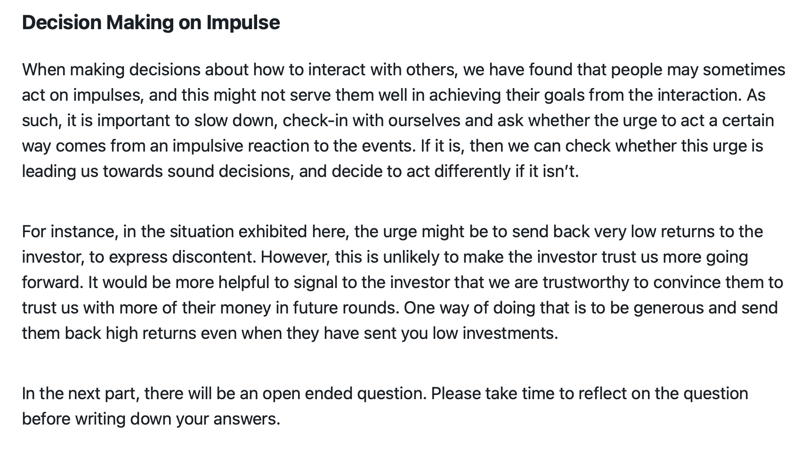

```{r setupCoax, include=FALSE}
knitr::opts_chunk$set(warning = FALSE, message = FALSE, echo = FALSE) 
knitr::opts_chunk$set(out.width = "\\textwidth")
```


```{r load-packages05, include = FALSE}
library(papaja)
library(kableExtra)
require(knitr)
require(citr)
require(bookdown)

# using some functions dplyr, ggpubr, PairedData and sjPlot. Need to be loaded. 
library(tidyverse)
library(afex)
library(PairedData)
library(multcompView)
library(lsmeans)
library(depmixS4)
library(flextable)
library(gridExtra)
library(forcats)
library(ggsignif)


```

```{r analysis-preferences, include = FALSE}
# Seed for random number generation
set.seed(42)
options(tinytex.verbose = TRUE)
```


# Introduction

At the core of social interaction is figuring out the goals, intentions, and decision-making process of the interaction partner. This inference is however fraught with uncertainty, as we cannot reasonably observe these features without prior knowledge of the person. Absent a history of interaction, one needs to decide whether to take the risk of trusting others. @rousseau_introduction_1998 define trust as a "psychological state comprising the intention to accept vulnerability based upon positive expectations of the intentions or behavior of another". As such, whilst trusting and being able to signal trustworthiness are necessary conditions for building and maintaining important social bonds,  the challenge of trust is that it is by construction a risky endeavour. For example, if we deem a person trustworthy, we might decide to take the risk of investing in the relationship hoping for a collaborative outcome. If we misplace our trust, this can come at a high cost to us. Not trusting others is also risky since opportunities may be foregone, and any substitution for trust, such as excessive suspicion, over-reliance on self and other maladaptive strategies are likely to add burden and costs to a person.

Evidence from the literature emphasises the importance of social trust in determining why some people fare better than others physically and mentally [@giordano_trust_2016 ; @meng_multilevel_2014]. It affects the health status of individuals through reinforcing social support networks, maintaining community norms and facilitating collective action. Research into the determinants of psychopathology has linked trust-based constructs to the emergence of mental health disorders. @fonagy_role_2014 identified epistemic trust as an important function of early attachment relationships. Epistemic trust can be defined as the trust in the authenticity and personal relevance of interpersonally transmitted knowledge. It enables individuals to learn from their social environment in dynamic social and cultural contexts. Importantly, it allows the individual receiving social information to let go of their natural self-protective vigilance, dubbed hyper-vigilance. @fonagy_mentalizing_2017 identified hyper-vigilance, or lack of "epistemic trust" which may partially be rooted in adverse childhood experiences, as a key risk factor for the emergence of multiple mental health disorders such as Borderline Personality Disorder and Anti-Social Personality Disorder.

A popular paradigm in the study of the emergence and maintenance of trust is the repeated trust game [@joyce_trust_1995]. In this game, one player takes the role of the "investor" and is provided with a fixed endowment at the start of each trial. They get to decide how much of their endowment to invest with the other player taking the role of the "trustee". The amount that is sent is tripled and the trustee gets to decide, in return, how much of the tripled amount to send back to the investor. If the investor sends a non-zero amount, they express trust in the other player for that round, as the amount they will receive back is uncertain. Assuming the trustee sends back more than the initial investment, they signal trustworthiness to the investor and both players make gains. This scenario would constitute a cooperative exchange and would be mutually beneficial. However, cooperation in this setting is prone to be broken through intentional or simply misinterpreted actions on behalf of either player [@bendor_when_1991]. In order to repair a damaged cooperative equilibrium, players need to infer that their behaviour has violated social norms and offer amends through generous actions at potentially a high cost to them. @king-casas_rupture_2008 links the breakdown of cooperation in trustees with Borderline Personality Disorder to the absence or reduction of activation in brain regions associated with the perception of norm violations. 

Since a lack of epistemic trust is a risk factor for social dysfunction [@fonagy_mentalizing_2017], and given the importance of trust for building and maintaining strong social bonds, interventions to foster and strengthen trust-based cooperation would be highly beneficial to society. Such an intervention would allow people to more easily repair broken relationships, and continue harvesting the benefits of cooperation even in the presence of accidental or intentional social norm violations. In the context of social dilemmas, there have been many attempts at fostering cooperative outcomes through either mechanism design, environment modifications or other. 

Mechanism design, pioneered by @vickrey_counterspeculation_1961, is a field that studies incentive alignment and looks for ways to promote social welfare or revenue maximization, despite self-interest of the individual actors. In the context of social dilemmas, key mechanisms were explored with good effect to foster and maintain the cooperative outcome. @axelrod_evolutionary_1986 studied the emergence and stability of behavioral norms to regulate non-cooperative actions in social settings. He identifies a behavioral norm as a dominant behavioural strategy which is often punished by others when not adhered to. A meta-norm is the propensity to incur a cost in order to enforce a norm. @axelrod_evolutionary_1986 showed that when playing a social dilemma game, individuals have a strong incentive to enforce punishment of defectors lest they are in turn punished by others. This led to a decline of defection. Thus, meta-norms can be seen as a mechanism to promote and sustain cooperation in a population. In the context of the trust game, @charness_investment_2008 explored the effect a third party monitor can have on the amounts sent and received. This third-party's payoff is unaffected by the decisions made by the investor and trustee. However, the study allowed the third party to punish overly selfish trustees or reward Investors making a loss on the interaction. They found that the actions of both players were materially more cooperative in the presence of this third party. @fiedler_effect_2017 found that the introduction of a third party that monitors the investments and returns of the players led to more cooperative behavior, even when the third party had no ability to reward or punish the players. 

Rather than try to modify the mechanism of the game, other approaches focused on intervening directly on the participants. @drazkowski_gratitude_2017 investigated the effect of expressing gratitude on later behaviour in the trust game. The gratitude intervention consisted of thinking about and writing down 5 things that the participants were grateful for in their life. The exercise was repeated over three sessions. Those completing the gratitude intervention reported more positive emotions and this mediated an increase in their investment in one-shot trust games. @burnham_friend-or-foe_2000 primed participants by introducing the investor as either a "friend" or "foe". They found that this priming produces significant differences in both trust (measured by the proportion of endowment sent) and trustworthiness  (measured by the proportion returned) with participants in the "friend" treatment exhibiting over twice as much trustworthiness than those in the "foe" condition. 

Whilst these interventions show that it is possible to improve cooperative outcomes at the start of the game, they did not address how to repair a breakdown of trust that might occur due to intentional or accidental non-cooperative actions by the players. Indeed, cooperative play in the repeated trust game can easily break down when there is a transgressive behavior, such as a nil or very low investment by the investor after cooperation has been established, or a return of the trustee below the investment sent. Such ruptures of cooperation appear frequently when the trustee suffers from mental health disorders affecting the social domain such as Borderline Personality Disorder [@lieb_borderline_2004]. In theses situations, BPD trustees fail to engage in trust repairing behavior such as coaxing the investor through sending high return to signal trustworthiness, and this failure may be linked to a failure to perceive their low returns in the game as a violation of social norms [@king-casas_rupture_2008]. 


<!-- why this particular intervention? Why use this intervention for repair of trust? One motivation which you don't mention is the motivation to use cognitive probes to understand mechanisms of psychotherapy itself - this may be worth introducing.  -->

In devising potential interventions to repair trust, we can derive inspiration from the cognitive interventions championed by successful psychological therapies that aim to improve aspects of interpersonal dysfunction in BPD patients. Whilst there is no proven pharmacological therapy for BPD, some forms of psychotherapy such as Mentalisation Based Therapy (MBT) and Dialectical Behavior Therapy (DBT), have been clinically validated as efficacious approaches to improve various dysfunctional behaviors in BPD patients, including those related to social interaction [@gunderson_borderline_2018]. However, these therapies suffer from a high variability in treatment responses. Determining which interventions are effective for particular patients has been very challenging  [@rudge_mechanisms_2020; @arch_longitudinal_2012]. One promising approach is the study of how specific psychotherapeutic treatment components affect quantitative markers of behavior such as those inferred through computational modelling techniques [@huys_computational_2016]. As such, using specific cognitive probes inspired by therapeutic interventions complemented by computational modelling of behavior in tasks, may allow us to uncover cognitive mechanisms targeted by common forms of psychotherapy, as well as evaluate whether knowledge about these different mechanisms can improve the targeting of existing psychotherapies to different individuals.

In this study, we assess the effectiveness of a cognitive intervention aimed at repairing the potential breakdown of cooperation from a pre-programmed, one-off low investment sent by the investor. The intervention focuses on explaining the potential harm from reciprocating non-cooperative actions and suggesting a non-impulsive course of action to coax the investor back into cooperation. It explicitly articulates the advantages of adopting a coaxing behavior in this setting, and as such, is directly relevant to the task at hand and is very clear about the desired behavior without being overly directive. The idea being that if participants show no response to this type of direct intervention in this setting, then other forms of intervention that may target general processes such as better emotional regulation or better mentalising are then even less likely to show a benefit. As such this intervention can be seen as a litmus test for the success of more "general" forms of cognitive interventions. Moreover, in the event of the intervention's failure, analysis of the resistance to an explicit intervention itself might be worthy of further investigation to understand the mechanism behind the lack of success. 

In this experiment, participants are given the role of the trustee and are randomly assigned to either a control group or an intervention group. They play two instances of the repeated Trust Game facing what they believe are two different players. In between games, they either receive a cognitive intervention (intervention condition) or not (control condition, where participants are asked to solve anagrams). In reality, participants face the same computerised agent in both instances, which is programmed to play according to an HMM fitted to rela players data. We explore whether the intervention has an effect on the behaviour of the trustee and whether the learning is transferred to a new repeated Prisoner's Dilemma game when facing a seemingly new player. 


<!-- DATA WRANGLING  -->
```{r dataLoad, include=FALSE }
d_finished <- readRDS("data/d_finished.RDS")
```


<!-- Before you introduce the tasks, you need to introduce the overall design of the experiment, i.e. the before/after randomized controlled experimental setup. A figure to illustrate this is a good idea. You could then have a section called 'measures' which includes details about each of the tasks (probably including the HMM), questionnaires and also emotion grid, and a section called 'interventions', which contains both the low return and the actual intervention. -->


# Method


## Participants and Design
A total of 318  participants were recruited on the Prolific Academic platform. The mean age of participants was `r round(mean(as.numeric(d_finished$exitSurvey.age), na.rm=TRUE),1)` years. Participants were paid a fixed fee of £5 plus a bonus dependent on their performance. The experiment had a 2 (Condition: Intervention or Control) by 2 (Game : Pre or Post Intervention) design, with repeated measures on the first factor. Participants were randomly assigned to one of the two levels of the second factor. 


## Procedure

```{r timeline,fig.cap = "Overview of the timeline of the experiment detailing the various phases participants go through.", fig.align='center', out.width="80%"}

knitr::include_graphics("figures/timeline.png")

```


Figure \ref{fig:timeline} shows the timeline of the experiment. After reviewing an information sheet about the experiment, participants were informed that there would be three phases to go through, with them facing a different opponent in each phase. They would face the same player throughout the first phase, consisting of the "Investment Game" with several rounds. This was the moniker used for the repeated trust game, and a total of 15 rounds were played.

After reading instructions on how to play the trust game, players were told that they would be assigned the role of the trustee.  A comprehension quiz on the trust game followed the instructions. The first trust game then ensued:  Each round started with an investment stage where the investor decided how much to send to the trustee and that choice was revealed. Immediately afterwards, participants were presented with a two-dimensional field to indicate their emotional state on two dimensions: valence, from unpleasant to pleasant (on the horizontal axis) and arousal, from low arousal to high arousal (on the vertical axis). After selecting a point on the field, participants were asked to decide how much to send back to the investor using a slider ranging from sending back nothing to sending back the whole (tripled) investment. Following that choice, an outcome page summarised both players decisions and showed the total pay-off for each player and the round then concluded. At the end of the game, participants were asked to rate the player they were facing on 4 attributes using a scale from 1 to 10: Trustworthiness, friendliness, cooperativeness and selfishness.

After being randomly assigned to either a control or intervention condition, participants were informed they would be paired with a different player in a second phase of the experiment. This second phase was similar to the first phase in terms of the game played (RTG) and the number of rounds. Finally, players were told they would be paired with a new player in the third phase of the experiment. This third phase consisted of 7 rounds of the prisoner's dilemma game, facing the new player. Throughout all games, players were explicitly told to aim to maximise the number of points as their bonus would depend on the score they accumulated throughout the experiment. The total number of rounds was not communicated to the participants in any of the games played.

After the three phases were completed, participants were asked to complete a series of questionnaires at the end of the experiment. These included: the PAI-BOR measuring Borderline traits [@morey_personality_1991], the DERS measuring Emotion Regulation ability [@gratz_multidimensional_2004] and the RFQ8 for mentalising abilities [@fonagy_development_2016]. Finally, participants were asked a series of questions around how they played each phase. First, participants were asked whether they thought they played differently in the second compared to the first phase of the RTG. Second, participants had to select whether they thought the opponents they faced were human or computer agents. Finally, we revealed to the participants that they faced the same computer agent throughout the RTG. We explained that any change in their perception of the opponent or any change in how the opponent played is due to their own change in behavior as the agent was simply reacting to their actions. Finally, we asked participants to reveal whether this experiment has taught them anything about how they should behave in social situations.


```{r interventionSlide,fig.cap = "Screenshot of the main  slide in the intervention condition", fig.align='center', out.width="80%"}



```

## Interventions

After a total of 15 rounds of the trust game, players were given either an "intervention" or a "control" manipulation. The intervention consisted of presenting a hypothetical scenario in which they were playing the repeated trust game and the investor would send a low investment in a new round after having previously sent higher amounts. Participants were then asked how they would react in this situation and what sort of return (low or high) they were thinking of sending back. The players then were presented with an educational slide about the benefits of not resorting to impulsive decisions such as punishment when they feel they have been wronged. In this text, players were told that punishment can create a negative feedback loop where the other player might trust them even less. An alternative action was suggested, whereby players would respond kindly to such a transgression in the hope of gaining trust from the investor. The full text of the intervention slide is presented in Figure \ref{fig:interventionSlide}. Afterwards, participants were asked whether they would send a low or high return in the same hypothetical scenario now that they have read the information on the slide. Players were asked to justify their answer. For each question during this intervention, participants had to wait for a fixed duration of 20 seconds before being able to write their answers, and they were prevented from proceeding before that time was up.  This choice was made to allow participants to engage with the questions, think about their answers and provide meaningful feedback. 

In the control condition, participants were asked to solve five anagrams ("listen", "triangle", "deductions", "players", "care"). They provided their answers in a free-form text box. The time given to solve the anagrams was the same as that given to respond to questions in the intervention manipulation.  

## Measures

### Repeated Trust Game 
Participants played two iterations of the standard version of the repeated trust game [@joyce_trust_1995]. The game is played in dyads, with one player assigned the role of the "investor" and the other player that of the "trustee". In the variant of the game we chose, the investor is endowed with 20 units at the start of each round. They need to decide how much of that endowment they want to invest with the trustee. The investment is then multiplied by a factor of 3 and sent to the trustee. As shown in Figure \ref{fig:trustGame}, the trustee in turn needs to decide how much of the (multiplied) investment they want to send back to the investor. If they send back more than a third of what they received, then both the investor and the trustee make a gain. Otherwise, the trustee would benefit but the investor would lose on their investment. If the interaction lasts for only one round, the Nash equilibrium of this game is for the investor to send nothing, as there is no incentive for the trustee to send back any return. In the repeated version, to maximise their rewards over time, both players need to build trust so that they can share the benefits of the bigger pie (the investment multiplied by three). If during the course of the interaction, the investor has been rewarded for taking the risk of sending an investment, then they would be more likely to invest more, and the multiplied investment would give both a bigger pie to share. If however the investor felt that they were not getting a return on their investment, then they would refrain from investing and neither would gain from the interaction.


```{r trustGame,fig.cap = "Screenshot of the repeated Trust Game. The game is played in dyads, with one player assigned the role of the investor and the other player that of the trustee. The investor is endowed with 20 units at the start of each round. They need to decide how much of that endowment they want to invest with the trustee. The investment is then multiplied by a factor of 3 and sent to the trustee. The trustee in turn needs to decide how much of the multiplied investment they want to send back to the investor. Shown here is the stage at which the trustee makes a decision of how much to send back the investor", fig.align='center'}

knitr::include_graphics("figures/trust_game.png")

```

### Repeated Prisoner's Dilemma 
The other game the participants played is the repeated Prisoner's Dilemma (RPD). Over multiple rounds, participants could choose one of two actions: A cooperative action that would yield a high pay-off if the other person also cooperated, and the lowest possible pay-off if they did not cooperate. Or a non-cooperative option that would yield a high pay-off if the other person chooses the cooperative action and a lower pay-off if they also defect. Figure \ref{fig:payoffsRPD} shows the payoff of each combination of actions as presented to the participants. 

```{r payoffsRPD,fig.cap = "Screenshot of the Repeated Prisoner's Dilemma game. Over multiple rounds, participants could choose one of two actions: A cooperative action that would yield a high pay-off if the other person also cooperated, and the lowest possible pay-off if they did not cooperate. Or a non-cooperative option that would yield a high pay-off if the other person chooses the cooperative action and a lower pay-off if they also defect. Shown here is the table explaining the payoffs of each combination of actions the participant and their opponent choose", fig.align='center'}

knitr::include_graphics("figures/screenshot_RPD_payoffs.png")

```

### Feedback post investment in the repeated Trust Game

```{r grid,fig.cap = "Screenshot of the two axis grid in the Coaxing condition where participants were asked to report the valence and arousal of their emotional response ", fig.align='center'}

knitr::include_graphics("figures/emotion_grid.png")

```

Whilst playing the RTG, participants were asked to provide some feedback, in each round of the game, after seeing the amount sent by the investor. This feedback took the form of the answer to a question using a two dimensional field. What the axes of the field represented differed by condition. In the intervention condition, participants were asked to rate their emotional state with regard to the other player's choice of investment, with the x-axis representing the valence of the emotion they felt (positive or negative) and the Y-axis representing the emotional "arousal" they experienced (low or high). In the control condition, players were asked to rate attributes of the investment that were not related to their emotion, with the X-axis rating of how fast the investor is (slow or fast) and the Y-axis the magnitude of the investment (low or high). Figure \ref{fig:grid} shows a screenshot of the field in the intervention condition where participants were asked about their own emotional response to the investment. At the beginning of each game, participants were provided with detailed explanations of the meaning of the two axes as well as the opportunity to provide a baseline emotional state through using the field prior to the start of the game.


### Design of the AI agents in the RTG and RPD

```{r}
Anti_social <-  c(0.1025436430408, 0.1221931236853, 0.1345215238995,
0.1368182252617, 0.1285592471751, 0.1116014322677, 0.0895041220882,
0.0663166721334, 0.0453950277118, 0.0287077419587, 0.0167723588011,
0.0090530028158, 0.0045143317507, 0.0020796744990, 0.0008851094702,
0.0003480141146, 0.0001264134789, 0.0000424213859, 0.0000131513231,
0.0000037665630, 0.0000009965755)

Neutral <- c(0.003393529, 0.006930874, 0.013053553, 0.022671228,
0.036310144, 0.053627606, 0.073039389, 0.091734929, 0.106248217,
0.113479701, 0.111769796, 0.101517390, 0.085028780, 0.065675083,
0.046778251, 0.030725245, 0.018610323, 0.010394861, 0.005354126,
0.002543094, 0.001113881)

Pro_social <- c(0.003162697, 0.001057162, 0.001410197, 0.001881016,
0.002508877, 0.003346113, 0.004462480, 0.005950950, 0.007935434,
0.010581067, 0.014107909, 0.018809194, 0.025075644, 0.033427845,
0.044559370, 0.059394206, 0.079163228, 0.105506029, 0.140606514,
0.187373417, 0.249680651)

investment <- seq(0:20) -1

response_probs <- as.data.frame(cbind(investment,Anti_social,Neutral,Pro_social)) %>% 
  rename("low-trust" = "Anti_social", "medium-trust"="Neutral", "high-trust" = "Pro_social") %>%
  pivot_longer(cols=c("low-trust","medium-trust","high-trust"),
                    names_to='Investor_state',
                    values_to='probability') %>% 
   mutate(across(Investor_state, factor, levels=c("low-trust","medium-trust","high-trust")))
```

```{r invHMMPlot, fig.cap="Distribution of investments by the artificial investor agent conditional on its latent state as estimated by a three state hidden Markov model with a discretised truncated Gaussian as a response function",fig.align="center", fig.width=6, fig.height = 4}

ggplot(response_probs,                            
       aes(x = investment,
           y = probability,
           fill = Investor_state)) +
  geom_bar(stat = "identity",
           position = "dodge") + 
  labs(fill='Latent investor state') + 
  theme_bw() + 
  theme(legend.position = "bottom")
  

```


```{r, include=FALSE}

unhappy_pars <- rbind(c(3.5435248 , 0.0592584), c(0.1611541, 0.4675468), c(0,0)) 
neutral_pars <- rbind(c(0.8846036, - 0.4394031), c(2.4214322, - 0.0710711), c(0,0))
happy_pars <- rbind(c(-2.004988 ,- 0.151186), c(-1.2976976 , - 0.1357088), c(0,0))

pars_inv <- list(unhappy_pars, neutral_pars, happy_pars)

plot_HMM_transitions <- function(ns, pars_mat) {

  trans_prob <- data.frame(
    from = rep(1:ns, each=100*ns),
    to = rep(1:ns, each=100),
    ret = seq(-20,60,length=100),
    probs = 0
  )
  
  
  y <- matrix(0.0,ncol=ns, nrow=100)
  
  for(from in 1:ns) {
  pars <- matrix(pars_mat[[from]], ncol=2)
  # print(pars)
  
    for(to in 1:ns) {
        x <- trans_prob[trans_prob$from == from & trans_prob$to == to,"ret"]
        y[,to] <- exp(pars[to,1] + pars[to,2]*x)
    }
    y <- y/rowSums(y)

    
    for(to in 1:ns) {
      trans_prob$probs[trans_prob$from == from & trans_prob$to == to] <- y[,to]
    }
  }
  
  df <- as.data.frame(trans_prob) %>% 
    mutate(from = recode(from, "1" = "low-trust", "2" = "medium-trust", "3" = "high-trust"),
           to = recode(to, "1" = "low-trust", "2" = "medium-trust", "3" = "high-trust") ) %>% 
    mutate(across(from, factor, levels=c("low-trust","medium-trust","high-trust"))) %>% 
    mutate(across(to, factor, levels=c("low-trust","medium-trust","high-trust")))
                                    
  
  ggplot(df,aes(x=ret,y=probs, colour = as.factor(to))) + geom_line() + facet_wrap(~from) + ylim(c(0,1)) +  labs(x = "Investor's Net Return", y = "Transition probability", color='State Transitioned to') + 
    theme_bw() + theme(legend.position = "bottom")


}

```


```{r invHmmTrans, fig.cap="Transition function for investor conditional on current state",fig.align="center", fig.width=6, fig.height = 4}

plot_HMM_transitions(3, pars_inv) 

```

The role of the investor was in reality played by an adaptive artificial agent whose strategy was modelled on the behaviour of human participants taking the role of the investor in the RTG. Using data from human dyadic interaction in the 10 round trust game, we estimate a Hidden Markov Model (HMM) to characterise the investor's behavior as emanating from a small number of latent states [@rabiner_hmm_1989]. In this instance, for both iterations of the repeated trust game, the HMM used was identical: it had three states that can be described as "low-trust", "medium-trust" and "high-trust". Each latent state was associated with a distribution over all possible investor actions (from 0 to 20 investment) that reflected the amount of trust, as presented in Figure \ref{fig:invHMMPlot}. 


<!-- The advantages of this approach is that it does not require any a priori assumptions about the model features. The number of states, the policy conditional on the state, and the transition function between states can all determined in a purely data driven way. These HMMs can in turn be used to simulate a human-like agent playing the trust game. This agent may transition to a new state depending on the other player's actions and adopt a policy reflecting its state, thus simulating changes in emotional dispositions of human players during a repeated game. When the investor gains from the interaction, they become more likely to transition to a state where their policy is to be more trusting and invest more. However, faced with losses, the investor is more likely to transition to a more cautious policy where its investment belies lower trust in the trustee. The policies and the transitions between states are sufficient to build an agent that reflects this type of adaptive behavior and reacts to the trustee's action choices in a way that mimics a human player.  -->


The HMM assumes that the probability of each investment $I_t=0,…,20$, at each trial t, conditional on the current state of the investor $S_t$, is dependent on an underlying normal distribution with mean $\mu_s$ and standard deviation $\sigma_s$. The probability of each discrete investment was determined by the cumulative normal distribution $\Phi$. For instance, the probability of an investment $I_t=2$ is defined as: 

$$P(I_t=2 | S_t=s)= \frac{\Phi(2.5 | \mu_s,\sigma_s ) - \Phi(1.5 | \mu_s,\sigma_s )} {\Phi(20.5 | \mu_s,\sigma_s ) - \Phi(-0.5 | \mu_s,\sigma_s )}$$

Note that the denominator truncates the distribution between 0 and 20. To estimate the transition probability between states for the investor, a multinomial logistic regression model was fitted to the investor's data such as: 

$$P(S_{t+1} = s' | S_t=s , X_t = x)= \frac{\exp(\beta_{0,s,s'} + \beta_{1,s,s'} x)}{\sum_{s''} \exp(\beta_{0,s,s''} + \beta_{1,s,s''} x)}$$ 

where $X_t=R_t-I_t$ is the net return to the investor with  $R_t$ the amount returned by the trustee and $I_t$ is the Investment sent. Figure \ref{fig:invHmmTrans} shows these transition probabilities as a function of the net return conditional on the investor's state. 

For the repeated prisoner's dilemma, we used an artificial agent that was playing according to Tit-For-Tat [@axelrod_evolution_1981]. It started by choosing the cooperative action and then it mirrored whatever the other player played in the previous round.

### AI agents pre-programmed defection

In order to probe efforts to repair trust, we introduced rounds where the investor deviated from the policy provided by the HMM, and chose to send a low investment in the Trust Game, or chose the non-cooperative action in the Prisoner's Dilemma. In the trust games, we programmed the HMM agent to send a very low investment (2 out of 20) to the trustee on specific rounds (round 12 pre-intervention and 13 post-intervention). For the repeated Prisoner's Dilemma game, we programmed the agent to choose the non-cooperative action on round 4. After each "defection" round, the agents were programmed to proceed their policy from before that round, effectively ignoring the participants' response to their defection. For instance, the HMM investor would send an investment in the post defection round that was consistent with the outcome of the round immediately prior to that round. For the RPD, the agent would continue to play tit-for-tat, but also ignoring what happened in the defection round, and basing its action on mirroring what the other player did in the round immediately prior to the defection round. This ignorance of reactions to the defection rounds was chosen to reflect an accidental defection, with the Investor being open to repair subsequent interaction. 


<!-- ## Statistical analysis of Behavior -->

<!-- Since we aim to compare pre and post intervention measures between groups, we have to analyse repeated measures. To do that we will use linear mixed effects models as implemented in the R package "afex" [@singmann_afex_2022]. When models contain interactions between variables that involve continuous covariates such as the "Investment", we standardise the continuous covariate by transforming it into a z-score. This allows us to correctly interpret the coefficient of the interaction variable.  For the $F$-tests, we used the Kenward-Roger approximation to the degrees of freedom, as implemented in the R package "afex".  -->

<!-- ## Computational analysis of trustee returns -->

<!-- In order to characterise the effect of the intervention on the trustees strategy, we fit a Hidden Markov Model to the percentage returns of the trustees for the RTG data. The model allows for switching between latent trustee states over time. Hidden Markov models assume that an observable trustee return at time $t$ depends on a latent trustee state at time $t$. It is assumed that the latent state at time $t$ depends on the latent state at the previous time $t-1$. The model is specified by the state-conditional action distributions (these are provided by the likelihood of the fitted models), an initial state distribution (the distribution over the strategies at the initial round), and the state-transition probabilities (probability of switching from one state/strategy to another). Initial state probabilities and the transition probabilities were estimated with the depmixS4 package [@visser_depmixs4_2021]. -->

### HMM analysis of participants returns in the RTG

To model participants returns in the RTG across games and conditions, we used an HMM response function based on a discretised Gaussian distribution that takes into account what proportion the trustee would ideally like to return, and what returns are possible given the investment. For instance, if the investor sends an amount of $2$, the trustee would receive $6$ and they can send back any amount between $0$ and $6$. As such, we assume that the response is a distribution over proportions that can be calculated from these possible returns, i.e. $\{0,1/6, 2/6,...,1 \}$. The model assumes an underlying Normal distribution for each possible proportional return, predicting the probability of each via the cumulative Normal distribution with cut-off points set halfway between the proportions (e.g. the probability of returning 1/6 is determined as the probability of returning anything between 1/12 and 3/12).  The transition between states is assumed to depend on the investment through a multinomial logistic function such as:

$$P(S_{t+1} = s' | S_t=s , X_t = x)= \frac{\exp(\beta_{0,s,s'} + \beta_{1,s,s'} \ \text{inv} + \beta_{2,s,s'} \ x)}{\sum_{s''}\exp(\beta_{0,s,s''} + beta_{1,s,s'} \ \text{inv} + \beta_{2,s,s'} \ x)}$$ 

where $\text{inv}$ is a variable representing the investment received, $x$ is a dummy variable to characterise the group that the participant belongs to. We define four contrast codes for these dummy variables: pre-post (comparing pre and post games), post-coax (compares the post-intervention group to all others), post-control (compares the post-control group to all others) and full-contrast (a three level dummy variable: post-intervention compared to post-control and  all pre games).  

Having defined these contrast codes, we then fit HMM models where the transition function between latent states depends both on the investment received and depending on the model, one of the aforementioned contrast codes. To select the number of hidden states governing participants' policies, we fit models with different numbers of hidden states, and use the Bayesian Information Criterion [@schwarz_estimating_1978] to select the best model.

# Behavioral results

<!-- Our investment levels are clearly comparable. Our random matching condition is the most directly comparable to Berg et al., (1995) and Charness et al., (2008), both of whom used random matching. Our investment averages 4.97 out of 10 in the individual feedback condition, which falls right in between the investment level of 5.16 documented by Berg et al., (1995) and the 3.73 documented by Charness et al., (2008). The amount returned in the individual feedback condition with random matching is 5.61, which is slightly higher than the amounts returned in Berg et al., (1995) of 3.73 and Charness et al., (2008) of 4.65. The 19% return rate is comparable to results in similar designs. In an almost identical design, Fiedler et al., (2011) report a 17% return rate by responders. This is similar to our finding.  -->

```{r dataClean, include=FALSE}
# Filter only trust rounds and create % returns and investments 

avg_ret_df <- d_finished %>%
  dplyr::select(id, condition.f,roundType,investment,returns,roundNum,gameNum.f,BPD_trait,PBOR_score,DERS_score,RFQ_c,RFQ_u) %>% 
  mutate( condition.f = fct_recode(condition.f, "intervention" = "coaxing"))%>%
  filter(roundType=="trust",!is.na(roundNum)) %>% 
  mutate(roundNum = as.numeric(as.character(roundNum))) %>%
  mutate(inv_scaled = scale(investment)) %>% 
  mutate(inv_pct = investment/20, ret_pct = returns/(3*investment), ret_pct_0 = ifelse(investment==0,0,returns/(3*investment)))  %>% 
  # Creating Quartiles of % returns by participant over BOTH TRUST GAMES
  group_by(id) %>% 
  mutate(mean_pct_ret = mean(ret_pct), mean_abs_ret = mean(returns), mean_inv = mean(investment)) %>%
  ungroup() %>% 
  mutate(Quart_pct_ret = ntile(mean_pct_ret,4),
         Quart_abs_ret = ntile(mean_abs_ret,4),
         Quart_inv     = ntile(mean_inv, 4)) 

# %>%
#   filter(complete.cases(.))   # <- one player had NA in one round as a return, so we exclude him from analysis. 


# Number of people left for analysis. 
nrow(avg_ret_df %>% filter(condition.f == "intervention"))/30
nrow(avg_ret_df %>% filter(condition.f == "control"))/30

# average investment for first 10 rounds pre intervention
avg_pct <- avg_ret_df %>% filter(roundNum < 11 , gameNum.f == "pre") %>% summarise(avg_inv = mean(inv_pct), avg_ret = mean(ret_pct, na.rm=TRUE))
```

For the outcomes of the RTG, we first check the benchmark results for the average investment and return to see if they are comparable to results in the literature. We focus on the first 10 rounds pre-manipulation (the first RTG) and pre-defection trial to exclude the effects of the investor's transgression and those of the intervention and to have a comparable number of rounds to the standard version of the RTG. The average investments and returns were within the range of reported investments (40-60% of endowment) and returns (35-50% of total yield) in the literature, and hence comparable to other implementations of this task reported in the literature [@charness_investment_2008; @fiedler_social_2011].

<!-- Investments averaged `r round(avg_pct$avg_inv,3)*100` $\%$ of endowment which is less than the $63.2\%$ documented by @fiedler_social_2011 and higher than the $37.3%$ documented by @charness_investment_2008, although the latter used repeated one shot games with random matching. Returns averaged `r round(avg_pct$avg_ret,3)*100` $\%$  of the total yield (3x investment sent), which is higher than the $35\%$ found in the same setting in @fiedler_social_2011.  -->

```{r gamesPlot, echo=FALSE, fig.cap="Average and standard errors of the trustee's return as a percentage of the multiplied investment received for each round and for both conditions. The red line shows the returns pre-manipulation and the blue line post-manipulation. ",fig.align="center", fig.width=6, fig.height = 4}

# colors <- c("investment" = "blue", "returns" = "red")
# 
# ggplot(avg_ret_df,aes(x=as.factor(roundNum),group = 1)) +
#   stat_summary(fun = "mean", geom = "line", aes(y=returns, color ="returns")) +
#   stat_summary(fun.data = "mean_se", geom = "errorbar", alpha =0.3, width = 0.2, aes(y=returns) ) +
#   stat_summary(fun = "mean", geom = "line", alpha =0.4,aes(y=investment, color = "investment")) +
#   stat_summary(fun.data = "mean_se", geom = "errorbar", alpha =0.3, width = 0.2, aes(y=investment) ) +
#   facet_wrap(~condition.f*gameNum.f) +
#   labs(x = "Round",
#        y = "Investment / Return",
#        color = "Legend") +
#   scale_color_manual(values = colors) +
#   theme_bw() +
#   theme(legend.position = "bottom") 

# Alternative chart with pre vs post percentage returns in one panel as suggested by QH.

ggplot(avg_ret_df ,aes(x=as.factor(roundNum),group=gameNum.f, color = gameNum.f)) +
  stat_summary(fun = "mean", geom = "line", aes(y=ret_pct)) +
  stat_summary(fun.data = "mean_se", geom = "errorbar", alpha =0.3, width = 0.2, aes(y=ret_pct) )+
  labs(x = "Round",
       y = "Percentage Return",
       color = "Game") +
  # ylab("Percentage Return") +
  # xlab("Round") +
  theme_bw() +
  theme(legend.position = "bottom") +
  facet_wrap(~condition.f)

```
Figure \ref{fig:gamesPlot} shows the average and standard error of trustee returns as a percentage of the total yield (3 x investment) over the full 15 rounds for both conditions and both RTG games. We note a different reaction to the pre-programmed one-off low investment between the two conditions: Whilst there is a dip in returns pre-manipulation for both conditions,  post manipulation we see higher returns in the intervention condition compared to the dip in returns seen in the control condition in the right panel. 

To explore whether participants behaved differently after the intervention compared to the control group over all rounds, we estimate a linear-mixed effects model, with fixed effects for Condition (intervention or control), Game-number (pre- or post-intervention) and Investment, as well as interactions between Condition and both Investment and Game-number, and participant-wise random intercepts and random slopes for Game-number. We Z-transform the Investment variable as centering is beneficial to interpreting the main effects more easily in the presence of interactions. More complex models with additional random effects provided could not be estimated reliably.

```{r, include=FALSE, cache=TRUE}

mod_returns_pct <- mixed( ret_pct ~ gameNum.f*condition.f*inv_scaled+ (1 + gameNum.f| id), avg_ret_df, REML= TRUE)
anova(mod_returns_pct)
summary(mod_returns_pct)


prepost_bycond <- pairs(emmeans::emmeans(mod_returns_pct, c("gameNum.f"), by = "condition.f", pbkrtest.limit = 9400))


```

```{r afexPLotPctRet, fig.cap="Marginal means and distributions of percentage trustee returns over all rounds, shown across participants by Game number and Condition",fig.align="center", fig.width=6, fig.height = 4}
afex::afex_plot(mod_returns_pct, x = "gameNum.f", trace = "condition.f", dodge = 0.8, error = "within",
            mapping = c("linetype", "shape", "fill"),
            data_geom = geom_violin, 
            data_arg = list(width = 0.5),
            factor_levels = list(gameNum.f = c("Pre", "Post")), legend_title = "Condition") + 
  theme_bw() + 
  labs(y = "Percentage Return", x = "Game") + 
  theme(legend.position = "bottom") +
            
```

Estimated marginal means of percentage returns as well as the distribution of the returns for participants across all trials are presented in Figure \ref{fig:afexPLotPctRet}. If the intervention has an effect, then we should expect a higher increase in returns after the intervention compared to the control condition, which should be evident from an interaction between Condition (intervention vs control) and Game-number (pre- vs post-manipulation). Therefore, the variable of interest here is the interaction between Condition and Game-number. We do find an interaction effect due to an increase in the percentage returned in the intervention but not in the control group ($F(1,314.2) =  26.9, p < 0.001$). We also find a significant main effect for Condition ( $F(1,315.31) = 9.52, p = 0.002)$), which is due to participants returning higher percentage returns, in the post game, in the intervention group ($p < 0.001$), and lower returns in the control group ($p = 0.02$). We also find a main effect of Investment due to higher percentage returns being sent back for higher investments ( $F(1,9208) = 373.6, p < 0.001$), and an interaction effect of Investment by Condition ($F(1,9207) =45.38, p < 0.001$), with investments having less of a positive effect on the percentage returns in the intervention group compared to the control group. The latter effect indicates that the higher returns we see in the intervention group are unlikely to be purely driven by higher investments. Finally, we find a three way interaction between Game-number, Condition and Investment ($F(1,8988)= 24.6, p < 0.001$), showing that the differentiated effect of the investment on the proportion returned by condition is itself moderated by the Game-number.


```{r, include=FALSE, cache=TRUE}
mod_invs <- mixed( investment ~ gameNum.f*condition.f  + (1 + gameNum.f| id), avg_ret_df )
summary(mod_invs)
anova(mod_invs)

# pairs(emmeans::emmeans(mod_invs, c("condition.f"), by = "gameNum.f" ))
# 
# pairs(emmeans::emmeans(mod_invs,c("gameNum.f") , by = c("condition.f")))
# 
# pairs(emmeans::emmeans(mod_invs, c("gameNum.f")))
# pairs(emmeans::emmeans(mod_invs, c("condition.f")))

 
```

```{r afexPlotInv, fig.cap="Marginal means and distributions of investments over all rounds for HMM agents playing the role of the investor, by Game number and Condition.",fig.align="center", fig.width=6, fig.height = 4}

afex_plot(mod_invs, x = "gameNum.f", trace = "condition.f", dodge = 0.8, error = "within",
            mapping = c("linetype", "shape", "fill"),
            data_geom = geom_violin,
            data_arg = list(width = 0.5),
            factor_levels = list(gameNum.f = c("Pre", "Post")), 
            legend_title = "Condition") + 
  theme_bw() + 
  labs(y = "HMM Investment", x = "Game") + 
  theme(legend.position = "bottom")
          

```

Since the artificial agent taking the role of the investor adapts its behavior to the actions of the participants, we can analyse whether the HMM agent exhibits a differentiated behavior between games and conditions.  We use a linear-mixed effects model, with fixed effects for Condition (intervention or control), Game-number (pre or post intervention), as well as interaction between Condition and Game-number, and participant-wise random intercepts and random slopes for Game-number. We find a main effect for both Condition ($F(1,317) = 8.7, p = 0.003$) and Game-number($F(1,317) = 8.3, p = 0.004$). As can be seen in Figure \ref{fig:afexPlotInv}, investment was higher in the intervention compared to the control condition across games ($p=0.003$). Across conditions, investment was also higher in the second game compared to the first ($p=0.003$). 

In summary, participants in the control group sent back **lower** returns in the second game (`r apa_print(prepost_bycond)$full_result$control`) despite the HMM investor sending, on average higher absolute investments. Those in the intervention group returned **higher** percentage returns in the second game (`r apa_print(prepost_bycond)$full_result$intervention`), with the investor also sending higher investments. We can rule out that these higher returns in the intervention group compared to the control group were purely driven by higher investments. If that was the case, then we would expect the presence of the Investment variable in our model of returns to lead to a non-significant interaction between Game-number and Condition. Since we find the interaction effect whilst controlling for Investment, this suggests this effect is not purely explained by the change in investments.


## Pre-defection trials 

```{r, include=FALSE, cache=TRUE}
# ALL ROUNDS BEFORE DEFECTION TRIAL
pre_int_data <- avg_ret_df %>% filter(roundType=="trust",!is.na(gameNum.f),(roundNum < 12 & gameNum.f =="pre")| (roundNum < 13 & gameNum.f =="post"))

mod_returns_pre <- mixed( ret_pct ~ gameNum.f*condition.f*inv_scaled+ (1 + gameNum.f| id), pre_int_data, REML= TRUE)
anova(mod_returns_pre)
summary(mod_returns_pre)


pairs_pre_int <- pairs(emmeans::emmeans(mod_returns_pre, c("gameNum.f"), by = "condition.f", pbkrtest.limit = 9400, reverse=TRUE))

```
Since we observed higher returns pre-defection trials, we can also explore whether there was differentiated behavior if we restrict our analysis to the rounds prior to the pre-programmed one-off investment (rounds 1 to 11 pre-manipulation and 1 to 12 post-manipulation). We fit the same linear mixed effects model to percentage returns as the one for the full data. Estimated marginal means of percentage returns as well as the distribution of the returns for participants across all trials are presented in Figure \ref{fig:preCoaxPlot}. We do find an interaction effect between Condition and Game number ($F(1,317.99) =  17.1, p < 0.001$). This was due to an increase in the percentage returned pre low-investment trial in the intervention condition (`r apa_print(pairs_pre_int)$full_result$intervention`) but not in the control group (`r apa_print(pairs_pre_int)$full_result$control`). This indicates that the differentiated behavior we saw, where participants were sending back higher returns in the intervention condition but not in the control condition, was not simply due to their reaction post the low-investment trial. The higher returns were consistent with the message of the intervention, but have also happened, on average across participants, before the participants experienced the event similar to the one described in the intervention. 

```{r preCoaxPlot, fig.cap="Marginal means and distributions of percentage trustee returns across all participants for pre-defection trials only, by Game number and Condition.",fig.align="center", fig.width=6, fig.height = 4}
afex_plot(mod_returns_pre, x = "gameNum.f", trace = "condition.f", dodge = 0.8, error = "within",
            mapping = c("linetype", "shape", "fill"),
            data_geom = geom_violin,
            data_arg = list(width = 0.5),
            factor_levels = list(gameNum.f = c("Pre", "Post")), 
            legend_title = "Condition") + 
  theme_bw() + 
  labs(y = "Percentage Return", x = "Game") + 
  theme(legend.position = "bottom")
```


## Defection and post defection trials 

The interventions focused on repairing cooperation in the wake of a transgressive action by the investor. To assess the effect of the intervention, we can therefore consider the percentage return after the "transgression" trials. We fit the same linear mixed effects model to percentage returns as the one for the full data. We now restrict the data to rounds 12 to 15 in the first game, and 13 to 15 in the second game. These trials represent all trials after the pre-programmed defection of the investor (low investment of $2$) until the end of the game (round 15). 

```{r, include =FALSE}

# Defection trial only 
coax_data <- avg_ret_df %>%  filter(roundType=="trust",!is.na(gameNum.f),(roundNum == "12" & gameNum.f =="pre")| (roundNum == "13" & gameNum.f =="post"))

coax_data %>% group_by(gameNum.f, condition.f) %>% summarise(avg_inv = mean(investment),avg_return = mean(returns))


# ALL ROUNDS AFTER DEFECTION TRIAL (INCLUSIVE)
post_coax_data <- avg_ret_df %>% filter(roundType=="trust",!is.na(gameNum.f),(roundNum >= 12 & gameNum.f =="pre")| (roundNum >= 13 & gameNum.f =="post"))

post_coax_data %>% group_by(gameNum.f, condition.f) %>% summarise(avg_inv = mean(investment),avg_return = mean(returns))


```

```{r, include=FALSE, cache=TRUE}

mod_postcoax_trust <- mixed(ret_pct ~ gameNum.f*condition.f*inv_scaled  + ( 1 + gameNum.f|id), post_coax_data)
anova(mod_postcoax_trust)


postcoax_bygame <- emmeans::emmeans(mod_postcoax_trust, ~gameNum.f, pbkrtest.limit = 9400)
postcoax_bycond <- emmeans::emmeans(mod_postcoax_trust, ~condition.f, pbkrtest.limit = 9400)

postcoax_interaction <- emmeans::emmeans(mod_postcoax_trust, c("gameNum.f"), by = "condition.f", pbkrtest.limit = 9400)
postcoax_interaction

pairs(emmeans::emmeans(mod_postcoax_trust, c("gameNum.f"), by = "condition.f"))
```

```{r postCoaxPlot, fig.cap="Marginal means and distributions of percentage trustee returns across all participants for post-defection trials only, by Game number and Condition.",fig.align="center", fig.width=6, fig.height = 4}
afex_plot(mod_postcoax_trust, x = "gameNum.f", trace = "condition.f", dodge = 0.8, error = "within",
            mapping = c("linetype", "shape", "fill"),
            data_geom = geom_violin,
            data_arg = list(width = 0.5),
            factor_levels = list(gameNum.f = c("Pre", "Post")), 
            legend_title = "Condition") + 
  theme_bw() + 
  labs(y = "Percentage Return", x = "Game") + 
  theme(legend.position = "bottom")
```


Figure \ref{fig:postCoaxPlot} shows the marginal means of trustee returns and their distribution by Game-number and Condition. We found a main effect of Condition with returns on the intervention group higher than returns in the control group (`r apa_print(pairs(postcoax_bycond))$full_result$intervention_control`). We also found a main effect of Game-number, with returns higher for the pre-manipulation game compared to the post-manipulation game  (`r apa_print(pairs(postcoax_bygame))$full_result$pre_post`).
In addition, there was a significant interaction between Game-number and Condition. We found a significant decrease in returns between games in the control condition (`r papaja::apa_print(pairs(postcoax_interaction, by = "condition.f", reverse=FALSE))$full_result$control_pre_post`), but no such difference in the intervention condition (`r papaja::apa_print(pairs(postcoax_interaction, by = "condition.f", reverse=FALSE))$full_result$intervention_pre_post`).


## Emotion self-reports

```{r, include=TRUE}

# Get Emotions on x axis per round (valence)
emo.x <- d_finished %>% 
  mutate( condition.f = fct_recode(condition.f, "intervention" = "coaxing")) %>% 
  dplyr::select(id,roundType,condition.f,contains("emotionGrid")) %>% 
  dplyr::filter(roundType=="trust") %>% dplyr::select (-contains(".y") ) %>% pivot_longer(cols=contains(".x"), names_to = c("gameNumber","roundNum"), names_pattern ="return_trust_emotionGrid_(.*)_(.*)[.]x", values_to = "emo_coord_x") %>%
  distinct()  


#Get emotions on y axis (arousal)
emo.y <- d_finished %>%
  mutate( condition.f = fct_recode(condition.f, "intervention" = "coaxing")) %>%
  dplyr::select(id,roundType,condition.f,contains("emotionGrid")) %>% 
  dplyr::filter(roundType=="trust") %>% dplyr::select(-contains(".x") ) %>% pivot_longer(cols=contains(".y"), names_to = c("gameNumber","roundNum"), names_pattern ="return_trust_emotionGrid_(.*)_(.*)[.]y", values_to = "emo_coord_y") %>%
  distinct()  


# put emotions in one dataframe
full_emo <- full_join(emo.x,emo.y, by=c("id", "gameNumber","roundNum","roundType", "condition.f"))  %>% 
  mutate(roundNum=as.numeric(as.character(roundNum))) %>% 
  mutate(gameNum.f = factor(gameNumber,labels = c("pre","post"),levels=c("1","2"))) %>% 
  dplyr::select(-c("roundType","gameNumber")) %>% 
  group_by(condition.f) %>% 
  mutate(emo_scaled_x = scale(emo_coord_x), emo_scaled_y= -scale(emo_coord_y))  %>%    # <--- SCALING and reversing Y coordinates (0,0 is top left)
  ungroup()
  

#merge with returns dataframe
full_dat <- full_join(avg_ret_df, full_emo, by = c("id","condition.f","gameNum.f","roundNum" )) %>% filter(complete.cases(.))
#nrow(full_dat)

datCoax <- full_dat %>% filter(condition.f=="intervention")
datCtrl <- full_dat %>% filter(condition.f=="control")

```

```{r emoPlotCoax, fig.cap="Self-reported emotion valence and arousal as well as investment z-scores for each round of the repeated Trust Game averaged across participants in the intervention condition only.",fig.align="center", fig.width=6, fig.height = 4}

colors <- c("Investment" = "blue", "Valence" = "red", "Arousal" = "green")
ggplot(datCoax,aes(x=roundNum)) + 
  stat_summary(fun = "mean", geom = "line",group =1, aes(y=emo_scaled_x, color = "Valence")) + 
  stat_summary(fun = "mean", geom = "line",group =1, aes(y=emo_scaled_y, color = "Arousal") ) + 
  stat_summary(fun = "mean", geom = "line",group =1, aes(y=scale(investment), color = "Investment") ) + 
  # 
  # stat_summary(fun = "mean", geom = "point",shape=15, size=2.5,group=1,  alpha =0.3,aes(y=investment/10,color = "Investment")) +
  # scale_y_continuous(name="Valence/Arousal z-score", sec.axis=sec_axis(~./0.1, name="investment")) +
  scale_color_manual(name = " ",values = colors,labels = c("Investment", "Emotion valence", "Emotion arousal")) +
  labs(x = "Round", y="Series Z-score") +
  geom_hline(yintercept = 0, linetype="dotted", color = "grey", linewidth=1.5) +
  facet_grid(cols = vars(gameNum.f) ) +
  theme_bw() + 
  theme(legend.position = "bottom")

```

The results of the mixed-effects model of returns suggest that returns of participants in the intervention condition were less associated with the magnitude of the investment compared to those in the control condition. We can explore whether the emotional reaction to the investment was also lessened in the intervention condition through analysing the self-reported emotions on the two-axes feedback field.  Figure \ref{fig:emoPlotCoax} shows the average, across participants *in the intervention condition*, of emotion valence, the degree of arousal as well as the HMM's investment z-scores. We find a significant positive correlation between the two emotion axis ($r=0.52, p < 0.001$) as well as between valence and Investment ($r=0.47, p < 0.001$), and arousal and Investment ($r=0.50, p < 0.001$). Unsurprisingly, the low investment in the pre-determined defection round leads to negatively valenced emotions. Perhaps less expected is that they also lead to low arousal. We fit a linear mixed effects model to both emotion dimensions (valence and arousal) for the intervention group to explore whether the intervention changed the emotional appraisal of the investment, with fixed effects for Game-number (pre or post intervention) and Investment, as well as interaction between Investment and Game-number, with participant-wide random intercepts and random slopes for Game-number. 
```{r, include=FALSE}

mod_emo_x <- mixed( emo_scaled_x ~ gameNum.f*scale(investment) + (1 + gameNum.f| id), datCoax )
summary(mod_emo_x)
anova(mod_emo_x)

modVal <- emmeans::emmeans(mod_emo_x, ~gameNum.f)
pairs(modVal)


mod_emo_y <- mixed( emo_scaled_y ~ gameNum.f*scale(investment) + (1 + gameNum.f| id), datCoax )
summary(mod_emo_y)
anova(mod_emo_y)

modArousal <- emmeans::emmeans(mod_emo_y, ~gameNum.f)
pairs(modArousal)

# afex_plot(mod_emo_x, x = "gameNum.f", trace = "condition.f", dodge = 0.8, error = "within",
#             data_geom = geom_violin, 
#             data_arg = list(width = 0.5))
# 

# library(GGally)
# ggpairs(datCoax %>% dplyr::select(emo_scaled_x,emo_scaled_y,inv_scaled))

cor(datCoax %>% dplyr::select(emo_scaled_x,emo_scaled_y,investment))
cor.test(datCoax$emo_scaled_x, datCoax$emo_scaled_y)
```

For emotional valence, we find a main effect of Investment ($F(1,4664) = 2902, p < 0.001$), with higher investment leading to more positive emotions. We also find a main effect for Game-number, due tothe reported emotional valence of investments decreasing significantly after the intervention ($\Delta M = 0.11, 95\% \ CI = [0.05, 0.18], t(\infty) = 3.72, p < .001$). For emotional arousal, fitting a similar mixed effects model we find only a main effect of Investment  ($F(1,4668.4) = 1919, p < 0.001$) with higher investment leading to higher arousal. These effects are still present if we exclude the defection trial. We did not find any interaction between emotional valence or arousal and the investment, which would indicate a moderating effect of the intervention on the reaction to investments.

## Player rating

One possible reason of the differentiated returns post manipulation between conditions is that participants had a different perception of the investor, post-manipulation, in the control condition compared to the control condition. To explore this possibility, we can determine whether participants rated their artificial opponents differently between conditions (intervention vs control) and games (pre- vs post-intervention) using the players ratings they had to submit at the end of each game. To analyse the participants rating of their opponents, we used a linear mixed-effects model for each of the four players ratings (cooperativeness, selfishness, trustworthiness, friendliness) with fixed effects for Game-number (pre or post manipulation) and Condition (intervention or control), as well as interaction between condition and Game-number, and participant-wise random intercepts. 

```{r, include=FALSE}

# Pivot longer ratings on each attribute 
df_coop <- d_finished %>% dplyr::select(id,condition.f,contains("cooperative")) %>%  
  pivot_longer(cols=contains("cooperative"), names_to = c("gameNumber"), names_pattern ="rating_cooperative_(.*)", values_to = "rating_coop") %>% distinct()

df_selfish <- d_finished %>% dplyr::select(id,condition.f,contains("selfish")) %>% 
  pivot_longer(cols=contains("selfish"), names_to = c("gameNumber"), names_pattern ="rating_selfish_(.*)", values_to = "rating_selfish") %>% distinct

df_trustworthy <- d_finished %>% dplyr::select(id,condition.f,contains("trustworthy")) %>% 
  pivot_longer(cols=contains("trustworthy"), names_to = c("gameNumber"), names_pattern ="rating_trustworthy_(.*)", values_to = "rating_trustworthy") %>% distinct() 

df_friendly  <-  d_finished %>% dplyr::select(id,condition.f,contains("friendly")) %>% 
  pivot_longer(cols=contains("friendly"), names_to = c("gameNumber"), names_pattern ="rating_friendly_(.*)", values_to = "rating_friendly") %>%  distinct()  

#merge all data frames together
datRatings <- list(df_coop, df_selfish,df_trustworthy, df_friendly) %>% 
              reduce(full_join, by=c('id','gameNumber','condition.f') ) %>% 
              mutate(gameNum.f = factor(gameNumber,labels = c("pre","post"),levels=c("1","2")))

# Group means for each rating 
mu <- datRatings %>% group_by(gameNum.f, condition.f) %>% summarise(mean_coop = mean(rating_coop),
                                                  mean_selfish = mean(rating_selfish),
                                                  mean_trustworthy = mean(rating_trustworthy),
                                                  mean_friendly = mean(rating_friendly)
                                                  )
```


```{r, include=FALSE}


# Cooperative
coop_mod <- mixed(rating_coop ~ gameNum.f*condition.f + (1 | id), datRatings)
summary(coop_mod)

pairs(emmeans::emmeans(coop_mod, c("gameNum.f"), by = "condition.f"))

#Selfish
self_mod <- mixed(rating_selfish ~ gameNum.f*condition.f + (1 | id), datRatings)
summary(self_mod)
pairs(emmeans::emmeans(self_mod, c("gameNum.f"), by = "condition.f"))

#Trustworthy 
trust_mod <- mixed(rating_trustworthy ~ gameNum.f*condition.f + (1 | id), datRatings)
summary(trust_mod)
pairs(emmeans::emmeans(trust_mod, c("gameNum.f"), by = "condition.f"))


#Friendly
friend_mod <- mixed(rating_friendly ~ gameNum.f*condition.f + (1 | id), datRatings)
summary(friend_mod)
pairs(emmeans::emmeans(friend_mod, c("gameNum.f"), by = "condition.f"))

# Conduction t-tests 
# t.test(rating_coop ~ gameNumber, data = datRatingsCoax, paired = TRUE)
# t.test(rating_selfish ~ gameNumber, data = datRatingsCoax, paired = TRUE)
# t.test(rating_trustworthy ~ gameNumber, data = datRatingsCoax, paired = TRUE)
# t.test(rating_friendly ~ gameNumber, data = datRatingsCoax, paired = TRUE)


```

We find a main effect of Game-number on all attributes, with participants rating the second player as less cooperative (`r apa_print(pairs(emmeans::emmeans(coop_mod, c("gameNum.f"))))$full_result$pre_post`), less trustworthy (`r apa_print(pairs(emmeans::emmeans(trust_mod, c("gameNum.f"))))$full_result$pre_post`), less friendly (`r apa_print(pairs(emmeans::emmeans(friend_mod, c("gameNum.f"))))$full_result$pre_post`) and more selfish(`r apa_print(pairs(emmeans::emmeans(self_mod, c("gameNum.f"))))$full_result$pre_post`). We also find a main effect of Condition as participants in the intervention condition rated players higher than those in the control condition on cooperativeness (`r apa_print(pairs(emmeans::emmeans(trust_mod, c("condition.f"))))$full_result$coaxing_control`) and lower on selfishness  (`r apa_print(pairs(emmeans::emmeans(self_mod, c("condition.f"))))$full_result$coaxing_control`). There was no evidence for an interaction effect between Game-number and Condition on any of the attributes. 

<!-- However, breaking down the interaction term by Condition, we find that participants rated the post-intervention player significantly lower on all positive attributes and higher on the negative one (selfish). There was no such difference in player ratings the control condition. -->


## Transfer to the Prisoner's Dilemma Game 

```{r, include=FALSE}

PD_data <- d_finished %>%
  mutate( condition.f = fct_recode(condition.f, "intervention" = "coaxing")) %>%
  dplyr::select(id, condition.f,roundType,roundNum, PDoption,PDchoice, AiChoicePD,gameNum.f, PBOR_score) %>% 
                          filter(roundType == "PD",!is.na(roundNum)) %>% 
                          dplyr::mutate(coop = ifelse(PDchoice=="cooperate",1,0),phase = ifelse(roundNum <= 4, 0,1)) 

# Average cooperation rates per round
#PD_data %>% group_by(roundNum, condition.f) %>% summarise(coopRate = mean(coop))
```

```{r PDCoop, fig.cap="Mean and standard error of the rate at which the cooperative action was chosen by the participants for each round of the repeated Prisoner's Dilemma game. The decrease of cooperation seen from round 5 onwards is likely due to a pre-determined defection of the agent in round 4",fig.align="center", fig.width=6, fig.height =3}
# plot of cooperation rates per round
ggplot(PD_data,aes(x=roundNum,group = 1)) + 
  stat_summary(fun = "mean", geom = "line", aes(y=coop), color ="red") + 
  stat_summary(fun.data = "mean_se", geom = "errorbar",alpha =0.3, width = 0.2, aes(y=coop) ) + 
  facet_grid(~ condition.f) +
  xlab("Round") + 
  ylab("Cooperation rate (%)") +
  scale_x_continuous(breaks = round(seq(1,10, by = 1),1)) + 
  theme_bw()

```

```{r, include=FALSE}

ipd_mod <- mixed(coop ~ condition.f * phase + (1 |id), data= PD_data, method = "LRT", family= "binomial") 
summary(ipd_mod)

ipd_mod_r5 <- glm(coop ~ condition.f, data= PD_data%>% filter(roundNum >= 5)) 
summary(ipd_mod_r5)

```

If the intervention successfully increased coaxing behaviour in participants, we would hope they generalized this to other games beyond the Trust Game. Across participants, we first look at the rate at which the cooperative action was chosen in each round. Figure \ref{fig:PDCoop} shows the mean and standard error of the cooperation rate by round. Round 4 is where we programmed the Tit-for-Tat agent to defect, which explains the lower cooperation rate we see in round 5 onwards. Using a logistic mixed-effects model with Condition and Phase (before or after defection trial) as fixed effects and a random intercept for participants, we found no evidence for a different cooperation rate in the intervention condition compared to the control condition. We also found no difference in cooperation rates post defection trial between conditions. 

## Self report questionnaires 


```{r, include=FALSE}
########### HOW DO PBOR SCORES affect returns and intervention effect ?########

avg_ret_df <- avg_ret_df %>% mutate(PBOR_scaled = scale(PBOR_score), DERS_scaled = scale(DERS_score), RFQc_scaled = scale(RFQ_c))

# these are repeated measures here, so not independent. need to used mixed effects model.
mixed_PBOR_pct <- afex::mixed(ret_pct ~ PBOR_scaled*gameNum.f*condition.f + investment + (1 | id ), data= avg_ret_df)
summary(mixed_PBOR_pct)

# At average value of PBOR score  
emmeans(mixed_PBOR_pct, pairwise ~ PBOR_scaled * condition.f )

## Looking at difference between average returns across rounds
#scoreDAT <- avg_ret_df %>% dplyr::select(id,diff_pctRet, PBOR_scaled, DERS_scaled, RFQ_c, condition.f) %>% unique()


```


Failure to repair a breakdown in trust in the repeated trust game has been associated with trustees with BPD traits [@king-casas_rupture_2008]. Theories of social dysfunction in BPD have focused on dysfunction in the patients' mentalising ability [@allen_handbook_2006] as well as difficulties in emotional regulation [@rudge_mechanisms_2020]. The questionnaires we included in the experiment tried to assess borderline traits (PAI-BOR), emotional regulation capabilities (DERS) and mentalising ability (RFQ8). As such, we wanted to test whether there was an association between scores in these questionnaires and the effect of the intervention. We fit a linear mixed effect model to the percentage return of trustees with fixed effects for Condition (intervention or control), Game-number (pre or post manipulation), Investment, and questionnaire score as well as all interactions between the fixed effects. We assume participant-wise random intercepts. We Z-transform the questionnaire scores and Investment as centering would be beneficial to interpreting the main effects more easily. We find no interaction effect of the questionnaire scores with Condition variable, nor a main effect of the questionnaire scores. 

## Debrief Questions 

In post experimental debrief questions, when asked whether they thought they were facing humans or machines, participants were divided in their answers. Although these were open questions, not easily amenable to quantitative analysis, we noted some important trends. Reading through participants answers, we note that most of those who correctly deduced that their opponents were artificial agents mentioned cues such as the speed of response of the agent or the duration it took to match up with a game partner to justify their answers. This means that this deduction was not associated with the way the agent was perceived to play the game. In terms of the agent's behavior, participants expressed they felt it was either human or possessed human-like characteristics such as "spitefulness" or "greed". In summary, participants did not systematically detect that their opponents were AI agents reacting to their returns, and were sometimes projecting human traits onto the observed behavior of their artificial opponents.

# HMM analysis of participant returns 


```{r, include=FALSE}


# Removing player whose return was not properly recorded by data (NA in one of the rounds) so as to run depmixS4
id_with_na <-  as.character(avg_ret_df[is.na(avg_ret_df$returns),"id"])

# Create return percentage bins Bins
avg_ret_df <- avg_ret_df %>%
  filter(id != id_with_na) %>% 
  mutate(game_id = rep(1:636, each=15)) %>%
  group_by(game_id) %>%
  mutate(next_investment = lead(investment, default=0),
         investment_bin = cut(investment, breaks = c(-1,2.5,7.5,12.5,17.5,21)),  
         return_pct_bin = cut(ret_pct_0, breaks = c(-.1,.16,.33,.50,.66,0.84,1.1)),  # 0, 1/6, 2/6, 3/6,...
         intervention_ctrst = factor(ifelse(gameNum.f=="pre", 0,ifelse(condition.f=="control",1,2))),
         ctrl_only_ctrst = factor(ifelse(gameNum.f=="post" && condition.f=="control", 1,0)),
         coax_only_ctrst = factor(ifelse(gameNum.f=="post" && condition.f=="intervention", 1,0)),
         pre_post_ctrst = factor(ifelse(gameNum.f=="post", 1,0)))  %>% 
  ungroup()
# We put factor as otherwise R thinks that it's a linear variable. We want the first level to be reference group, 0. Default uses that. 

priordat <- avg_ret_df %>% filter(roundNum==1)


############### HMM support functions   #########################

# order the states of the HMM to allow it to order them as low ret/mid/ret/high ret. 
label_switch <- function(mod,labels) {
  # labels is vector, first element is new label for original state 1, second is new label for original state 2, etc.
  if(!is(mod,"depmix") || !is(mod,"depmix.fitted")) stop("this function is for depmix models")
  n_states <- mod@nstates
  if(length(labels) != n_states || length(unique(labels)) != n_states || !(all(labels) %in% 1:n_states)) {
    stop("labels needs to be a vector of unique integers between 1 and", n_states)
  }
  inv_labels <- sapply(1:n_states,function(x) which(labels == x))
  tmp <- mod
  # relabel prior
  ppars <- getpars(mod@prior)
  fpars <- getpars(mod@prior,which="fixed")
  out_pars <- as.numeric(t(matrix(ppars,nrow=length(ppars)/n_states,byrow = TRUE)[,inv_labels]))
  out_fixed <- as.logical(t(matrix(fpars,nrow=length(fpars)/n_states,byrow = TRUE)[,inv_labels]))
  if(!tmp@prior@family$link=="identity") tmp@prior@family$base <- labels[tmp@prior@family$base]
  # relabel transition
  for(i in 1:n_states) {
    ppars <- getpars(mod@transition[[inv_labels[i]]])
    fpars <- getpars(mod@transition[[inv_labels[i]]],which="fixed")
    out_pars <- c(out_pars,as.numeric(t(matrix(ppars,nrow=length(ppars)/n_states,byrow = TRUE)[,inv_labels])))
    out_fixed <- c(out_fixed,as.logical(t(matrix(fpars,nrow=length(fpars)/n_states,byrow = TRUE)[,inv_labels])))
    tmp@transition[[i]] <- mod@transition[[inv_labels[i]]]
    if(!tmp@transition[[i]]@family$link=="identity") tmp@transition[[i]]@family$base <- labels[tmp@transition[[i]]@family$base]
    #out_pars <- c(out_pars,getpars(mod@transition[[inv_labels[i]]]))
  }
  # relabel response
  for(i in 1:n_states) {
    out_pars <- c(out_pars,unlist(lapply(mod@response[[inv_labels[i]]],getpars)))
    out_fixed <- c(out_fixed,unlist(lapply(mod@response[[inv_labels[i]]],getpars,which="fixed")))
  }
  tmp <- setpars(tmp,out_fixed,which="fixed")
  tmp <- setpars(tmp,out_pars)
  if(is(tmp,"depmix.fitted")) tmp@posterior <- viterbi(tmp)
  return(tmp)
}


# ORDERING STATES
order_mod_gauss <- function(mod) {
  ns <- nstates(mod)
  sum <- rep(0.0,ns)
  for(i in 1:ns) {
    # Expected return in each state calculation 
    sum[i] = mod@response[[i]][[1]]@parameters$mu
  }
  # reordering the states
  mod <- label_switch(mod, rank(sum))
  return(mod)
}


```


```{r, include=F}
# define a response class which only contains the standard slots, no additional slots
setClass("discgaus", contains="response", slots=c(breaks="numeric"))

# define a generic for the method defining the response class

setGeneric("discgaus", function(y, pstart = NULL, fixed = NULL, ...) standardGeneric("discgaus"))

# define the method that creates the response class

setMethod("discgaus", 
          signature(y="ANY"), 
          function(y,pstart=NULL,fixed=NULL, breaks = c(-Inf, 0:19 + .5, Inf), ...) {
            y <- matrix(y,length(y))
            x <- matrix(1)
            parameters <- list()
            npar <- 2
            if(is.null(fixed)) fixed <- as.logical(rep(0,npar))
            if(!is.null(pstart)) {
              if(length(pstart)!=npar) stop("length of 'pstart' must be ",npar)
              parameters$mu <- pstart[1]
              parameters$sigma <- pstart[2]
            }
            mod <- new("discgaus",parameters=parameters,fixed=fixed,x=x,y=y,npar=npar, breaks=breaks)
            mod
          }
)

setMethod("show","discgaus",
          function(object) {
            cat("Gaussian with discrete support\n")
            cat("Parameters: \n")
            cat("mu: ", object@parameters$mu, "\n")
            cat("sigma: ", object@parameters$sigma, "\n")
          }
)

setMethod("dens","discgaus",
          function(object,log=FALSE) {
            p <- pnorm(object@breaks[-1], mean = object@parameters$mu, sd = object@parameters$sigma) - pnorm(object@breaks[-length(object@breaks)], mean = object@parameters$mu, sd = object@parameters$sigma)
            if(log) return(log(p[as.numeric(cut(object@y, breaks=object@breaks))])) else return(p[as.numeric(cut(object@y, breaks=object@breaks))])
          }
)

setMethod("setpars","discgaus",
          function(object, values, which="pars", ...) {
            npar <- npar(object)
            if(length(values)!=npar) stop("length of 'values' must be",npar)
            # determine whether parameters or fixed constraints are being set
            nms <- names(object@parameters)
            switch(which,
                   "pars"= {
                     object@parameters$mu <- values[1]
                     object@parameters$sigma <- values[2]
                   },
                   "fixed" = {
                     object@fixed <- as.logical(values)
                   }
            )
            names(object@parameters) <- nms
            return(object)
          }
)

setMethod("getpars","discgaus",
          function(object,which="pars",...) {
            switch(which,
                   "pars" = {
                     parameters <- numeric()
                     parameters <- unlist(object@parameters)
                     pars <- parameters
                   },
                   "fixed" = {
                     pars <- object@fixed
                   }
            )
            return(pars)
          }
)

setMethod("fit","discgaus",
          function(object,w) {
            if(missing(w)) w <- NULL
            if(!is.null(w)) {
              negLL <- function(pars) {
                object <- setpars(object, c(pars[1], exp(pars[2])))
                -sum(w*log(dens(object)))
              }
            } else {
              negLL <- function(pars) {
                object <- setpars(object, c(pars[1], exp(pars[2])))
                -sum(log(dens(object)))
              }
            }
            pars <- optim(c(object@parameters$mu, log(object@parameters$sigma)), fn=negLL)$par
            object <- setpars(object,c(pars[1], exp(pars[2])))
            object
          }
)

setClass("truncdiscgaus", contains="discgaus", slots=c(min="numeric", max="numeric"))

setMethod("dens","truncdiscgaus",
          function(object,log=FALSE) {
            breaks <- c(object@min, object@breaks[object@breaks > object@min & object@breaks < object@max], object@max)
            p <- pnorm(breaks[-1], mean = object@parameters$mu, sd = object@parameters$sigma) - pnorm(breaks[-length(breaks)], mean = object@parameters$mu, sd = object@parameters$sigma)
            p <- p/sum(p)
            if(log) return(log(p[as.numeric(cut(object@y, breaks=object@breaks))])) else return(p[as.numeric(cut(object@y, breaks=object@breaks))])
          }
)

setGeneric("truncdiscgaus", function(y, pstart = NULL, fixed = NULL, ...) standardGeneric("truncdiscgaus"))

setMethod("truncdiscgaus", 
          signature(y="ANY"), 
          function(y,pstart=NULL,fixed=NULL, breaks = c(-Inf, 0:19 + .5, Inf), min=0, max=20, ...) {
            y <- matrix(y,length(y))
            x <- matrix(1)
            parameters <- list()
            npar <- 2
            if(is.null(fixed)) fixed <- as.logical(rep(0,npar))
            if(!is.null(pstart)) {
              if(length(pstart)!=npar) stop("length of 'pstart' must be ",npar)
              parameters$mu <- pstart[1]
              parameters$sigma <- pstart[2]
            }
            mod <- new("truncdiscgaus",parameters=parameters,fixed=fixed,x=x,y=y,npar=npar, breaks=breaks, min=min, max=max)
            mod
          }
)


order_mod_gauss <- function(mod) {
  ns <- nstates(mod)
  sum <- rep(0.0,ns)
  for(i in 1:ns) {
    # Expected return in each state calculation 
    sum[i] = mod@response[[i]][[1]]@parameters$mu
  }
  # reordering the states
  mod <- label_switch(mod, rank(sum))
  return(mod)
}

# define a response class which only contains the standard slots, no additional slots
setClass("vtdgaus", contains="response", slots=c(yield="numeric"))

# define a generic for the method defining the response class

setGeneric("vtdgaus", function(y, pstart = NULL, fixed = NULL, ...) standardGeneric("vtdgaus"))

# define the method that creates the response class

setMethod("vtdgaus", 
          signature(y="ANY"), 
          function(y, yield, pstart=NULL,fixed=NULL, ...) {
            y <- matrix(y,length(y))
            x <- matrix(1)
            parameters <- list()
            npar <- 2
            if(is.null(fixed)) fixed <- as.logical(rep(0,npar))
            if(!is.null(pstart)) {
              if(length(pstart)!=npar) stop("length of 'pstart' must be ",npar)
              parameters$mu <- pstart[1]
              parameters$sigma <- pstart[2]
            } else {
              parameters <- list(mu=.5,sigma=1)
            }
            mod <- new("vtdgaus",parameters=parameters,fixed=fixed,x=x,y=y,npar=npar, yield=yield)
            mod
          }
)

setMethod("show","vtdgaus",
  function(object) {
    cat("Gaussian with variable discrete support for percentage responses\n")
    cat("Parameters: \n")
    cat("mu: ", object@parameters$mu, "\n")
    cat("sigma: ", object@parameters$sigma, "\n")
  }
)

setMethod("dens","vtdgaus",
  function(object,log=FALSE) {
      # determine cuts for pnorm based on 
      p <- pnorm(sapply(object@y + .5*(1/object@yield),function(x) min(x,1.001)), mean = object@parameters$mu, sd = object@parameters$sigma) - pnorm(sapply(object@y - .5*(1/object@yield),function(x) max(x,-0.001)), mean = object@parameters$mu, sd = object@parameters$sigma)
      norm <- (pnorm(1 + .001, mean = object@parameters$mu, sd = object@parameters$sigma) - pnorm(-0.001, mean = object@parameters$mu, sd = object@parameters$sigma))
      p <- p/norm
      # alternatively, normalize factor based on size of cuts
      #p <- pnorm(object@y + .5*(1/object@yield), mean = object@parameters$mu, sd = object@parameters$sigma) - pnorm(object@y - .5*(1/object@yield), mean = object@parameters$mu, sd = object@parameters$sigma)
      #p <- p/(pnorm(1 + .5*(1/object@yield), mean = object@parameters$mu, sd = object@parameters$sigma) - pnorm(0 - .5*(1/object@yield), mean = object@parameters$mu, sd = object@parameters$sigma))
    # probability when yield == 0 is always 1 
      p[object@yield == 0] <- 1
      if(log) return(log(p)) else return(p)
    }
)

setMethod("setpars","vtdgaus",
          function(object, values, which="pars", ...) {
            npar <- npar(object)
            if(length(values)!=npar) stop("length of 'values' must be",npar)
            # determine whether parameters or fixed constraints are being set
            nms <- names(object@parameters)
            switch(which,
                   "pars"= {
                     object@parameters$mu <- values[1]
                     object@parameters$sigma <- values[2]
                   },
                   "fixed" = {
                     object@fixed <- as.logical(values)
                   }
            )
            names(object@parameters) <- nms
            return(object)
          }
)

setMethod("getpars","vtdgaus",
          function(object,which="pars",...) {
            switch(which,
                   "pars" = {
                     parameters <- numeric()
                     parameters <- unlist(object@parameters)
                     pars <- parameters
                   },
                   "fixed" = {
                     pars <- object@fixed
                   }
            )
            return(pars)
          }
)

setMethod("fit","vtdgaus",
          function(object,w) {
            if(missing(w)) w <- NULL
            if(!is.null(w)) {
              negLL <- function(pars) {
                object <- setpars(object, c(pars[1], exp(pars[2])))
                -sum(w*log(dens(object)))
              }
            } else {
              negLL <- function(pars) {
                object <- setpars(object, c(pars[1], exp(pars[2])))
                -sum(log(dens(object)))
              }
            }
            pars <- optim(c(object@parameters$mu, log(object@parameters$sigma)), fn=negLL)$par
            object <- setpars(object,c(pars[1], exp(pars[2])))
            object
          }
)
```


```{r, include=F}
priordat <- avg_ret_df %>% filter(roundNum==1)
n_state_min <- 2
n_state_max <- 7

trust_simple <- trust_ctrl <- trust_coax <- trust_fullCtrst <- trust_prePost <- list()

# HMMs based on bins
for(i in n_state_min:n_state_max) {
  
  trust_simple[[i]] <- depmix(return_pct_bin ~ 1, data = avg_ret_df, nstates = i, transition = ~ next_investment, prior = ~ investment, initdata=priordat, family=multinomial("mlogit"), ntimes = rep(15,636))
  
  trust_ctrl[[i]] <- depmix(return_pct_bin ~ 1, data = avg_ret_df, nstates = i, transition = ~ next_investment*ctrl_only_ctrst, prior = ~ investment, initdata=priordat, family=multinomial("mlogit"), ntimes = rep(15,636))
  
  trust_coax[[i]] <- depmix(return_pct_bin ~ 1, data = avg_ret_df, nstates = i, transition = ~ next_investment*coax_only_ctrst, prior = ~ investment, initdata=priordat, family=multinomial("mlogit"), ntimes = rep(15,636))
  
  trust_fullCtrst[[i]] <- depmix(return_pct_bin ~ 1, data = avg_ret_df, nstates = i, transition = ~ next_investment*intervention_ctrst, prior = ~ investment, initdata=priordat, family=multinomial("mlogit"), ntimes = rep(15,636))
  
  trust_prePost[[i]] <- depmix(return_pct_bin ~ 1, data = avg_ret_df, nstates = i, transition = ~ next_investment*pre_post_ctrst, prior = ~ investment, initdata=priordat, family=multinomial("mlogit"), ntimes = rep(15,636))

}


# vtdgaus no contrasts
simple_HMMs <- ctrl_HMMs <- coax_HMMs <- fullCtrst_HMMs <- prePost_HMMs <- list()

for(i in n_state_min:n_state_max) {

  rModels <- rep(list(list(vtdgaus(y=avg_ret_df$ret_pct_0,yield=3*avg_ret_df$investment))),each=i)
  
  simple_HMMs[[i]] <- makeDepmix(response=rModels,transition=trust_simple[[i]]@transition,prior=trust_simple[[i]]@prior, ntimes = rep(15,636), homogeneous=FALSE)
  
  ctrl_HMMs[[i]] <- makeDepmix(response=rModels,transition=trust_ctrl[[i]]@transition,prior=trust_ctrl[[i]]@prior, ntimes = rep(15,636), homogeneous=FALSE)
  
  coax_HMMs[[i]] <- makeDepmix(response=rModels,transition=trust_coax[[i]]@transition,prior=trust_coax[[i]]@prior, ntimes = rep(15,636), homogeneous=FALSE)
  
  fullCtrst_HMMs[[i]] <- makeDepmix(response=rModels,transition=trust_fullCtrst[[i]]@transition,prior=trust_fullCtrst[[i]]@prior, ntimes = rep(15,636), homogeneous=FALSE)
  
  prePost_HMMs[[i]] <- makeDepmix(response=rModels,transition=trust_prePost[[i]]@transition,prior=trust_prePost[[i]]@prior, ntimes = rep(15,636), homogeneous=FALSE)
    
}
```


```{r, include=FALSE}

# fittedSimple <- fittedCoax  <- fittedCtrl  <- fittedFullCtrst  <- fittedPrePost  <- list()
# # increase default in multistart from 10 to 20. or set the same seed for every model
# 
# set.seed(20221028)
# for(i in n_state_min:n_state_max) {
# 
#   fittedSimple[[i]] <- multistart(simple_HMMs[[i]],nstart=20)
# }
# save(fittedSimple, file="fittedSimple.RData")
# ##############################
# 
# set.seed(20221028)
# for(i in n_state_min:n_state_max) {
#   fittedCtrl[[i]] <- multistart(ctrl_HMMs[[i]],nstart=20)
# }
# save(fittedCtrl, file="fittedCtrl.RData")
# ##############################
# 
# set.seed(20221028)
# for(i in n_state_min:n_state_max) {
#   fittedCoax[[i]] <- multistart(coax_HMMs[[i]],nstart=20)
# }
# save(fittedCoax, file="fittedCoax.RData")
# ##############################
# 
# set.seed(20221028)
# for(i in n_state_min:n_state_max) {
#   fittedPrePost[[i]] <- multistart(prePost_HMMs[[i]],nstart=20)
# }
# save(fittedPrePost, file="fittedPrePost.RData")
# #############################
# 
# 
# 
# for(i in n_state_min:n_state_max) {
#   fittedFullCtrst[[i]] <- multistart(fullCtrst_HMMs[[i]],nstart=20)
# }
# save(fittedFullCtrst, file="fittedFullCtrst.RData")
# ###############################


```

```{r, include=FALSE}
# # The full contrast model convergence was not attained. Here we use parameters of fitted PrePost model as initial values of the FullContrast model to speed up fitting and aim for faster convergence.

# newFull <- fittedFullCtrst
# for (ns in n_state_min :n_state_max){
# 
#   fmod <- fittedPrePost[[ns]]
#   origin_pars <- getpars(fmod)
#   numCovTr <- 4
#   numCovIn <- 2
#   
#   # create a new vector which has the right number of pars for the full contrast model. 
#   new_pars <- c(origin_pars[1:(ns*2)])
#   # from is state we are transitioning from 
#   for(from in 1:ns) {
#   mat <- matrix(getpars(fmod)[seq(ns*numCovIn + 1 + (from - 1)*numCovTr*ns, ns*numCovIn + 1 + (from - 1)*numCovTr*ns + numCovTr*ns - 1)],ncol=numCovTr)
#   new_mat <- mat[,c(1:2,3,3,4,4)]
#   new_pars <- c(new_pars,as.numeric(new_mat))
#   }
#   
#   new_pars <- c(new_pars,origin_pars[(ns*numCovIn + 1 + (ns - 1)*numCovTr*ns + numCovTr*ns):length(origin_pars)])
#   
#   newFull[[ns]] <- setpars(newFull[[ns]],new_pars)
#   newFull[[ns]] <- fit(newFull[[ns]], emcontrol= em.control(maxit = 1000,random.start = FALSE))
# }
# 
# save(newFull, file="newFull.RData")
 
```

```{r, include=FALSE}

load("data/fittedSimple.RData")
load("data/fittedCtrl.RData")
load("data/fittedCoax.RData")
load("data/fittedFullCtrst.RData")
load("data/fittedPrePost.RData")
load("data/newFull.RData")

BICs_simple <- BICs_Ctrl <- BICs_Coax <- BICs_FullCtrst <- BICs_PrePost <-  BICs_newFull <- list()
for(i in n_state_min:n_state_max) {
  BICs_simple[[i]] <- BIC(fittedSimple[[i]]) 
  BICs_Ctrl[[i]] <- BIC(fittedCtrl[[i]])
  BICs_Coax[[i]] <- BIC(fittedCoax[[i]]) 
  BICs_FullCtrst[[i]] <- BIC(fittedFullCtrst[[i]]) 
  BICs_PrePost[[i]] <- BIC(fittedPrePost[[i]]) 
  BICs_newFull[[i]] <- BIC(newFull[[i]]) 
  
}

print("SIMPLE HMM models")
BICs_simple

print("HMM with contrast on post Control vs others")
BICs_Ctrl

print("HMM with contrast on post Coax vs others")
BICs_Coax

print("HMM with Pre vs Post Contrast")
BICs_PrePost

print("HMM with contrast levels Pre, Post Control and Post Coaxing")
BICs_FullCtrst

print("HMM with contrast levels Pre, Post Control and Post Coaxing, new fitting")
BICs_newFull

df_bics <- cbind(2:7,as.numeric(BICs_simple[2:7]), as.numeric(BICs_Ctrl[2:7]),as.numeric(BICs_Coax[2:7]), as.numeric(BICs_PrePost[2:7]), as.numeric(BICs_newFull[2:7]))
df_bics


```

```{r table-BICs-coax, warning = FALSE, echo=FALSE, ft.align="center", tab.id='table-BICs-coax', label='table-BICs-coax'}

data.frame(df_bics) %>% 
  `colnames<-` (c("Number of states","HMM-inv", "HMM-ctrl", "HMM-coax", "HMM-prepost","HMM-full")) %>%
  mutate_if(is.numeric, format, digits=4,nsmall = 0, big.mark = ",") %>% 
  knitr::kable(.,booktabs = TRUE,
  caption = 'Table of BICs for each of the estimated HMM models for assumed number of latent states between 2 and 7') %>% kable_styling(latex_options="scale_down")
```

To characterise differences between participants' behavior in the intervention compared to the control condition following the manipulation, we analyse their observed returns using hidden Markov models.  Here we present the results from fitting the HMM models to trustee data using various contrasts that distinguish between pre and post-maipulation and/or between conditions.

We distinguish between five types of models: First, we fit a simple model where we assume that the transition function between states depends only on the investment (HMM-inv). This specification does not distinguish between pre- and post-manipulation games, nor does it distinguish between control and intervention conditions. It simply assumes that the way the investment affects the transition function of the trustee is the same regardless of which Game number and condition the data is from. Second, we specify a model for the transition function where we contrast two groups: Pre and Post Intervention, irrespective of the condition (HMM-prepost). Alternatively, we also specify three other models with contrasts distinguishing between pre and post intervention and the condition.  A model that contrasts the post-intervention condition to the pre-intervention and both control conditions (HMM-coax). Another model that contrasts the post-control condition to the pre-control and both intervention conditions (HMM-ctrl). Finally, in a full contrast model, both pre-control and pre-intervention groups are coded as one group, another group consists of post-control and a third group of post-intervention condition (HMM-full). For all five specifications, we fit various HMMs with a number of states varying between 2 and 7 and select the model with the lowest BIC. 

Table \ref{tab:table-BICs-coax} shows the BICs of the various fitted models for an assumed number of states between 2 and 7.  For a simple model without any contrasts (HMM-inv) and a model with post-control only contrast (HMM-ctrl) we find a 6-state model to be best fitting. If the contrast is between the post-intervention group and all the other groups (HMM-coax), then a 7 state model is best fitting. When the contrast is comparing only pre and post Intervention groups (HMM-prepost), a 5 state model fits best. Finally, when we distinguish between pre-manipulation, post-control and post-intervention (HMM-full), we find that a 5 state model fits best. Since we only fit models between 2 and 7 states, it is possible that for those where we find the 7 state model to be best fitting, models with a higher number of states could fit the data better. We decided to stop at 7 states for computational cost reasons and because the interpretation of models with a higher number of states becomes complex. 


```{r, include=FALSE}
summary(fittedSimple[[5]])

logLik(fittedSimple[[5]])
logLik(fittedCtrl[[5]])
logLik(fittedCoax[[5]])
logLik(fittedPrePost[[5]])
# logLik(fittedFullCtrst[[5]])
logLik(newFull[[5]])

# Nested model comparison for 5 states, with and without intervention contrast. llratio test shows no effect, meaning interaction term addition does not change goodness of fit of model. 
llratio(newFull[[5]], fittedSimple[[5]])

llratio(fittedCtrl[[5]],fittedSimple[[5]])
llratio(fittedCoax[[5]],fittedSimple[[5]])
llratio(fittedPrePost[[5]],fittedSimple[[5]])

llratio(newFull[[5]],fittedCtrl[[5]])
llratio(newFull[[5]],fittedCoax[[5]])
llratio(newFull[[5]],fittedPrePost[[5]])

```

In order to compare the goodness of fit of the various models, we test the relative likelihood of models using a likelihood ratio test. This procedure is useful to compare the most complex model (HMM-full, which allows for differences between pre-intervention and the two conditions post-intervention) to nested models which equate behaviour in some if the stages and conditions. 

<!-- We start by comparing HMM-full with HMM-inv. We find that HMM-full fits the data better than HMM-inv ($\chi^2(84) = `r round(-2*as.numeric(logLik(fittedSimple[[5]])) - (-2*as.numeric(logLik(newFull[[5]]))) , 2)`$, $p < .001$). Likewise HMM-ctrl fits better than HMM-inv ($\chi^2(44) = `r round(-2*as.numeric(logLik(fittedSimple[[5]])) - (-2*as.numeric(logLik(fittedCtrl[[5]]))) , 2)`$, $p < .001$). The same is true for HMM-coax compared to HMM-inv ($\chi^2(44) = `r round(-2*as.numeric(logLik(fittedSimple[[5]])) - (-2*as.numeric(logLik(fittedCoax[[5]]))) , 2)`$, $p < .001$) and HMM-prepost compared to HMM-inv ($\chi^2(44) = `r round(-2*as.numeric(logLik(fittedSimple[[5]])) - (-2*as.numeric(logLik(fittedPrePost[[5]]))) , 2)`$, $p < .001$). HMM-inv being the worst fitting model compared to the others indicates the existence of differentiated behavior pre vs post manipulation and/or between the control and intervention groups.  -->

Using likelihood ratio tests, we find that the HMM-full model fits significantly better than HMM-ctrl ($\chi^2(40) = `r round(-2*as.numeric(logLik(fittedCtrl[[5]])) - (-2*as.numeric(logLik(newFull[[5]]))) , 2)`$, $p < .001$), HMM-coax ($\chi^2(40) = `r round(-2*as.numeric(logLik(fittedCoax[[5]])) - (-2*as.numeric(logLik(newFull[[5]]))) , 2)`$, $p < .001$) and HMM-prepost ($\chi^2(40) = `r round(-2*as.numeric(logLik(fittedPrePost[[5]])) - (-2*as.numeric(logLik(newFull[[5]]))) , 2)`$, $p < .001$). This is consistent with a differentiated behavior of the trustees between all three groups: the post-intervention group, the post-control group and the pre-manipulation group. 

<!--    ORDER THE STATES    -->
```{r, include=FALSE}
tr_fdmod_5 <- order_mod_gauss(newFull[[5]])
```


```{r, include=FALSE}

state1 <- dens(truncdiscgaus(seq(0.025,0.975,length=20),pstart=c(unlist(tr_fdmod_5@response[[1]][[1]]@parameters)), breaks = c(0, seq(0.05,0.95,length=19) , 1),  min=0, max=1))

state2 <- dens(truncdiscgaus(seq(0.025,0.975,length=20),pstart=c(unlist(tr_fdmod_5@response[[2]][[1]]@parameters)), breaks = c(0, seq(0.05,0.95,length=19) , 1),  min=0, max=1))

state3 <- dens(truncdiscgaus(seq(0.025,0.975,length=20),pstart=c(unlist(tr_fdmod_5@response[[3]][[1]]@parameters)), breaks = c(0, seq(0.05,0.95,length=19) , 1),  min=0, max=1))

state4 <- dens(truncdiscgaus(seq(0.025,0.975,length=20),pstart=c(unlist(tr_fdmod_5@response[[4]][[1]]@parameters)), breaks = c(0, seq(0.05,0.95,length=19) , 1),  min=0, max=1))

state5 <- dens(truncdiscgaus(seq(0.025,0.975,length=20),pstart=c(unlist(tr_fdmod_5@response[[5]][[1]]@parameters)), breaks = c(0, seq(0.05,0.95,length=19) , 1),  min=0, max=1))

returns <- seq(0.025,0.975,length=20)

response_best_mod <- as.data.frame(cbind(returns,state1,state2,state3,state4,state5)) %>% 
  pivot_longer(cols=c("state1","state2","state3","state4","state5"),
                    names_to='Trustee_state',
                    values_to='probability')

```

```{r trusteeHMMPlot, fig.cap="Distribution of participants' percentage return for each of the latent states in the 5 state HMM-full model",fig.align="center", fig.width=6, fig.height = 4}

ggplot(response_best_mod,                            
       aes(x = returns,
           y = probability,
           fill = Trustee_state)) +
  geom_bar(stat = "identity",
           position = "dodge") + 
  labs(fill='Latent trustee State') +
  theme_bw() + 
  theme(legend.position = "bottom")

```

Using the best fitting model (HMM-full), Figure \ref{fig:trusteeHMMPlot} shows the distribution of the participants' returns conditional on the latent state they are in. The states are ordered based on the mean of the Gaussian distribution fitted to the response (percentage return). State 1 represents the state in which the returns have have the lowest underlying mean, and state 5 is the state in which the returns have the highest underlying mean. The higher the state number the more pro-social the policy adopted. More specifically, state 1 can be thought of as a non-cooperative state in which returns are low and close to 0, meaning that the trustee is keeping most of the tripled investment. State 2 is a state where the average return is around the investment sent and can be interpreted as a cautious state in which the return on trust is small. States 3, 4 and 5 are increasingly cooperative states. For instance, in state 5, the average return is close to two thirds of the tripled investment, meaning the trustee is keeping an amount similar to the investment that was sent and returning to the investor double the investment.

Figure \ref{fig:plotTransitionsDiscGaus} shows the transition between states as a function of the investment received for each group (pre-manipulation, post-control and post-intervention) using results from the best fitting model: HMM-full. The best fitting HMM model has multiple states and a high number of parameters. We can nonetheless focus on particular states linked to the breakdown and repair of cooperation. For instance, focusing on the transition functions to state 1 (the lowest return state with returns close to 0) from higher return states, we can compare the  post-control group to the post-intervention group. The red line representing the probability of transitioning to the low-return state 1 when the investment is close to 0 is lower in the intervention group compared to the control group when the trustee is in a relatively pro-social state (states 3 to 5). This is pointing towards more "forgiving" behavior where participants in the intervention group were less likely to transition to this anti-social state compared to the control group. 


```{r, include=FALSE}

plot_state_transitions <- function(fmod, numCovIn, numCovTr) {

  #print(getpars(fmod))
  ns <- nstates(fmod)
  
  trans_prob <- data.frame(
    from = rep(1:ns, each=100*ns),
    to = rep(1:ns, each=100),
    investment = seq(0,20,length=100),
    prob_pre = 0,
    prob_ctrl = 0,
    prob_coax =0
  )
  
  y0 <- matrix(0.0,ncol=ns, nrow=100)
  y1 <- matrix(0.0,ncol=ns, nrow=100)
  y2 <- matrix(0.0,ncol=ns, nrow=100)
  
  for(from in 1:ns) {
  pars <- matrix(getpars(fmod)[seq(ns*numCovIn + 1 + (from - 1)*numCovTr*ns, ns*numCovIn + 1 + (from - 1)*numCovTr*ns + numCovTr*ns - 1)],ncol=numCovTr)
  #print(pars)
  
    for(to in 1:ns) {
        x <- trans_prob[trans_prob$from == from & trans_prob$to == to,"investment"]
        y0[,to] <- exp(pars[to,1] + pars[to,2]*x)
        y2[,to] <- exp(pars[to,1] + pars[to,2]*x + pars[to,3]*1 + pars[to,5]*x )
        y1[,to] <- exp(pars[to,1] + pars[to,2]*x + pars[to,4]*1 + pars[to,6]*x )
    }
    y0 <- y0/rowSums(y0)
    y1 <- y1/rowSums(y1)
    y2 <- y2/rowSums(y2)
    
    for(to in 1:ns) {
      trans_prob$prob_pre[trans_prob$from == from & trans_prob$to == to] <- y0[,to]
      trans_prob$prob_ctrl[trans_prob$from == from & trans_prob$to == to] <- y1[,to]
      trans_prob$prob_coax[trans_prob$from == from & trans_prob$to == to] <- y2[,to]
    }
  }
  
  
  
  saveRDS(trans_prob, "data/trans_prob.RDS")
  
  return(trans_prob)
  
  #  p_pre <- ggplot(trans_prob,aes(x=investment,y=prob_pre, colour = as.factor(to))) + geom_line() + facet_wrap(~from) + ylim(c(0,1)) + ggtitle("Transition function pre manipulation") + labs(x = "Investment", y = "Transition probability", color='State Transitioned to') + theme_bw()
  # 
  # p_ctrl <- ggplot(trans_prob,aes(x=investment,y=prob_ctrl, colour = as.factor(to))) + geom_line() + facet_wrap(~from) + ylim(c(0,1)) + ggtitle("Transition function post control") + labs(x = "Investment", y = "Transition probability", color='State Transitioned to') + theme_bw()
  # 
  # p_coax <- ggplot(trans_prob,aes(x=investment,y=prob_coax, colour = as.factor(to))) + geom_line() + facet_wrap(~from) + ylim(c(0,1)) + ggtitle("Transition function post intervention") + labs(x = "Investment", y = "Transition probability", color='State Transitioned to') + theme_bw()
  # 
  # grid.arrange(p_pre, p_ctrl,p_coax, nrow=3, ncol=1)


}


# plot_state_transitions(tr_fdmod_5,numCovIn=2, numCovTr=6) 

```

```{r,include=F}

trans_prob <- readRDS("data/trans_prob.RDS")

ctrl_pre_plot <- ggplot(trans_prob,aes(x=investment,y=prob_ctrl, colour = as.factor(to))) + 
  geom_line() + 
  geom_line(aes(y=prob_pre),linetype="dotted") +
  facet_wrap(~from) + 
  ylim(c(0,1)) + 
  ggtitle("Transition function pre- and post-control manipulation") + 
  labs(x = "Investment", y = "Transition probability", color='State Transitioned to') + 
  theme_bw()


coax_pre_plot <- ggplot(trans_prob,aes(x=investment,y=prob_coax, colour = as.factor(to))) + 
  geom_line() + 
  geom_line(aes(y=prob_pre),linetype="dotted") +
  facet_wrap(~from) + 
  ylim(c(0,1)) + 
  ggtitle("Transition function pre- and post-intervention manipulation") + 
  labs(x = "Investment", y = "Transition probability", color='State Transitioned to') + 
  theme_bw()


```


```{r plotTransitionsDiscGaus, fig.cap="Transition function for the HMM-full trustee model. Each panel represents the state transitioned from, and each color the state transitioned to. Solid lines show estimated transition probabillities post-manipulation. Dotted lines show the same probabilities prior to the manipulation",fig.align="center", fig.width=6, fig.height = 7 }

grid.arrange(ctrl_pre_plot , coax_pre_plot , nrow=2, ncol=1)

# plot_state_transitions(tr_fdmod_5,numCovIn=2, numCovTr=6) 

```

<!-- To explore the differences in transition probabilities between the control and coaxing conditions, we can choose an investment and compare the probabilities of transitioning between States. For instance, in case the trustee is low in trustworthiness (State 1), and the investor sends an average amount, we can compare the likelihood of the trustee transitioning away from the low trustworthiness state. Assuming an investment of 10 (half the endowment), The trustee remains in State 1 with around $85\%$ probability in the control condition, but only $67\%$ probability after the coaxing intervention. Likewise, assuming the trustee is in State 4, and receiving a low investment of 2, there is a much lower probability ($0.2\%$) of transitioning to low trustworthiness state in the coaxing condition compared to the control condition ($21\%$). -->


```{r, include = FALSE}
set.seed(20221010)
# Get investor posterior states from model and add to data table

# mention we are using local decoding (refer to the book). 
predTrStates <- posterior(tr_fdmod_5, type="local")
avg_ret_df$TrState <-  factor(predTrStates, levels= c(1,2,3,4,5),labels=c("1","2","3","4","5"))

# avg_ret_df$TrState <-  factor(predTrStates, levels= c(5,4,3,2,1),labels=c("5","4","3","2","1"))


# predTrStates <- posterior(tr_fdmod_5)
# avg_ret_df$TrState <-  factor(predTrStates$state, levels= c(1,2,3,4,5),labels=c("1","2","3","4","5"))

library(dplyr)
temp_df <- avg_ret_df %>% dplyr::select(roundNum,investment,returns, next_investment, TrState)
```

```{r postStatesBestMod,  echo=FALSE, fig.cap = "Distribution of posterior trustee states post manipulation by condition for all rounds, as estimated by the most likely posterior state in the best fitting HMM model (HMM-full) using a local decoding procedure.", fig.align="center", fig.width=8, fig.height = 4}
# investor real state distribution (posterior)
ggplot(avg_ret_df %>% dplyr::filter(gameNum.f=="post")) +
  geom_bar(aes(x = roundNum, group = TrState, fill = TrState),  position = position_stack(reverse = TRUE)) + 
  facet_wrap(~condition.f) +  
  labs(x = "Round", fill='Posterior trustee state') +
  theme_bw() +
  theme(legend.position = "bottom")


```


```{r, include= F}

props_df_5 <- avg_ret_df %>% 
  filter(gameNum.f=="post", roundNum== 5) %>% 
  group_by(condition.f,TrState) %>% 
  summarise(n = n()) %>%
  mutate(freq = n / sum(n))

prop.test(c(11,29), c(159,159))

props_df_14 <- avg_ret_df %>% 
  filter(gameNum.f=="post", roundNum== 14) %>% 
  group_by(condition.f,TrState) %>% 
  summarise(n = n()) %>%
  mutate(freq = n / sum(n))


prop.test(c(35,68), c(159,159))


props_df_13 <- avg_ret_df %>% 
  filter(gameNum.f=="post", roundNum== 13) %>% 
  group_by(condition.f,TrState) %>% 
  summarise(n = n()) %>%
  mutate(freq = n / sum(n))

# compare proportions in state 1 in round 13 between conditions
prop.test(c(48,72), c(159,159))

# compare proportions in states 4 and 5  in round 13 between conditions
prop.test(c(48,18), c(159,159))

# props_df_12 <- avg_ret_df %>% 
#   filter(gameNum.f=="post", roundNum== 12) %>% 
#   group_by(condition.f,TrState) %>% 
#   summarise(n = n()) %>%
#   mutate(freq = n / sum(n))


```

To quantitatively explore the differences in transition probabilities between the control and intervention conditions, we can estimate from the model, using local decoding methods, the most likely posterior state of the trustee participants by round given the actions they have taken. Figure \ref{fig:postStatesBestMod} shows the distribution of these states by round for both the intervention and control groups post manipulation. We can see that participants were more likely to be in a lower return state in the control condition compared to the intervention condition. For instance, in round 5, state 1 was the most likely posterior state for $7$% of participants in the intervention condition compared to $24$% in the control condition, indicating a higher proportion of participants were in the lowest trustworthiness state without the intervention, and the differences between proportions were significant ($\chi^2(1) = 8.26, p < 0.01$). For the post defection trial after the intervention (round 14), state 1 was the most likely state for 22% of participants in the intervention condition compared to 43% in the control condition, and the differences between proportions were significant ($\chi^2(1) = 14.70, p < 0.001$). 

It is also noteworthy that there is an important heterogeneity in participants' most likely posterior state when faced with a situation like the one described during the intervention manipulation. Focusing on round 13 (the round where the low investment was sent post manipulation), we can see that a high proportion of participants ($30.2$%) in the intervention condition were in a low-return state. This group does not exhibit a behaviour consistent with the goal of the intervention. By contrast, another group exhibited behavior that is likely to be driven by assimilating the message from the coaxing manipulation, through transitioning to a high-return state even in the face of a low investment, which would be consistent with a coaxing behavior. Whilst only 11.3% in the control condition were in states 4 and 5 following the pre-programmed low investment, 30.3% of participants in the intervention condition were estimated to be in those states. The difference between the proportions is  statistically significant ($\chi^2(1) = 16.08, p < 0.001$). These differences can be seen as an indication of important heterogeneity in the effectiveness of the intervention. 

# Discussion

<!-- QH : I'd suggest introducing issues around trust in borderline a bit more early on, aslo discussing variability in treatment response, and the quest for mechanisms. This then forms an interesting platform for the discussion. The other aspect that probably needs discussing a bit more is the relationship between behaviour and emotion. -->

In this experiment, we made human participants face artificial computer agents endowed with the ability to transition between latent states and react to the participants' returns. The number of states, the policy in each state as well as the way these agents transitioned between states was based on estimating a hidden Markov model to behaviour from real human participants. On average, we saw the emergence of cooperative behavior with investment and returns in line with what is reported in human dyadic interaction in the repeated trust game [@charness_investment_2008; @fiedler_social_2011]. The emergence of cooperative behavior and comments projecting human attributes on the opponent from the answers to the debrief questions, point to the potential of these agents to mimic human behavior in economic games whilst offering a higher degree of experimental control. 

The intervention's aim was to articulate the effect of acting on impulse in case of a transgressive action from the investor in the form of a one-off low investment. It explained that reciprocating this non-cooperative action might signal untrustworthiness and lead to a more permanent breakdown of cooperation. It also suggested an alternative strategy of coaxing the investor back into cooperation. When the agent defected as programmed, yielding a situation similar to the one presented in the intervention, we saw that the intervention led to higher percentage returns post defection compared to the control intervention, as intended. What was also notable, is that the intervention led to generally higher returns in post intervention, indicative of more cooperative behavior even before the defection trial. The question therefore is: what are the reasons for participants to engage in higher cooperative actions even in the absence of a sudden low investment? One possibility is that they have simply learned that by returning more, the investment on the next trial would be higher. If that was the case, we would expect a similar increase in percentage returns in the control condition, which we didn't find. Another possibility is that on average, the second player they faced invested more which prompted positive reciprocity in the human trustees. As all players were programmed in the same way, any difference would be due to participant's actions. Likewise, participants rated both players similarly on relevant attributes of cooperativeness and trust. The higher returns are thus unlikely to be driven by different beliefs about the investor. A likely explanation for overall higher trustworthiness as measured by higher percentage return post investment is that participants, on average, interpreted the intervention message as an argument for more pro-social behavior, irrespective of the investor's actions. 

It is noteworthy that there were important individual differences in the percentage return changes post vs. pre intervention, which can be seen as a proxy for the intervention effectiveness. Some participants might not have been convinced by the intervention's message and decided to reduce their returns both pre and post defection in the second trust game, while others increased their returns in both phases. This raises important questions for the measurement of intervention effectiveness. Recent work has shed the light on the important heterogeneity inherent in how disorders are categorised: This heterogeneity arises from the view that mental health problems should be viewed as complex systems, or interactions between neuro-computational processes and socio-environmental contexts evolving over time [@fried_moving_2017]. This view was used to justify computational psychiatry's difficulty in establishing differential and reliable predictors of likely treatment responses [@hitchcock_computational_2022]. But if a healthy group's reaction to a relatively explicit intervention is itself heterogeneous as we have shown in this experiment, then the issue of variable treatment responses might the result of the interaction of two sources of variability: the phenotyping of the disorder as well as the phenomenological aspects of the intervention itself.

As such, a rigorous exploration of the determinants of inter-individual differences to an intervention in the general patient population is required. In our case, judging by the inter-individual heterogeneity in responses, some people may not have been convinced that a coaxing behavior was a good way to establish long term cooperative outcomes, and their need to "punish" the other player for their low investment may have been more pertinent than what we suggested. This was also evident from the participants' replies to a question about whether they would change their behavior, just after seeing the intervention manipulation. An important avenue is to explore the role of emotion in decision making in such situations. We could aim to measure emotional reactions more accurately and explore whether specific emotions mediate the relationship between the investment received and the decision of what proportion to return. Measuring the emotions using the twos axes of valence and arousal could be improved: Results indicate that these concepts may not have been well understood by participants since we would not expect to see low arousal after the pre-programmed defection of the investor. 

The effect of this short intervention was not transferred to the Repeated Prisoner's Dilemma game. In this game, the rate at which the cooperative option was chosen was not significantly different between the control and intervention groups, both pre and post defection. Since the prisoner's dilemma is a very popular economic game, it is possible that participants had strong prior preferences towards which strategy they would adopt, irrespective of whether or not they received the intervention. As such, this paradigm might not be the best test case for knowledge transfer. For those that took on the intervention message and showed coaxing behavior in the second trust game, the fact that the investor still defected in the final rounds might have reinforced the idea that not reciprocating negative behavior is a losing strategy after all. 

Overall, it is remarkable that such a short intervention, consisting of reading a short text detailing a non-impulsive reaction to low investments can lead to such differentiated behavior. In future studies, we aim to explore the effects of different cognitive interventions and improve the experimental design in multiple ways. First, the intervention could benefit from being more interactive, with visual inputs such as cartoons or short videos, rather than only text, which can be more cumbersome to read and lead to lower engagement. Second, we selected trustees from the general population, which might not suffer from the inability or unwillingness to repair relationships due to accidental breakdown of trust that characterises some mental health disorders such as BPD. As such, it would be interesting to contrast these results with findings from experiments involving trustees that are selected from patient populations known to suffer from difficulties in maintaining or repairing cooperative interactions. Third, as we explained above, the choice of the task to measure transfer of intervention learning could be made better by involving less popular paradigms. The high popularity of the Prisoner's Dilemma and the strategy of playing tit-for-tat may have resulted in a strong prior on which strategy to adopt in this game irrespective of the intervention. We opined that asking people about how they felt in the control condition might have affected how they behaved and might constitute an intervention in itself. However, being able to compare the differential impact of the intervention on the emotional interpretation of the opponent action between an intervention and control conditions could lead to insights on the mechanism through which the intervention affects the emotional reaction to the opponent's actions. 

# Conclusion

We explored the effect of a short cognitive intervention on the behavior of human trustees facing adaptive artificial agents endowed with multiple latent behavioral states. Each state defines different levels of a cooperative response with the agent able to transition between these states based on the behavior of the human opponent. Feedback from participants indicated that these agents were sometimes perceived as humans. Their strategy led to emergent cooperative behavior when playing the repeated trust game with human players. The intervention, promoting a less impulsive reaction to transgressive actions, led to coaxing behavior and less negative reciprocity when the investor sent a very low investment. It also led to more trustworthy behavior prior to the pre-programmed defection trial  and to coaxing behavior after defection. Whilst this intervention effect varied between participants and generally was not transferred to a new game, an HMM analysis of participant's play post intervention showed differentiated patterns of transitions between latent states, indicating a change in the effect of the opponent action on the probability of transitioning between latent mental states. 


# References

