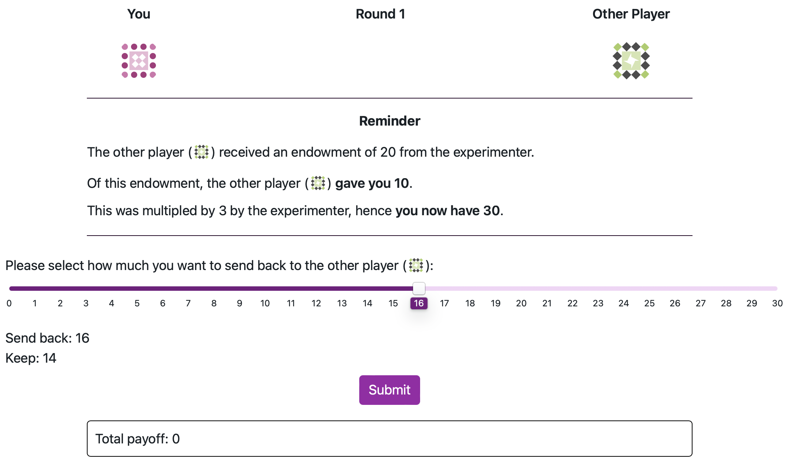
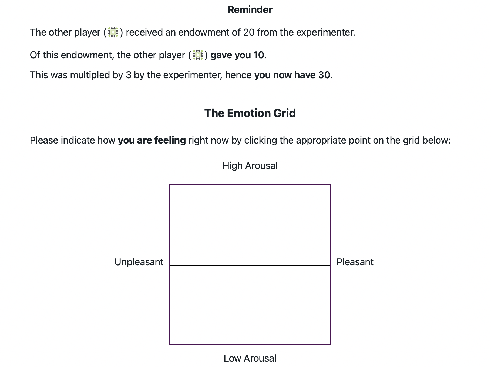
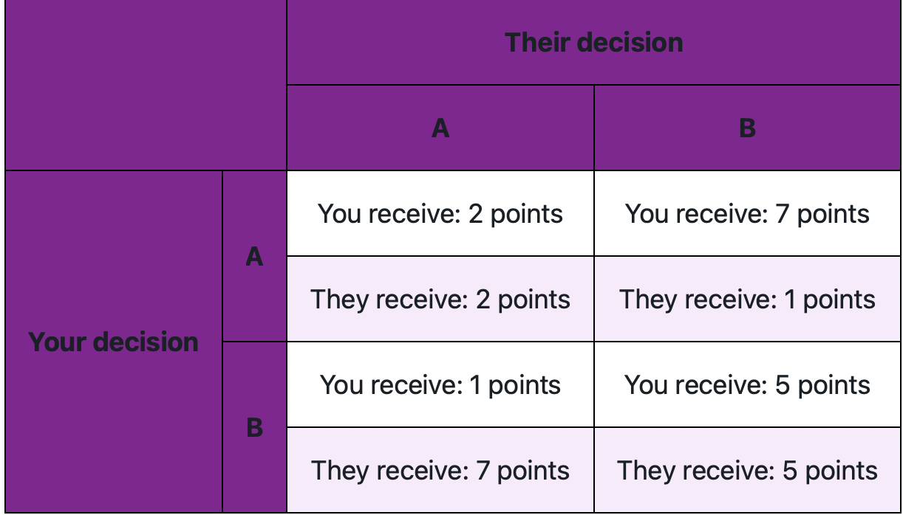
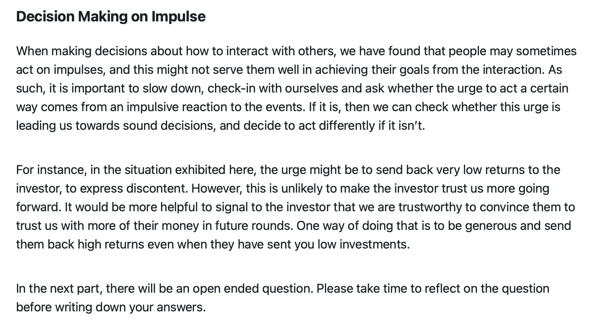

```{r setupCoax, include=FALSE}
knitr::opts_chunk$set(warning = FALSE, message = FALSE, echo = FALSE) 
knitr::opts_chunk$set(out.width = "\\textwidth")
```

# Repeated Trust Game 
<!-- Participants played two iterations of the standard version of the repeated trust game [@joyce_trust_1995]. The game is played in dyads, with one player assigned the role of the "investor" and the other player that of the "trustee". In the variant of the game we chose, the investor is endowed with 20 units at the start of each round. They need to decide how much of that endowment they want to invest with the trustee. The investment is then multiplied by a factor of 3 and sent to the trustee. As shown in Figure \ref{fig:trustGame}, the trustee in turn needs to decide how much of the (multiplied) investment they want to send back to the investor. If they send back more than a third of what they received, then both the investor and the trustee make a gain. Otherwise, the trustee would benefit but the investor would lose on their investment. If the interaction lasts for only one round, the Nash equilibrium of this game is for the investor to send nothing, as there is no incentive for the trustee to send back any return. In the repeated version, to maximise their rewards over time, both players need to build trust so that they can share the benefits of the bigger pie (the investment multiplied by three). If during the course of the interaction, the investor has been rewarded for taking the risk of sending an investment, then they would be more likely to invest more, and the multiplied investment would give both a bigger pie to share. If however the investor felt that they were not getting a return on their investment, then they would refrain from investing and neither would gain from the interaction. -->

Participants played a 15-round repeated trust game [@joyce_trust_1995] in the trustee role against a computer-programmed investor. On each round the investor was endowed with 20 units and decided how much of that endowment to invest. This investment is multiplied by a factor of 3 and sent to the trustee, who then decides how to split this between them and the investor. If the trustee returns more than a third, then the investor makes a gain. The Nash equilibrium for a single-round version is for the investor to send nothing. In the repeated version, rewards for both players are maximised if they build trust and share the benefits of the the investment multiplied by three. An investor who has been rewarded for taking the risk of sending an investment is more likely to invest more on future rounds. An investor obtaining a low return on their investment may choose to reduce future investment and thereby reduce both players’ gains.


```{r trustGame,fig.cap = "Screenshot of the repeated Trust Game. The game is played in dyads, with one player assigned the role of the investor and the other player that of the trustee. The investor is endowed with 20 units at the start of each round. They need to decide how much of that endowment they want to invest with the trustee. The investment is then multiplied by a factor of 3 and sent to the trustee. The trustee in turn needs to decide how much of the multiplied investment they want to send back to the investor. Shown here is the stage at which the trustee makes a decision of how much to send back the investor", fig.align='center'}



```


## Feedback post investment in the repeated Trust Game

```{r grid,fig.cap = "Screenshot of the two axis grid in the Coaxing condition where participants were asked to report the valence and arousal of their emotional response ", fig.align='center'}



```

Whilst playing the RTG, participants were asked to provide some feedback, in each round of the game, after seeing the amount sent by the investor. This feedback took the form of the answer to a question using a two dimensional field. What the axes of the field represented differed by condition. In the intervention condition, participants were asked to rate their emotional state with regard to the other player's choice of investment, with the x-axis representing the valence of the emotion they felt (positive or negative) and the Y-axis representing the emotional "arousal" they experienced (low or high). In the control condition, players were asked to rate attributes of the investment that were not related to their emotion, with the X-axis rating of how fast the investor is (slow or fast) and the Y-axis the magnitude of the investment (low or high). Figure \ref{fig:grid} shows a screenshot of the field in the intervention condition where participants were asked about their own emotional response to the investment. At the beginning of each game, participants were provided with detailed explanations of the meaning of the two axes as well as the opportunity to provide a baseline emotional state through using the field prior to the start of the game.

# Repeated Prisoner's Dilemma 

The other game the participants played is the repeated Prisoner's Dilemma (RPD). Over multiple rounds, participants could choose one of two actions: A cooperative action that would yield a high pay-off if the other person also cooperated, and the lowest possible pay-off if they did not cooperate. Or a non-cooperative option that would yield a high pay-off if the other person chooses the cooperative action and a lower pay-off if they also defect. Figure \ref{fig:payoffsRPD} shows the payoff of each combination of actions as presented to the participants. As an opponent in this game, we used an artificial agent that was playing according to Tit-For-Tat [@axelrod_evolution_1981]. It started by choosing the cooperative action and then it mirrored whatever the other player played in the previous round.

```{r payoffsRPD,fig.cap = "Screenshot of the Repeated Prisoner's Dilemma game. Over multiple rounds, participants could choose one of two actions: A cooperative action that would yield a high pay-off if the other person also cooperated, and the lowest possible pay-off if they did not cooperate. Or a non-cooperative option that would yield a high pay-off if the other person chooses the cooperative action and a lower pay-off if they also defect. Shown here is the table explaining the payoffs of each combination of actions the participant and their opponent choose", fig.align='center'}



```

# Intervention Detail 

The intervention consisted of presenting a hypothetical scenario in which they were playing the repeated trust game and the investor would send a low investment in a new round after having previously sent higher amounts. Participants were then asked how they would react in this situation and what sort of return (low or high) they were thinking of sending back. The players then were presented with an educational slide about the benefits of not resorting to impulsive decisions such as punishment when they feel they have been wronged. In this text, players were told that punishment can create a negative feedback loop where the other player might trust them even less. An alternative action was suggested, whereby players would respond kindly to such a transgression in the hope of gaining trust from the investor. The full text of the intervention slide is presented in Figure \ref{fig:interventionSlide}. Afterwards, participants were asked whether they would send a low or high return in the same hypothetical scenario now that they have read the information on the slide. Players were asked to justify their answer. For each question during this intervention, participants had to wait for a fixed duration of 20 seconds before being able to write their answers, and they were prevented from proceeding before that time was up.  This choice was made to allow participants to engage with the questions, think about their answers and provide meaningful feedback. 

```{r interventionSlide,fig.cap = "Screenshot of the main  slide in the intervention condition", fig.align='center', out.width="80%"}



```

# Self report questionnaires 

Failure to repair a breakdown in trust in the repeated trust game has been associated with trustees with BPD traits [@king-casas_rupture_2008]. Theories of social dysfunction in BPD have focused on dysfunction in the patients' mentalising ability [@allen_handbook_2006-1] as well as difficulties in emotional regulation [@rudge_mechanisms_2020]. The questionnaires we included in the experiment tried to assess borderline traits (PAI-BOR), emotional regulation capabilities (DERS) and mentalising ability (RFQ8). As such, we test for any association between scores in these questionnaires and the effect of the intervention.To analyse responses,  we fit a linear mixed effect model to the percentage return of trustees with fixed effects for Condition (intervention or control), Game-number (pre or post manipulation), Investment, and questionnaire score as well as all interactions between the fixed effects. We assume participant-wise random intercepts. We Z-transform the questionnaire scores and Investment as centering would be beneficial to interpreting the main effects more easily.
<!-- ## Statistical analysis of Behavior -->


# Hidden markov Model used to simulate the Investor's actions

The HMM assumes that the probability of each investment $I_t=0,…,20$, at each trial t, conditional on the current state of the investor $S_t$, is dependent on an underlying normal distribution with mean $\mu_s$ and standard deviation $\sigma_s$. The probability of each discrete investment was determined by the cumulative normal distribution $\Phi$. For instance, the probability of an investment $I_t=2$ is defined as: 

$$P(I_t=2 | S_t=s)= \frac{\Phi(2.5 | \mu_s,\sigma_s ) - \Phi(1.5 | \mu_s,\sigma_s )} {\Phi(20.5 | \mu_s,\sigma_s ) - \Phi(-0.5 | \mu_s,\sigma_s )}$$

Note that the denominator truncates the distribution between 0 and 20. To estimate the transition probability between states for the investor, a multinomial logistic regression model was fitted to the investor's data such as: 

$$P(S_{t+1} = s' | S_t=s , X_t = x)= \frac{\exp(\beta_{0,s,s'} + \beta_{1,s,s'} x)}{\sum_{s''} \exp(\beta_{0,s,s''} + \beta_{1,s,s''} x)}$$ 

where $X_t=R_t-I_t$ is the net return to the investor with  $R_t$ the amount returned by the trustee and $I_t$ is the Investment sent.

The advantages of this approach is that it does not require any a priori assumptions about the model features. The number of states, the policy conditional on the state, and the transition function between states can all determined in a purely data driven way. These HMMs can in turn be used to simulate a human-like agent playing the trust game. This agent may transition to a new state depending on the other player's actions and adopt a policy reflecting its state, thus simulating changes in emotional dispositions of human players during a repeated game. When the investor gains from the interaction, they become more likely to transition to a state where their policy is to be more trusting and invest more. However, faced with losses, the investor is more likely to transition to a more cautious policy where its investment belies lower trust in the trustee. The policies and the transitions between states are sufficient to build an agent that reflects this type of adaptive behavior and reacts to the trustee's action choices in a way that mimics a human player.

# Hidden Markov models to analyse participants returns

To model participants returns in the RTG across games and conditions,  we fit various hidden Markov models to participants returns. The response function is modelled as a discretised Gaussian distribution that takes into account what proportion the trustee would ideally like to return, and what returns are possible given the investment. For instance, if the investor sends an amount of $2$, the trustee would receive $6$ and they can send back any amount between $0$ and $6$. As such, we assume that the response is a distribution over proportions that can be calculated from these possible returns, i.e. $\{0,1/6, 2/6,...,1 \}$. The model assumes an underlying Normal distribution for each possible proportional return, predicting the probability of each via the cumulative Normal distribution with cut-off points set halfway between the proportions (e.g. the probability of returning 1/6 is determined as the probability of returning anything between 1/12 and 3/12).  The transition between states is assumed to depend on the investment through a multinomial logistic function such as:

$$P(S_{t+1} = s' | S_t=s , X_t = x)= \frac{\exp(\beta_{0,s,s'} + \beta_{1,s,s'} \ \text{inv} + \beta_{2,s,s'} \ x)}{\sum_{s''}\exp(\beta_{0,s,s''} + beta_{1,s,s'} \ \text{inv} + \beta_{2,s,s'} \ x)}$$ 

where $\text{inv}$ is a variable representing the investment received, $x$ is a dummy variable to characterise the group that the participant belongs to. We define four contrast codes for these dummy variables: pre-post (comparing pre and post games), post-coax (compares the post-intervention group to all others), post-control (compares the post-control group to all others) and full-contrast (a three level dummy variable: post-intervention compared to post-control and  all pre games).  


# References 
