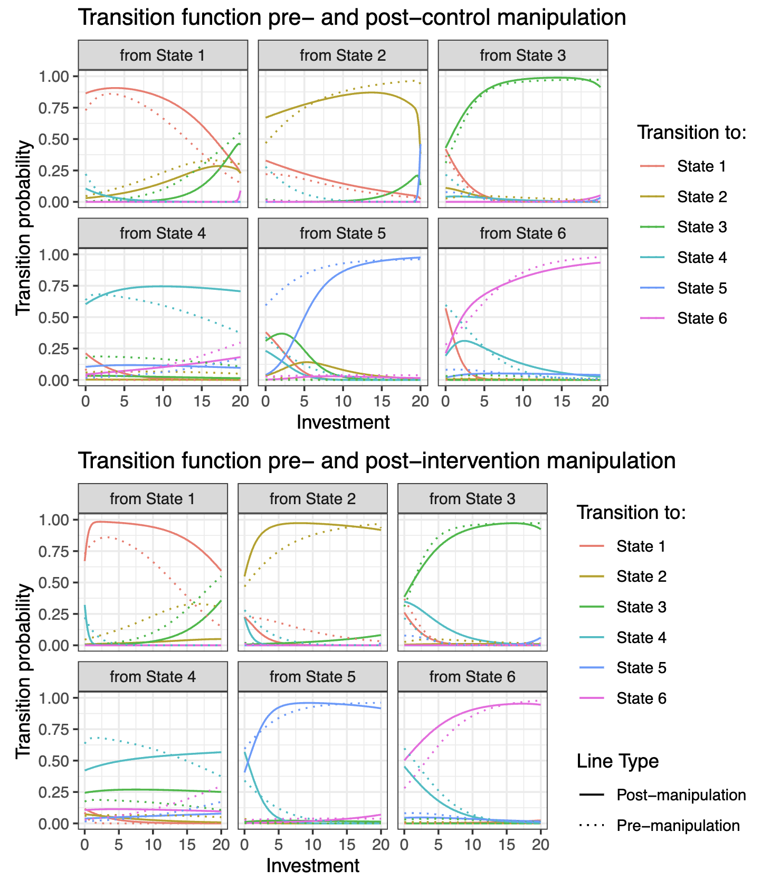

```{r setupCoaxsupp, include=FALSE}
knitr::opts_chunk$set(warning = FALSE, message = FALSE, echo = FALSE) 
knitr::opts_chunk$set(out.width = "\\textwidth")
library(papaja)
library(kableExtra)
library(knitr)

# using some functions dplyr, ggpubr, PairedData and sjPlot. Need to be loaded. 
library(tidyverse)
library(afex)
library(PairedData)
library(multcompView)
library(lsmeans)
library(depmixS4)
library(flextable)
library(gridExtra)
library(forcats)
library(ggsignif)
```

# Repeated Trust Game 

Participants played a 15-round repeated trust game [@joyce_trust_1995] in the trustee role against a computer-programmed investor. Each player was represented with an icon with the participant always on the left of the screen and the opponent on the right. The participants were able to choose the icon that represents them at the start of the experiment. The icon representing the opponent changed at the start of each new game, to simulate a new interaction partner. Participants were not told they were facing computerised opponents. We chose to simulate the behavior of a human interaction partner through allowing for a delay whilst pairing with new opponents as the start of each game as well as programming the agents to respond during each round after a random time lapse (randomly chosen between 5 and 10 seconds). 


```{r trustGameScreenshot, include=F, fig.cap = "Screenshot of the repeated Trust Game. The game is played in dyads, with one player assigned the role of the investor and the other player that of the trustee. The investor is endowed with 20 units at the start of each round. They need to decide how much of that endowment they want to invest with the trustee. The investment is then multiplied by a factor of 3 and sent to the trustee. The trustee in turn needs to decide how much of the multiplied investment they want to send back to the investor. Shown here is the stage at which the trustee makes a decision of how much to send back the investor", out.width="70%", out.height="70%", fig.align='center'}

knitr::include_graphics("figures/trust_game.png")

```


```{r grid, include=F, fig.cap = "Screenshot of the two axis grid in the Coaxing condition where participants were asked to report the valence and arousal of their emotional response ", out.width="70%", out.height="70%", fig.align='center'}


```

On each round of the RTG, before deciding how much to return, participants were asked to provide feedback on the investment sent. This feedback consisted of a rating on two dimensions, provided via a two-dimensional field. What the axes of the field represented differed between the conditions. In the intervention condition, participants were asked to rate their emotional reaction to the other player’s choice of investment in terms of valence (positive or negative) and arousal (low or high). In the control condition, participants were asked to rate the choice of investment in terms of speed (slow or fast) and magnitude (low or high). At the beginning of each game, participants were provided with detailed explanations of the meaning of the two axes as well as the opportunity to provide a baseline emotional state through using the field prior to the start of the game. Participants in the control condition were asked to chose any point on the two dimensional grid to show they have understood how to interact with the grid.

# Repeated Prisoner's Dilemma 

The other game the participants played is the normal form, double-choice Repeated Prisoner's Dilemma (RPD). Over multiple rounds, participants could choose one of two actions: A cooperative action that would yield a high pay-off if the other person also cooperated, and the lowest possible pay-off if they did not cooperate, or a non-cooperative option that would yield a high pay-off if the other person chooses the cooperative action and a lower pay-off if they also defect. Figure \ref{fig:payoffsRPD} shows the payoff of each combination of actions as presented to the participants. As an opponent in this game, we used an artificial agent that played according to Tit-For-Tat [@axelrod_evolution_1981]. It started by choosing the cooperative action and then it mirrored whatever the other player played in the previous round.

```{r payoffsRPD,fig.cap = "Screenshot of the Repeated Prisoner's Dilemma game. Over multiple rounds, participants could choose one of two actions: A cooperative action that would yield a high pay-off if the other person also cooperated, and the lowest possible pay-off if they did not cooperate. Or a non-cooperative option that would yield a high pay-off if the other person chooses the cooperative action and a lower pay-off if they also defect. Shown here is the table explaining the payoffs of each combination of actions the participant and their opponent choose", out.width="70%", out.height="70%", fig.align='center'}


```

# Intervention Detail 

The intervention consisted of presenting a hypothetical scenario in which they were playing the repeated trust game and the investor would send a low investment in a new round after having previously sent higher amounts. Participants were then asked how they would react in this situation and what sort of return (low or high) they were thinking of sending back. The players then were presented with an educational slide about the benefits of not resorting to impulsive decisions such as punishment when they feel they have been wronged. In this text, players were told that punishment can create a negative feedback loop where the other player might trust them even less. An alternative action was suggested, whereby players would respond kindly to such a transgression in the hope of gaining trust from the investor. The full text of the intervention slide is presented in Figure \ref{fig:interventionSlide}. Afterwards, participants were asked whether they would send a low or high return in the same hypothetical scenario now that they have read the information on the slide. Players were then asked to justify their answer. For each question during this intervention, participants had to wait for a fixed duration of 20 seconds before being able to write their answers, and they were prevented from proceeding before that time was up.  This choice was made to allow participants to engage with the questions, think about their answers and provide meaningful feedback. 

```{r interventionSlide,fig.cap = "Screenshot of the main  slide in the intervention condition", fig.align='center', out.width="80%"}

knitr::include_graphics("figures/intervention_text.png")

```

# Self-report questionnaires 

Failure to repair a breakdown in trust in the repeated trust game has been associated with trustees with BPD traits [@king-casas_rupture_2008]. Theories of social dysfunction in BPD have focused on dysfunction in the patients' mentalising ability [@allen_handbook_2006-1] as well as difficulties in emotional regulation [@rudge_mechanisms_2020]. The questionnaires we included in the experiment tried to assess borderline traits (PAI-BOR; @morey_personality_1991), emotional regulation capabilities (DERS; @gratz_multidimensional_2004) and mentalising ability (RFQ8; @fonagy_development_2016). As such, we test for any association between scores in these questionnaires and the effect of the intervention. To analyse responses,  we fit a linear mixed effect model to the percentage return of trustees with fixed effects for Condition (intervention or control), Game-number (pre or post manipulation), Investment, and questionnaire score as well as all interactions between the fixed effects. We assume participant-wise random intercepts. We Z-transform the questionnaire scores and Investment as centering would be beneficial to interpreting the main effects more easily.

# Hidden markov Model used to simulate the Investor's actions

The HMM assumes that the probability of each investment $I_t=0,…,20$, at each trial t, conditional on the current state of the investor $S_t$, is dependent on an underlying normal distribution with mean $\mu_s$ and standard deviation $\sigma_s$. The probability of each discrete investment was determined from the cumulative normal distribution $\Phi$, computing the probability of a Normal variate falling between the midway points of the response options. As responses were bounded at 0 and 20, we normalized these probabilities further by taking the endpoints into account. For instance, the probability of an investment $I_t=2$ is defined as: 

$$P(I_t=2 | S_t=s)= \frac{\Phi(2.5 | \mu_s,\sigma_s ) - \Phi(1.5 | \mu_s,\sigma_s )} {\Phi(20.5 | \mu_s,\sigma_s ) - \Phi(-0.5 | \mu_s,\sigma_s )}$$

Note that the denominator truncates the distribution between 0 and 20. To estimate the transition probability between states for the investor, a multinomial logistic regression model was fitted to the investor's data such as: 

$$P(S_{t+1} = s' | S_t=s , X_t = x)= \frac{\exp(\beta_{0,s,s'} + \beta_{1,s,s'} x)}{\sum_{s''} \exp(\beta_{0,s,s''} + \beta_{1,s,s''} x)}$$ 

where $X_t=R_t-I_t$ is the net return to the investor with  $R_t$ the amount returned by the trustee and $I_t$ is the Investment sent.

The advantages of this approach is that it does not require any a priori assumptions about the model features. The number of states, the policy conditional on the state, and the transition function between states can all determined in a purely data-driven way. These HMMs can in turn be used to simulate a human-like agent playing the trust game. This agent may transition to a new state depending on the other player's actions and adopt a policy reflecting its state, thus simulating changes in emotional dispositions of human players during a repeated game. When the investor gains from the interaction, they become more likely to transition to a state where their policy is more "trusting" with generally higher investments. However, faced with losses, the investor is more likely to transition to a more cautious policy with generally lower investments. The policies and the transitions between states are sufficient to build an agent that reflects this type of adaptive behavior and reacts to the trustee's action choices in a way that mimics a human player.

We estimated a three-state model for investor's behaviour, using maximum likelihood estimation via the Expectation-Maximisation algorithm as implemented in the depmixS4 (Visser & Speekenbrink) package for R. The model was estimated using investments from existing datasets of human dyads playing 10 rounds of the RTG with the same trustee. The dataset consisted of a total of 381 games from two data sources: First, a total of 93 repeated trust games with healthy investors and a mix of healthy trustees and trustees diagnosed with Borderline Personality Disorder (BPD) [@king-casas_rupture_2008]. The second source was from data collected as part of a project investigating social exchanges at the Montague lab at Virginia Tech and consists of 288 games.

# Mixed effects models of participants percentage returns

For both pre and post defection trials, we model the percentage return (percentage of tripled investment returned to investor) using the same linear mixed-effects model used for all the rounds as described in the main text:


\[
\begin{split}
R_{ij} = & \beta_0 + \beta_1 \text{ (Condition)}_i + \beta_2 \text{ (Game)}_i + \beta_3 \text{ (Investment)}_i + \\
& \beta_4 \text{ (Condition × Game)}_i + \beta_5 \text{ (Condition × Investment)}_i + \beta_6 \text{ (Game × Investment)}_i +  \\ 
& \beta_7 \text{ (Condition × Game × Investment)}_i +b_{0j} + b_{1j} \text{ (Game)}_i + \epsilon_{ij}
\end{split}
\]

where:

- \( R_{ij} \): percentage of tripled investment returned to investor for participant \( j \) in observation \( i \)
- \( \beta_0 \): intercept
- \( \beta_1 \): effect of Condition (intervention vs. control)
- \( \beta_2 \): effect of Game (RTG game pre vs. post-intervention)
- \( \beta_3 \): effect of Investment
- \( \beta_4 \): interaction effect between Condition and Game
- \( \beta_5 \): interaction effect between Condition and Investment
- \( \beta_6 \): interaction effect between Game and Investment
- \( \beta_7 \): three-way interaction effect between Condition, Game and Investment
- \( b_{0j} \): participant-wise random intercept for participant \( j \)
- \( b_{1j} \): participant-wise random slope for Game for participant \( j \)
- \( \epsilon_{ij} \): error term for participant \( j \) in observation \( i \)


## Mixed-effects model results for pre-defection returns

We fit the above linear mixed effects model to all trials prior to the pre-programmed defection by the HMM investor (occurring on round 12 pre-manipulation, and round 13 post). A summary of results can be seen in Figure \ref{fig:preDefectionModel}. 

```{r, include=F}


# Create a summary object
modelPre_summary <- readRDS("data/mod_returns_pre")

# Extract the fixed effects as a data frame
summary_Pre_df <- as.data.frame(modelPre_summary$coefficients)


summary_Pre_df <- summary_Pre_df %>%
  rownames_to_column(var = "Term") %>% 
  mutate(Term = gsub("condition.f1", "Condition", Term),
         Term = gsub("gameNum.f1", "Game", Term),
         Term = gsub("inv_scaled", "Investment", Term))

# Create a summary table using apa_table
summary_Pretable <- papaja::apa_table(
  summary_Pre_df,
  caption = "Summary of Mixed-Effects Model",
  align = c("l", "c", "c", "c", "c", "c")
)


```

```{r preDefectionModel, fig.cap = "Summary of results of a Mixed-effects model fitted to participants returns restricted to  pre-defection trials", fig.align='center'}


```


## Mixed-effects model results for post-defection returns: 


```{r, include=F}


# Create a summary object
modelPost_summary <- readRDS("data/mod_returns_post")

# Extract the fixed effects as a data frame
summary_Post_df <- as.data.frame(modelPost_summary$coefficients)


summary_Post_df <- summary_Post_df %>%
  rownames_to_column(var = "Term") %>% 
  mutate(Term = gsub("condition.f1", "Condition", Term),
         Term = gsub("gameNum.f1", "Game", Term),
         Term = gsub("inv_scaled", "Investment", Term))

# Create a summary table using apa_table
summary_PostTable <- papaja::apa_table(
  summary_Post_df,
  caption = "Summary of Mixed-Effects Model",
  align = c("l", "c", "c", "c", "c", "c"),
  label = "tab:postDefection-model"
)


```


In the same way, we fit the linear mixed effects model to all post-defection trials by the HMM investor, including the round on which the defection occurs. A summary of results is presented in Figure \ref{fig:postDefectionModel}


```{r postDefectionModel,fig.cap = "Summary of results of a Mixed-effects model fitted to participants returns restricted to  post-defection trials", fig.align='center',fig.pos="H"}

#summary_PostTable


```


# Hidden Markov models to analyse participants returns

To model participants' returns in the RTG across games and conditions,  we fit various hidden Markov models to participants returns. The response function is modelled as a discretised Gaussian distribution that takes into account what proportion the trustee would ideally like to return, and what returns are possible given the investment. For instance, if the investor sends an amount of $2$, the trustee would receive $6$ and they can send back any amount between $0$ and $6$. As such, we assume that the response is a distribution over the possible proportions that can be calculated from these possible returns, i.e. $\{0,1/6, 2/6,...,1 \}$. The model assumes an underlying Normal distribution for each possible proportional return, predicting the probability of each via the cumulative Normal distribution with cut-off points set halfway between the proportions (e.g. the probability of returning 1/6 is determined as the probability of returning anything between 1/12 and 3/12).  The transition between states is assumed to depend on the investment through a multinomial logistic function such as:

$$P(S_{t+1} = s' | S_t=s , X_t = x)= \frac{\exp(\beta_{0,s,s'} + \beta_{1,s,s'} \ \text{x}+ \beta_{2,s,s'} \ d)}{\sum_{s''}\exp(\beta_{0,s,s''} + \beta_{1,s,s'} \ \text{x} + \beta_{2,s,s'} \ d)}$$ 

where $\text{x}$ is a variable representing the investment received, $d$ is a dummy variable to characterise the group that the participant belongs to. We define four contrast codes for these dummy variables: pre-post (comparing pre and post games), post-coax (compares the post-intervention group to all others), post-control (compares the post-control group to all others) and full-contrast (a three level dummy variable: post-intervention compared to post-control and  all pre games).

```{r table-HMMs,fig.cap = "Table comparing the HMM-full models fit assuming the latent number of states is between 2 and 7. Using BIC, the 6 state model fits best", out.width="70%", out.height="70%", fig.align='center',fig.pos="H"}


```

As seen in Figure \ref{fig:table-HMMs}, using the BIC, the 6 state HMM-full model fits best. Since we only fit models between 2 and 7 states, it is possible that models with a higher number of states could fit the data better. We decided to stop at 7 states for computational cost reasons and because the interpretation of models with a higher number of states becomes complex.


```{r trusteeHMMPlot, include=F, fig.cap = "Distribution of participants' percentage return for each of the latent states in the 6 state HMM-full model. The latent states are ordered by the mean of the Gaussian that best fits the policy in that state, so higher numbered states are more pro-social", fig.align='center'}


```

## Transition function of HMM model describing participant's returns 

Using the HMM-full 6 state model, we can plot the transition probabilities of the model for pre and post-intervention as well as pre- and post-control manipulation separately Figure \ref{fig:plotTransitionsSupp}). This allows us to see how the transition probabilities between latent states change across Games and Condition. 


```{r plotTransitionsSupp, fig.cap="Transition function for the HMM-full trustee model. Each panel represents the state transitioned from. For instance the upper left panel represents all transition probabilities from state 1.  The colors of the lines within each panel indicate the state transitioned to. For instance, in the upper left panel, the red line represents the transition probability to state 1 as a function of the received investment. In this case this is also the probability of staying in state 1 since we are in the state 1 panel.  Solid lines show estimated transition probabillities post-manipulation while dotted lines show the same probabilities prior to the manipulation",fig.align="center", fig.width=6, fig.height = 7 }




```

\pagebreak

# References 
